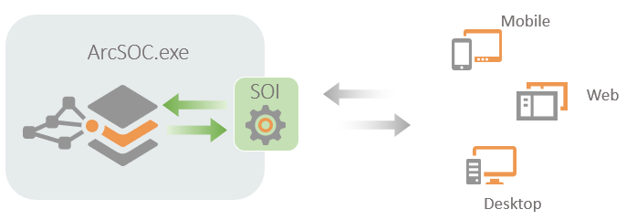
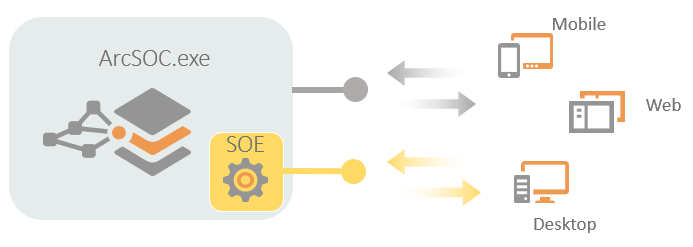

# arcgis-enterprise-sdk-resources

This repository provides samples and code snippets for server object extensions (SOEs) and server object interceptors (SOIs) built with 10.8 ArcGIS Enterprise SDK. Learn more about [ArcGIS Enterprise SDK](https://enterprise.arcgis.com/en/sdk/latest/windows/webframe.html#a2596185-823b-4de3-9831-7842fb6100fb.html).

An SOI is capable of intercepting REST, SOAP, and OGC requests and responses of a map service in the following way:

  

An SOE is capable of extending the functions of a map service in the following way:

  

## Features
- [Samples](Samples)
- Code snippets (Coming soon!)

## Instructions
1. Fork and then clone the repo. 
2. Run and try the samples.

## Requirements
* ArcGIS Enterprise (or a standalone ArcGIS Server).
* ArcGIS Enterprise SDK.
* Visual Studio for .NET (C# or VB) or Eclipse for Java.
* ArcGIS Pro is required to publish the map service that the SOE or SOI can be enabled with. 
> **Note:** ArcGIS Enterprise SDK supports map services published from ArcGIS Pro, including their feature access and OGC capabilities, such as feature service, WMS service, and so on. ArcGIS Enterprise SDK currently does not support hosted feature service or other services. 

## Resources
* [ArcGIS Enterprise SDK Developer Guide](https://enterprise.arcgis.com/en/sdk/latest/windows/webframe.html#a2596185-823b-4de3-9831-7842fb6100fb.html)
* [ArcGIS Server - Extending services](https://enterprise.arcgis.com/en/server/latest/develop/windows/about-extending-services.htm)

## Issues
Find a bug or want to request a new feature?  Please let us know by submitting an issue.

## Contributing
Esri welcomes contributions from anyone and everyone. Please see our [guidelines for contributing](https://github.com/esri/contributing).

## Licensing
Copyright 2019 Esri

Licensed under the Apache License, Version 2.0 (the "License");
you may not use this file except in compliance with the License.
You may obtain a copy of the License at

   http://www.apache.org/licenses/LICENSE-2.0

Unless required by applicable law or agreed to in writing, software
distributed under the License is distributed on an "AS IS" BASIS,
WITHOUT WARRANTIES OR CONDITIONS OF ANY KIND, either express or implied.
See the License for the specific language governing permissions and
limitations under the License.

A copy of the license is available in the repository's [License.txt](https://github.com/hanhansun/arcgis-enterprise-sdk-samples/blob/master/License.txt) file.
