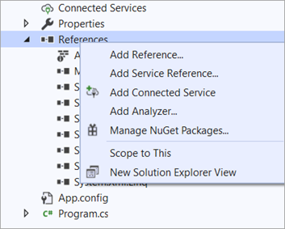
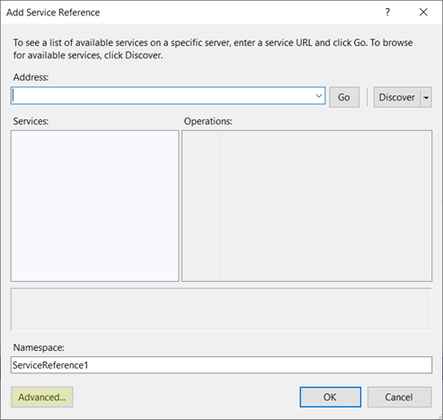
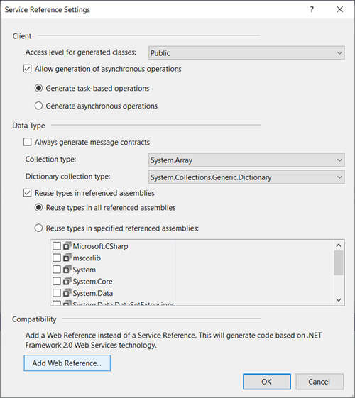
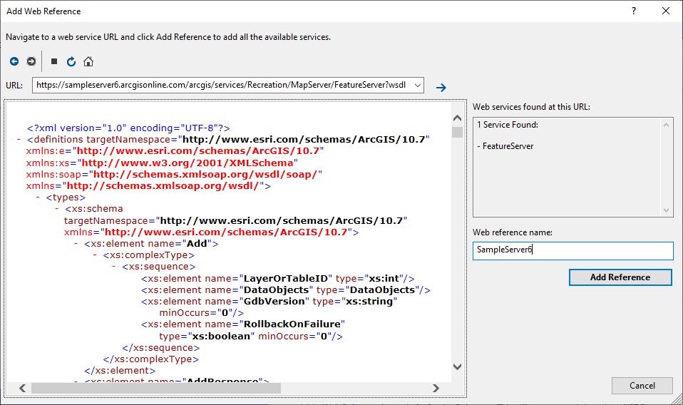

# .NET SOAP Query sample

This sample illustrates how to send a feature service [Query](http://resources.arcgis.com/en/help/soap/latest/#/Query/01vp00000047000000/) SOAP request in a .NET console application. It also provides the equivalent SOAP XML request in the [Reference](#reference) section and explains how to prepare the SOAP XML request.

## Sample service

https://sampleserver6.arcgisonline.com/arcgis/services/Recreation/MapServer/FeatureServer?wsdl

## Instructions

1. First, create a .NET console application in Visual Studio.
2. Add the SOAP service as a Web Reference:
   1. Right-click **References** and choose the **Add Service Reference...** option in the menu.
   
      
   2. In the **Add Service Reference** window, click the **Advanced** button.
   
      
   3. In the **Service Reference Settings** window, click the **Add Web Reference...** button.
   
      
   4. Copy the service's SOAP WSDL URL (https://sampleserver6.arcgisonline.com/arcgis/services/Recreation/MapServer/FeatureServer?wsdl) to the **URL** textbox in the **Add Web Reference** wizard. Press Enter. You will see the following content automatically shows up.
   
      
   5. To simplify the reference name, use `SampleServer6` as the web reference name in this dialogue box. Click **Add Reference**.
   
   6. If you want to update the existing web reference, you can modify the web reference URL and click **Update Web Reference**. You may have to change the service name (explained in the next step) if it's a different service.
   
3. Now you can reference the SOAP classes in your code via `SampleServer6` namespace.
   
   Note that since this feature service's service name is `Recreation_FeatureServer`, the feature service object can be referenced as the following code:
   
   ```c#
      SampleServer6.Recreation_FeatureServer featureServer = new SampleServer6.Recreation_FeatureServer();
      //featureServer.Url = "https://sampleserver6.arcgisonline.com/arcgis/services/Wildfire/MapServer/FeatureServer";
      string serverDescription = featureServer.GetServerInfo().ServiceDescription;
   ```
   
   If you want to dynamically send the same request to a different feature service, you can define the service URL via `featureServer.Url` as the line of code commented above. By default, this `Url` property is defined from the web reference WSDL so you don't need to specify it. Overriding this property allows you to consume a different feature service, which should have the same schema as the web reference service. The service schema is defined in the service WSDL and determined based on the service type and service version.
   
   To find out the service name, you can refer to the service WSDL: 
   ``` xml
   <service name="Recreation_FeatureServer">
      <port name="FeatureServerPort" binding="e:FeatureServerBinding">
         <soap:address location="https://sampleserver6.arcgisonline.com:443/arcgis/services/Recreation/MapServer/FeatureServer"/>
      </port>
   </service>
   ```
4. Run this application and you will see the layer count and feature count are returned. 

## Reference 

- Query SOAP API reference: http://resources.arcgis.com/en/help/soap/latest/#/Query/01vp00000047000000/
- Sample Query SOAP XML request using the same [sample service](#sample-service):

   ``` xml
   <soapenv:Envelope xmlns:soapenv="http://schemas.xmlsoap.org/soap/envelope/" 
                     xmlns:ns="http://www.esri.com/schemas/ArcGIS/10.7">
      <soapenv:Header/>
      <soapenv:Body>
         <ns:Query>
            <LayerOrTableID>0</LayerOrTableID>
            <DefinitionExpression>1=1</DefinitionExpression>
            <QueryFilter>
               <SubFields></SubFields>
               <WhereClause>1=1</WhereClause>
            </QueryFilter>
            <ServiceDataOptions>
               <Format>NATIVE</Format>
            </ServiceDataOptions>
            <!--Optional:-->
            <GdbVersion></GdbVersion>
            <!--Optional:-->
            <MaximumAllowableOffset>0.0</MaximumAllowableOffset>
         </ns:Query>
      </soapenv:Body>
   </soapenv:Envelope>
   ```

   Note that for ArcGIS-Pro-based services, the ArcGIS namespace is `http://www.esri.com/schemas/ArcGIS/2.x`, instead of `http://www.esri.com/schemas/ArcGIS/10.x` which is for ArcMap-based services. The ArcGIS namespace URL in the SOAP request XML should match the URL defined in the service WSDL, and you can visit the service's WSDL to find out what ArcGIS schema you should use to send the SOAP XML request. 

   - For 10.8 ArcMap-based feature service:
      ``` xml
      <definitions xmlns:soap="http://schemas.xmlsoap.org/wsdl/soap/" 
                   xmlns:xs="http://www.w3.org/2001/XMLSchema" 
                   xmlns:e="http://www.esri.com/schemas/ArcGIS/10.8" 
                   xmlns="http://schemas.xmlsoap.org/wsdl/" 
                   targetNamespace="http://www.esri.com/schemas/ArcGIS/10.8">
      ```
      The ArcMap-based feature service's WSDL file can be found at ArcGIS Server installation location (by default `C:\Program Files\ArcGIS\Server\XmlSchema\FeatureServer.wsdl`). 

   - For 10.8 ArcGIS-Pro-based feature service:
      ``` xml
      <definitions xmlns:soap="http://schemas.xmlsoap.org/wsdl/soap/" 
                   xmlns:xs="http://www.w3.org/2001/XMLSchema" 
                   xmlns:e="http://www.esri.com/schemas/ArcGIS/2.6.0" 
                   xmlns="http://schemas.xmlsoap.org/wsdl/" 
                   targetNamespace="http://www.esri.com/schemas/ArcGIS/2.6.0">
      ```
      The Pro-based feature service's WSDL file can be found at ArcGIS Server installation location (by default `C:\Program Files\ArcGIS\Server\framework\runtime\ArcGIS\Resources\XmlSchema\FeatureServer.wsdl`). 
