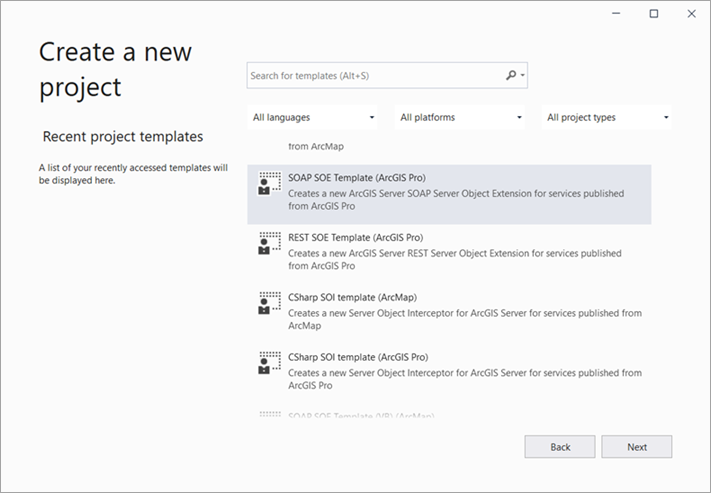
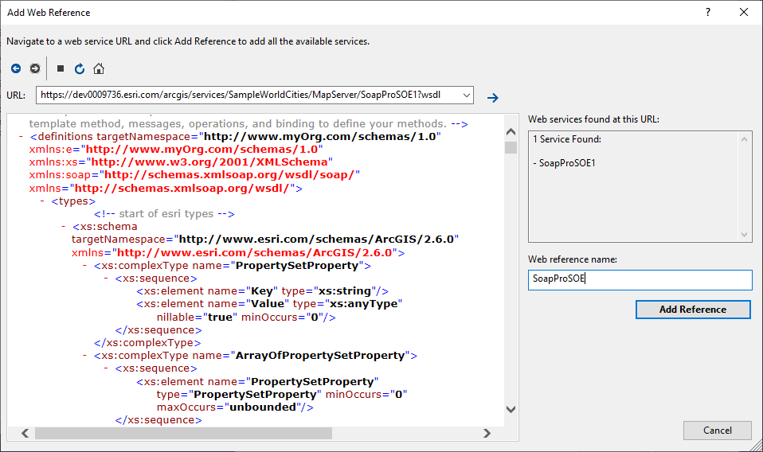

# .NET SOAP SOE client sample

This sample illustrates how to consume a simple SOAP SOE in a .NET console application. It also provides the equivalent SOAP XML request in the [Reference](#reference) section and explains how to prepare the SOAP XML request.

## Sample service

Your own ArcGIS Server is required:
https://serverdomain/webadaptorname/services/SampleWorldCities/MapServer/SoapProSOE1?wsdl

## Instructions

#### Create a simple SOAP SOE
1. First, create a new project in Visual Studio and choose SOAP SOE Template (ArcGIS Pro).

   
   
2. Open [SoapProSOE1.cs](SoapProSOE1/SoapProSOE1.cs) and copy [`http://www.myOrg.com/schemas/1.0`](SoapProSOE1/SoapProSOE1.cs#L51) to [`SOAPNamespaceURI = ""`](SoapProSOE1/SoapProSOE1.cs#L47).

   This URL is used as the SOAP SOE's targetNamespace. You can change this URL based on your own SOAP SOE's schema, but you must ensure to update the URLs in both the [SoapProSOE1.cs](SoapProSOE1/SoapProSOE1.cs) file and the [SoapProSOE1.wsdl](SoapProSOE1/Resources/SoapProSOE1.wsdl) file. 

   The [`c_ns_esri`](SoapProSOE1/SoapProSOE1.cs#L54) variable defines the ArcGIS namespace which is also used in the [SoapProSOE1.wsdl](SoapProSOE1/Resources/SoapProSOE1.wsdl) file. The ArcGIS namespace is used as the SOAP request and response schema, which helps serialize ArcGIS objects to binary data and de-serialize the binaries to ArcGIS objects in the SOE. For 10.8 Pro-based SOAP SOE, the ArcGIS namespace is 'http://www.esri.com/schemas/ArcGIS/2.6.0'.

3. Build the solution. The `SoapProSOE1_ent.soe` file should be generated.

4. Deploy this SOAP SOE to your ArcGIS Server by uploading `SoapProSOE1_ent.soe` in ArcGIS Server Manager.

5. Enable this SOAP SOE with the SampleWorldCities map service in ArcGIS Server Manager and take a note of the SOAP WSDL URL. 
 
   Make sure you share the SampleWorldCities map service public. If you want to consume a secured SOAP SOE, you should refer to [Generate SOAP proxy libraries](2.%20Generate%20SOAP%20proxy%20libraries) and [Consume a secured SOAP service in a .NET application](3.%20Consume%20secured%20SOAP%20services).
   
   Now you are ready to create a client application to consume this SOAP SOE.

#### Create the SOAP SOE client 

1. Create a .NET console application in Visual Studio.
2. Add the SOAP SOE's service WSDL as a Web Reference:
   
   1. Right-click **References** and choose the **Add Service Reference...** option in the menu.
      
      
   2. In the **Add Service Reference** window, click the **Advanced** button.
   
      
   3. In the **Service Reference Settings** window, click the **Add Web Reference...** button.
   
      
  
   4. Copy the SOAP SOE's WSDL URL (https://serverdomain/webadaptorname/services/SampleWorldCities/MapServer?wsdl) to the **URL** textbox in the **Add Web Reference** wizard. Press Enter. You will see the following content automatically shows up.
   
      
   5. To simplify the reference name, use `SoapProSOE` as the web reference name in this dialogue box. Click **Add Reference**.
   
   6. If you want to update the existing web reference, you can modify the web reference URL and click **Update Web Reference**. You may have to change the service name (explained in the next step) if it's a different service.

3. Now you can reference the SOAP classes in your code via `SoapProSOE` namespace.
   
   Note that since this SOAP SOE's service name is `SampleWorldCities_SoapProSOE1`, the service object can be referenced as the following code:
   
   ```c#
      SoapProSOE.SampleWorldCities_SoapProSOE1 soe = new SoapProSOE.SampleWorldCities_SoapProSOE1();
      SoapProSOE.PolygonN polygon = soe.BufferGeometry(centerPoint, 5) as SoapProSOE.PolygonN;
   ```
   
   If you want to dynamically send the same request to the SOAP SOE enabled with a different map service, you can define the service URL via `SampleWorldCities_SoapProSOE1.Url`. By default, this `Url` property is defined from the web reference WSDL so you don't need to specify it. Overriding this property allows you to consume the same SOAP SOE enabled with a different service, which has the same SOAP SOE schema.
   
   To find out the service name, you can refer to the service WSDL: 
   ``` xml
   <service name="SampleWorldCities_SoapProSOE1">
      <port name="SoapSOEPort" binding="e:SoapSOEBinding">
         <soap:address location="https://dev0009736.esri.com/arcgis/services/SampleWorldCities/MapServer/SoapProSOE1"/>
      </port>
   </service>
   ```
4. Run this application in debug session and you can inspect the buffered polygon object that is returned. 

## Reference 

- Sample SOAP BufferGeometry XML request using the same [sample service](#sample-service):

   ``` xml
   <soapenv:Envelope xmlns:soapenv="http://schemas.xmlsoap.org/soap/envelope/" 
                     xmlns:ns="http://www.myOrg.com/schemas/1.0">
      <soapenv:Header/>
      <soapenv:Body>
         <ns:BufferGeometry>
            <Geometry xsi:type="esri:PointN" xmlns:esri="http://www.esri.com/schemas/ArcGIS/2.6.0" 
                      xmlns:xsi="http://www.w3.org/2001/XMLSchema-instance">
               <X>544000</X>
               <Y>4900000</Y>
               <SpatialReference xsi:type="esri:ProjectedCoordinateSystem">
                  <WKID>26712</WKID>
               </SpatialReference>
            </Geometry>
            <Distance>5000</Distance>
      </soapenv:Body>
   </soapenv:Envelope>
   ```

   Note that since this SOAP SOE is an ArcGIS-Pro-based extension, its ArcGIS namespace is `http://www.esri.com/schemas/ArcGIS/2.x`, instead of `http://www.esri.com/schemas/ArcGIS/10.x` which is for ArcMap-based services. The ArcGIS namespace URL in the SOAP request XML should match the URL defined in the service WSDL, and you can visit the SOE's WSDL to find out what ArcGIS schema you should use to send the SOAP XML request.
