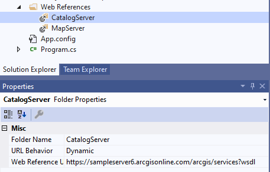

# Consume secured SOAP services

This section illustrates how to create a .NET application that consumes a secured SOAP map service. In this scenario, the WSDL URL of the secured service cannot be accessed without a token. For example, to access the WSDL of the secured service, you need to add the `token` parameter like this:

`https://sampleserver6.arcgisonline.com/arcgis/services/USA_secure_user1/MapServer?token=C5rJMY1Levmq1LQfBfOQGqTL6issJEa2qYl01g9h9Z8.&wsdl`

In other words, you should programmatically generate the token first, and then consume the SOAP service by setting the service URL with the token parameter appended. This sample takes a secured map service as an example.

## Sample service

Secured map service:

https://sampleserver6.arcgisonline.com/arcgis/services/USA_secure_user1/MapServer?wsdl

> Note: you won't be able to access the above link directly in a browser because a valid token is required.

Username: user1

Password: user1

## Instructions

To programmatically consume a secured SOAP map service, you should follow these steps. 

1. Add the catalog service's [WSDL URL as Web Reference](../1.%20Consume%20SOAP%20services%20and%20SOAP%20SOE/SOAPExportMapImage#instructions) in your project:
https://sampleserver6.arcgisonline.com/arcgis/services?wsdl

   
   
2. Obtain the token service URL from the `GetTokenServiceURL` method:

   ``` c#
      CatalogServer.Catalog myCatalog = new CatalogServer.Catalog();
      if (myCatalog.RequiresTokens())
      {
         string tokenServiceUrl = myCatalog.GetTokenServiceURL();
         string token = GetToken(tokenServiceUrl, username, password);
      }
   ```
   
   This URL can be different depending on whether the service is from a standalone [ArcGIS Server](https://developers.arcgis.com/rest/services-reference/generate-token.htm) or an [ArcGIS Enterprise](https://developers.arcgis.com/rest/users-groups-and-items/generate-token.htm).
   
   If you already know the token service URL that will be used, you can skip this part and directly define the token service URL in your code. 
   
3. Send a Generate Token request with username and password to the token service URL.

   ``` c#
      private static string GetToken(string url, string username, string password)
      {
          object tokenstr = "";
          var postData = string.Format("username={0}&password={1}&client=requestip&expiration=100&f=json", username, password);
          var data = Encoding.ASCII.GetBytes(postData);
          var request = (HttpWebRequest)WebRequest.Create(url);
          request.Method = "POST";
          request.ContentType = "application/x-www-form-urlencoded";
          request.ContentLength = postData.Length;

          using (var stream = request.GetRequestStream())
          {
              stream.Write(data, 0, data.Length);
          }

          var response = (HttpWebResponse)request.GetResponse();
          var rawResponse = new StreamReader(response.GetResponseStream()).ReadToEnd();

          if (rawResponse.Contains("error"))
          {
              Console.WriteLine("failed: " + rawResponse);
              throw new System.InvalidOperationException("fix the token generation process");
          }
          else
          {
              JavaScriptSerializer json = new System.Web.Script.Serialization.JavaScriptSerializer();
              Dictionary<string, object> jsonResponse = json.Deserialize<Dictionary<string, object>>(rawResponse);
              if (jsonResponse.ContainsKey("token"))
                  jsonResponse.TryGetValue("token", out tokenstr);
          }
          response.Close();
          return tokenstr.ToString();
      }
   ```
   
   This is a REST request, and you can use the C# code to programmatically send the request and get the returned token string. There is no ArcGIS object involved in this part. 

4. Add the SOAP service's proxy class in your project.

   Since the URL of the secured map service will be programmatically constructed and override the SOAP proxy class's default URL via `USA_MapServer.Url` later, there are multiple ways to add the service reference in your project. You can reference the provided [Esri SOAP libraries](http://resources.arcgis.com/en/help/soap/latest/#/NET/01vp00000090000000/), [build your own SOAP proxy](../2.%20Generate%20SOAP%20proxy%20libraries), or add a public SOAP service with the same schema to the [web reference](../1.%20Consume%20SOAP%20services%20and%20SOAP%20SOE/SOAPExportMapImage#instructions) of your project. 
   
   This step can be flexible and you can choose the one that works the best for you. To simplify this sample, an existing public SOAP service with the same schema is used as the web reference of the secured map service SOAP client as the following steps (but you can always build your own SOAP proxy class, which is more recommended):

   1. Add the WSDL URL of a public map service (with the same schema as the secured service) as Web Reference in your project. For example:
https://sampleserver6.arcgisonline.com/arcgis/services/USA/MapServer?wsdl

   

   2. This automatically generates the map service's SOAP proxy class with the service name `USA_MapServer` used for the class name and the public map service's URL as the default proxy class URL.
   
5. Set the URL of the secured map service with the token appended to the map service proxy class:
  
   ``` c#
      string mapServiceUrl = "https://sampleserver6.arcgisonline.com/arcgis/services/USA_secure_user1/MapServer";
      MapServer.USA_MapServer mapServer = new MapServer.USA_MapServer();
      //Append token to the service URL
      mapServer.Url = mapServiceURL + "?token=" + token;
   ```
  
6. Now, you can send SOAP request to the secured map service just as how you have done it before:

   ``` c#
      var defaultMapName = mapServer.GetDefaultMapName();
      Console.WriteLine("Map name: " + defaultMapName + "\n");
   ```
