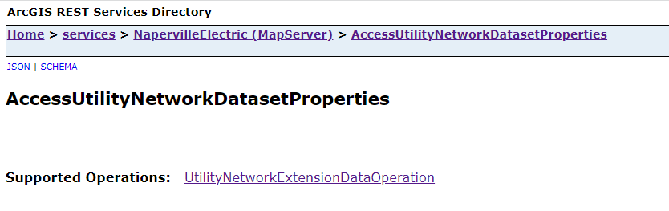
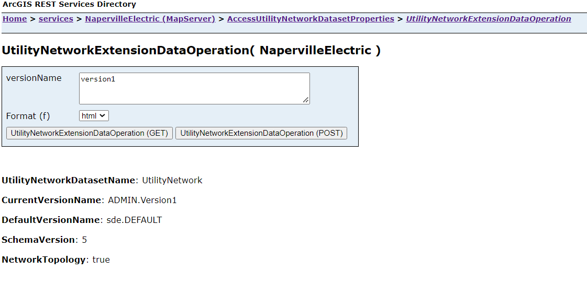

# .NET Open an Extension Dataset REST SOE

This sample demonstrates how to open and fetch properties of an extension dataset such as  Utility Network Dataset using the open extension dataset method.
The administrator that deploys this SOE must enable it on the map service that also has the Utility Network capability enabled.

Deploying the SOE from the .soe file (`..\AccessUtilityNetworkDatasetSOE\bin\Release\net6.0\AccessUtilityNetworkDatasetProperties_ent.soe`) does not require you to open Visual Studio. However, you can load the project (`AccessUtilityNetworkDatasetSOE\bin\Debug\net6.0\AccessUtilityNetworkDatasetProperties_ent.soe`) in Visual Studio to debug, modify, and recompile the SOE code.

## Features
  * Opening a Utility Network dataset (`IFeatureDataset`, `IDataset`)
  * Iterate over versions (`IEnumVersionInfo`, `IVersionInfo`)
  * Open extension dataset (`IFeatureWorkspace.OpenExtensionDataset(..)`)
  * UtilityNetwork properteis (`IBaseNetwork`, `IDEBaseNetwork`, `IBaseNetworkTopology`)


## Sample data
This sample requires the [Electric Utility Network Foundation](https://doc.arcgis.com/en/arcgis-solutions/latest/reference/use-electric-utility-network-foundation.htm) Naperville demo data to be loaded in an Enterprise Geodatabase and published as a service on ArcGIS Enterprise. Please follow the instructions provided in the above link to download, configure and publish the data.


## Instructions

### Deploy the SOE

1. Log in to ArcGIS Server Manager and click the ***Site*** tab.
2. Click ***Extensions***.
3. Click ***Add Extension***.
4. Click ***Choose File*** and choose the ***AccessUtilityNetworkDatasetProperties_ent.soe*** file (`..\AccessUtilityNetworkDatasetSOE\bin\Release\net6.0\AccessUtilityNetworkDatasetProperties_ent.soe` or `..\AccessUtilityNetworkDatasetSOE\bin\Debug\net6.0\AccessUtilityNetworkDatasetProperties_ent.soe`).
5. Click ***Add***.

### Enable the SOE on a map service

1. Make sure you have published the Naperville electric utility network service whose data source is from an Enterprise Geodatabase using ArcGIS Pro. If not, refer to [Electric Utility Network Foundation](https://doc.arcgis.com/en/arcgis-solutions/latest/reference/use-electric-utility-network-foundation.htm).
2. Log in to ArcGIS Server Manager and click the ***Services*** tab. Select the Naperville map service and select ***Capabilities***.
3. In the list of available capabilities, find ***AccessUtilityNetworkDatasetProperties_ent.soe*** and check the box to enable it.
4. Click the ***Save and Restart*** button to restart the service.

### Test the SOE in the ArcGIS Server Services Directory

1. Open a browser and navigate to the REST services endpoint of the Veg map service (URL: `http://<serverdomain>/<webadaptorname>/rest/services/<Naperville>/MapServer`).
2. Scroll to the bottom of the above page and click ***AccessUtilityNetworkDatasetProperties*** in ***Supported Extensions***. 
   
   This leads to the SOE's root page, at the following URL:

   ```
   http://<serverdomain>/<webadaptorname>/rest/services/<servicename>/MapServer/exts/AccessUtilityNetworkDatasetProperties/UtilityNetworkExtensionDataOperation
   ``` 
  
      
 

3. Click ***UtilityNetworkExtensionDataOperation*** in ***Supported Operations***. 

   Optionally, type a valid version name for querying the properties of specific dataset version in the ***where*** input box.
   
   Click the ***UtilityNetworkExtensionDataOperation*** button. You will see the UN dataset properties.

  