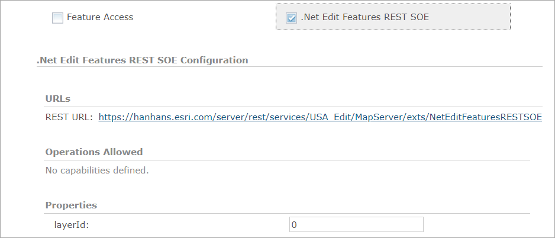
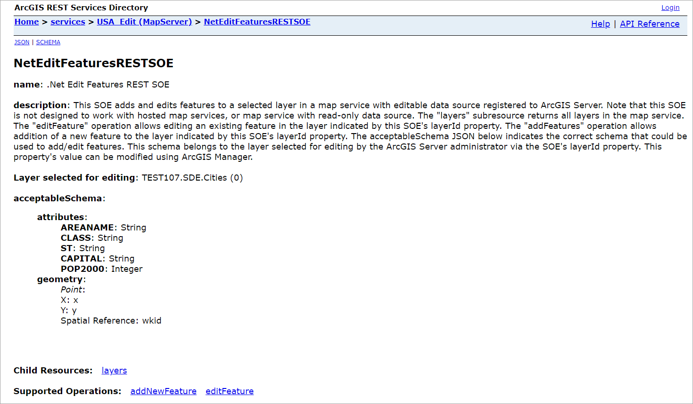
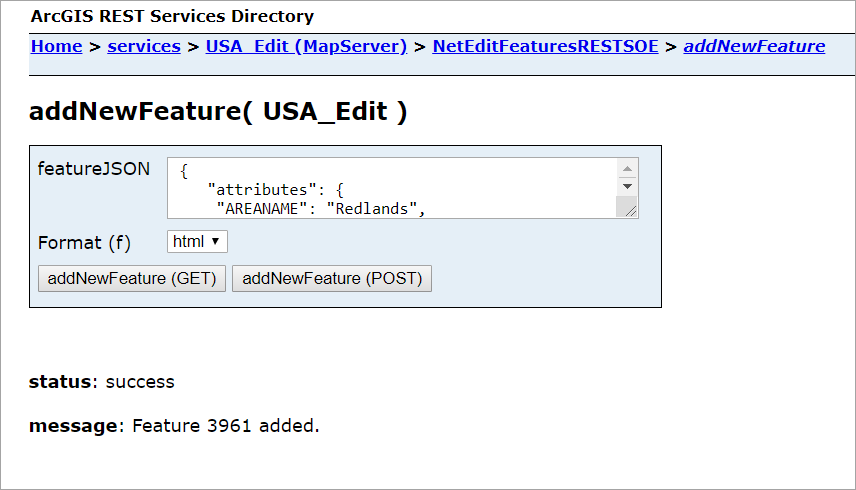
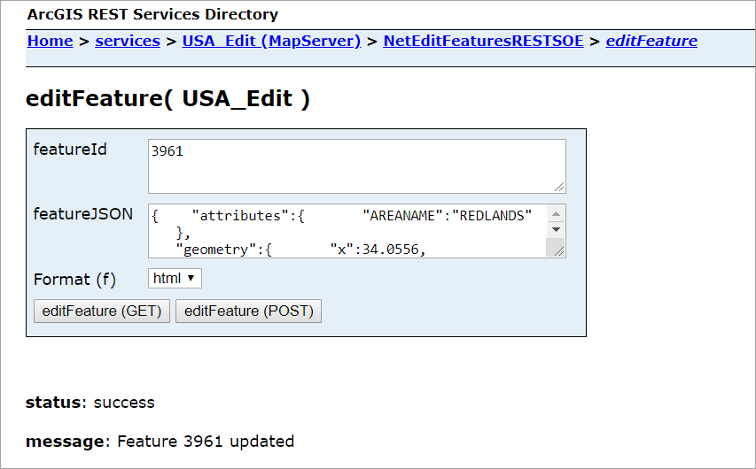

# .Net edit features REST SOE
This sample demonstrate how to edit features in layers exposed by a map service via an SOE. The EditFeatures SOE has one property called ***layerId***, which indicates the layer chosen for editing. This sample SOE also has one subresource called ***layers*** and two operations called ***editFeature*** and ***addNewFeatures***. The administrator that deploys this SOE and enables it on a map service can choose which layer to open for editing using the layerId property. Editing will be restricted to this specific layer only.

> **Note:** ***Even though the editing function is exposed via the SOE which is enabled with a map service, the editing function still requires the data source to be editable. In other words, the data used to publish the map service must be from an Enterprise Geodatabase that is registered with ArcGIS Enterprise. The map service doesn't need to have Feature Access capability enabled, but its data source must be editable and registered with ArcGIS Enterprise.***

Deploying the SOE from the .soe file (`..\EditFeaturesRESTSOE\bin\Release\NetEditFeaturesRESTSOE_ent.soe`) does not require you to open Visual Studio. However, you can load the project (`..\EditFeaturesRESTSOE\NetEditFeaturesRESTSOE.csproj`) in Visual Studio to debug, modify, and recompile the SOE code.


## Features
  * IWorkspaceEdit
  * IFeatureClass.CreateFeature()
  * ISpatialFilter
  * IJSONConverterGeometry


## Sample data
This instruction uses the [USA map service](../../../ReadMe.md#1-usa-service) as the sample service to test with the SOE. Make sure its data source is from an Enterprise Geodatabase and registered with ArcGIS Enterprise.


## Instructions

### Deploy the SOE

1. Log in to ArcGIS Server Manager and click the ***Site*** tab.
2. Click ***Extensions***.
3. Click ***Add Extension***.
4. Click ***Choose File*** and choose the ***NetEditFeaturesRESTSOE_ent.soe*** file (`..\EditFeaturesRESTSOE
\bin\Release\NetEditFeaturesRESTSOE_ent.soe` or `..\EditFeaturesRESTSOE\bin\Debug\NetEditFeaturesRESTSOE_ent.soe`).
5. Click ***Add***.

### Enable the SOE on a map service

1. Make sure you have published the USA map service whose data source is from an editable workspace using ArcGIS Pro. If not, refer to [USA map service](../../../ReadMe.md#2-veg-service).
2. Log in to ArcGIS Server Manager and click the ***Services*** tab. Select USA map service and select ***Capabilities***.
3. In the list of available capabilities, find ***.Net Edit Features REST SOE*** and check the box to enable it.
4. Under ***Properties*** section, make sure that ***layerId*** is set to the layer you would like to edit. In this sample, we can set it to `0`, which is the Cities layer.



5. Click the ***Save and Restart*** button to restart the service.

### Test the SOE in the ArcGIS Server Services Directory

1. Open a browser and navigate to the REST services endpoint of the Veg map service (URL: `http://<serverdomain>/<webadaptorname>/rest/services/<editable USA>/MapServer`).
2. Scroll to the bottom of the above page and click ***NetEditFeaturesRESTSOE*** in ***Supported Extensions***. 
   
   This leads to the SOE's root page, at the following URL:

   ```
   http://<serverdomain>/<webadaptorname>/rest/services/Veg/MapServer/exts/NetFindNearFeaturesRESTSOE
   ```
   
   
3. Click ***addNewFeature*** in ***Supported Operations***. 

   Type the following JSON in the ***featureJSON*** input box:
   ``` JSON
   { 
      "attributes":{ 
         "AREANAME":"Redlands",
         "CLASS":"city",
         "ST":"CA",
         "CAPITAL":"N"
      },
      "geometry":{ 
         "x":34,
         "y":-117,
         "spatialReference":{ 
            "wkid":4326
         }
      }
   }
   ```
   Click the ***addNewFeature*** button. You will receive a response indicating this request succeeded and returning the ID of the newly-added feature returned.
   
      
4. Perform the following ***Query*** operation to confirm the feature is added:

   ```
   https://<serverdomain>/<webadaptorname>/rest/services/USA_Edit/MapServer/0/query?where=&text=&objectIds=3961&time=&geometry=&geometryType=esriGeometryEnvelope&inSR=&spatialRel=esriSpatialRelIntersects&distance=&units=esriSRUnit_Foot&relationParam=&outFields=*&returnGeometry=true&returnTrueCurves=false&maxAllowableOffset=&geometryPrecision=&outSR=&having=&returnIdsOnly=false&returnCountOnly=false&orderByFields=&groupByFieldsForStatistics=&outStatistics=&returnZ=false&returnM=false&gdbVersion=&historicMoment=&returnDistinctValues=false&resultOffset=&resultRecordCount=&returnExtentOnly=false&datumTransformation=&parameterValues=&rangeValues=&quantizationParameters=&featureEncoding=esriDefault&f=html
   ```
   The `objectIds` input parameter is set to the new feature ID returned in the previous step. The ***Query*** operation should return the newly-added feature successfully.

5. Click ***editFeature*** in ***Supported Operations*** on the SOE's root page. 

   Type the same feature ID in the ***featureId*** input box and the following updated feature JSON in the ***featureJSON*** input box. 
   
   
   ``` JSON
   { 
      "attributes":{ 
         "AREANAME":"REDLANDS"
      },
      "geometry":{ 
         "x":34.0556,
         "y":-117.1825,
         "spatialReference":{ 
            "wkid":4326
         }
      }
   }
   ```
   Click the ***editFeature*** button. You will receive a response indicating this request succeeded and returning the ID of the feature that has been updated. You can also repeat the last step to confirm this updated result by performing a ***Query*** operation.
   
      
4. Perform the following ***Query*** operation to confirm the feature is added:
