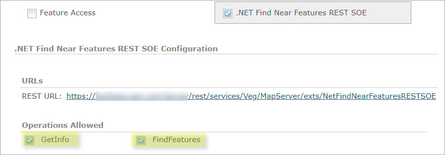
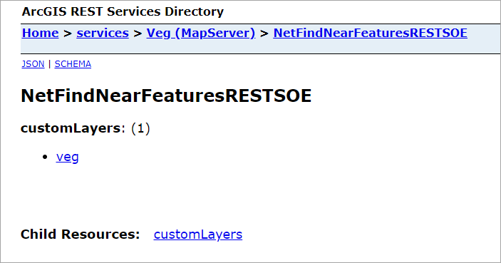
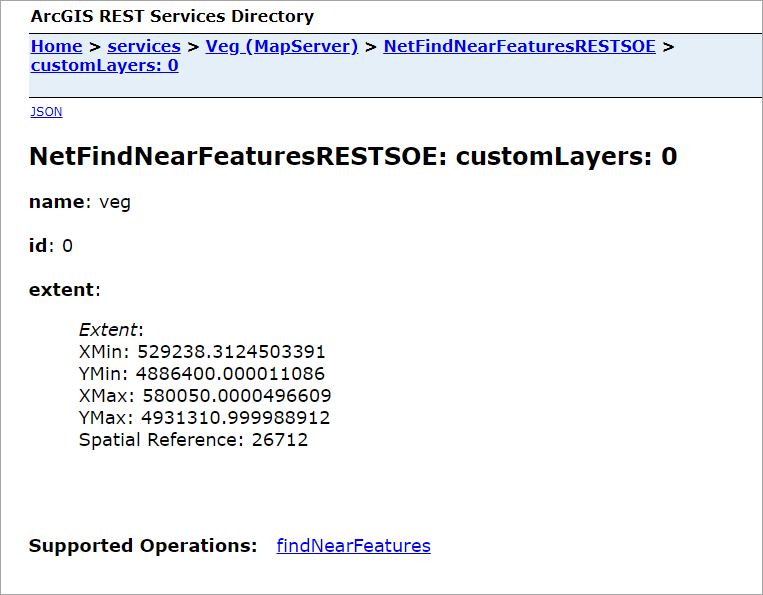
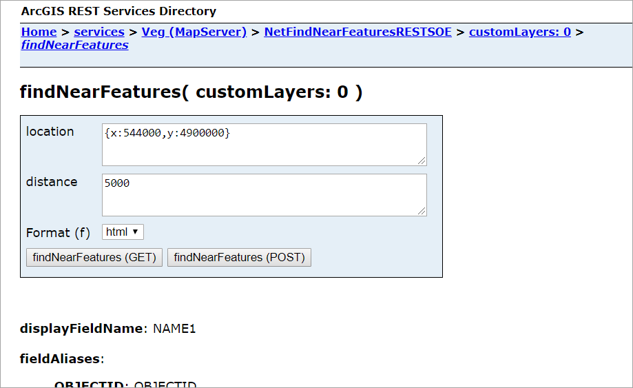

# .NET find nearby features REST SOE
This sample illustrates how to develop a REST server object extension (SOE) with a new spatial query operation. The spatial query operation returns all the features of a map service layer that fall within the user-defined search distance of a location point.

Deploying the SOE from the .soe file (`..\FindNearFeaturesRESTSOE\bin\Release\NetFindNearFeaturesRESTSOE_ent.soe`) does not require you to open Visual Studio. However, you can load the project (`..\FindNearFeaturesRESTSOE\NetFindNearFeaturesRESTSOE.csproj`) in Visual Studio to debug, modify, and recompile the SOE code.


## Features
  * RestOperation
  * RestResource
  * ISpatialFilter
  * IMapServer.QueryData()
  * CustomLayerInfo


## Sample data
This sample uses the [Vegetation map service](https://github.com/Esri/arcgis-enterprise-sdk-resources/tree/master/Samples) as the sample service to test with the SOE.


## Instructions

### Deploy the SOE

1. Log in to ArcGIS Server Manager and click the ***Site*** tab.
2. Click ***Extensions***.
3. Click ***Add Extension***.
4. Click ***Choose File*** and choose the ***NetFindNearFeaturesRESTSOE_ent.soe*** file (`..\FindNearFeaturesRESTSOE\bin\Release\NetFindNearFeaturesRESTSOE_ent.soe` or `..\FindNearFeaturesRESTSOE\bin\Debug\NetFindNearFeaturesRESTSOE_ent.soe`).
5. Click ***Add***.

### Enable the SOE on a map service

1. Make sure you have published the Vegetation map service using ArcGIS Pro. If not, refer to [Vegetation map service](https://github.com/Esri/arcgis-enterprise-sdk-resources/tree/master/Samples).
2. Log in to ArcGIS Server Manager and click the ***Services*** tab. Select Vegetation map service and select ***Capabilities***.
3. In the list of available capabilities, find ***.NET Find Near Features REST SOE*** and check the box to enable it.
4. Make sure the SOE is selected.
<<<<<<< HEAD
=======
5. Under ***Operations Allowed*** section, make sure to check both ***GetInfo*** and ***FindFeatures***.
>>>>>>> master

5. Under ***Operations Allowed*** section, make sure to check both ***GetInfo*** and ***FindFeatures***.

   

### Test the SOE in the ArcGIS Server Services Directory

1. Open a browser and navigate to the REST services endpoint of the Vegetation map service (URL: `http://<serverdomain>/<webadaptorname>/rest/services/Veg/MapServer`).
2. Scroll to the bottom of the above page and click ***NetFindNearFeaturesRESTSOE*** in ***Supported Extensions***. 
   
   This leads to the SOE's root page, at the following URL:

   ```
   http://<serverdomain>/<webadaptorname>/rest/services/Veg/MapServer/exts/NetFindNearFeaturesRESTSOE
   ```
3. Click ***customLayers*** child resource. 

   You should be able to see the `customLayers` JSON returned, with each layer's name, id, and extent.
   
   
   
4. Navigate back to the SOE's root page. Click ***veg***. 
 
   This leads to the ***customLayers: 0*** child resource, which represents the ***veg*** layer defined as the `customLayer`.

   

5. Click ***findNearFeatures*** in ***Supported Operations***. 

   Type `{x:544000,y:4900000}` in the ***location*** box and `5000` in the ***distance*** box. The features within 5000 meters of the location point (x:544000, y:4900000) will be returned. Click the ***findNearFeatures*** button. You will see the JSON of 38 features returned.

   
   
