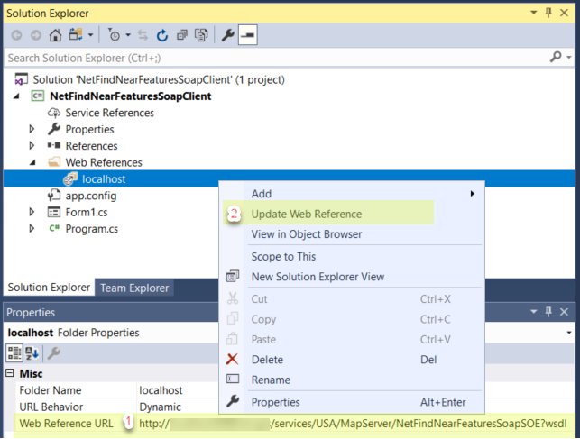

# .NET find near features SOAP SOE
This sample illustrates how to develop a SOAP server object extension (SOE) with new methods that can return service layer information and perform a spatial query to find features near a location. The FindNearFeatures method returns the features of a user-defined layer that fall within the search distance of a location point.

This sample is divided into the following parts:

- The SOE implementation, which receives SOAP messages, processes requests, and generates SOAP responses.
- A simple desktop client to consume the custom SOE via SOAP.

Deploying the SOE from the .soe file (`..\bin\Release\NetFindNearFeaturesSoapSOE_ent.soe`) does not require you to open Visual Studio. However, you can load the project (`..\FindNearFeaturesSOAPSOE\NetFindNearFeaturesSoapSOE.sln`) in Visual Studio to debug, modify, and recompile the SOE code.


## Features
  * IRequestHandler2
  * IMessage
  * IXMLSerializeData
  * Create SOAP SOE methods
  * SOAP capabilities
  * Spatial query


## Sample data
  Any dynamic map service published from ArcGIS Pro. This instruction uses the [USA map service](https://github.com/Esri/arcgis-enterprise-sdk-resources/tree/master/Samples) as the sample service to test with the SOE.


## Instructions

### Deploy the SOE

1. Log in to ArcGIS Server Manager and click the ***Site*** tab.
2. Click ***Extensions***.
3. Click ***Add Extension***.
4. Click ***Choose File*** and choose the ***NetFindNearFeaturesSoapSOE_ent.soe*** file (`..bin\Release\NetFindNearFeaturesSoapSOE_ent.soe` or `..\bin\Debug\NetFindNearFeaturesSoapSOE_ent.soe`).
5. Click ***Add***.

### Enable the SOE on a map service

1. Make sure you have published the USA map service using ArcGIS Pro. If not, refer to [USA map service](https://github.com/Esri/arcgis-enterprise-sdk-resources/tree/master/Samples)
2. Log in to ArcGIS Server Manager and click the ***Services*** tab. Select USA map service and select ***Capabilities***.
3. In the list of available capabilities, find ***.NET Find Near Features SOAP SOE*** and check the box to enable it.
4. Click the ***Save and Restart*** button to restart the service.

### Test the SOE in the .NET SOAP client
1. In Visual Studio, open the ***FindNearFeaturesSoapClient*** solution (`NetFindNearFeaturesSoapClient.sln`). 

   The application contains a simple Windows form with buttons and a text box. A ***Web Reference*** has been added to the project to reference the SOE SOAP endpoint. 
2. Update the ***Web Reference***.
   1. Make sure the USA Map service Sharing properties is shared with ***Everyone(public)***.
   2. Right-click the ***Web Reference*** folder in ***Solution Explorer***.
   3. Click ***Properties***.
   4. Ensure that the ***Web Reference URL*** matches your own SOE's WSDL URL. The URL is in the following format:
      ```
      http://<serverdomain>/<webadaptorname>/services/USA/MapServer/FindNearFeaturesSoapSOE?wsdl
      ```
   5. Click ***Update Web Reference***.
   
      
3. Update the service reference and URL in the code behind (Form1.cs).
   1. Open Form1.cs.
   2. Find the following two lines of code in each click event for the buttons:
   
      ``` c#
      var nearFeatsService = new localhost.USA_NetFindNearFeaturesSoapSOE();
      nearFeatsService.Url = "https://<serverdomain>/<webadaptorname>/services/USA/MapServer/NetFindNearFeaturesSoapSOE";
      ```
   3. Ensure that `nearFeatsService` references your SOAP SOE and `nearFeatsService.Url` is correct
4. Run the application and click the buttons. 
   
   Layer information for all layers and features near the center of the default map extent for the service will be returned. All returned content displays in the rich text box in the form.

### Test the SOE by sending XML requests in other SOAP clients
1. To test this SOE's ***GetLayerInfos*** operation in a SOAP client, you can try with the following request:

    ``` xml
   <soapenv:Envelope xmlns:soapenv="http://schemas.xmlsoap.org/soap/envelope/" xmlns:ns="http://examples.esri.com/schemas/NetFindNearFeaturesSoapSOE/1.0">
      <soapenv:Header/>
      <soapenv:Body>
         <ns:GetLayerInfos/>
      </soapenv:Body>
   </soapenv:Envelope>
   ```
2. To test the ***FindNearFeatures*** operation, try with this request:

   ``` xml
   <soapenv:Envelope xmlns:soapenv="http://schemas.xmlsoap.org/soap/envelope/" xmlns:ns="http://examples.esri.com/schemas/NetFindNearFeaturesSoapSOE/1.0" xmlns:xsi="http://www.w3.org/2001/XMLSchema-instance" xmlns:xsd="http://www.w3.org/2001/XMLSchema" xmlns:esri="http://www.esri.com/schemas/ArcGIS/2.5.0">
      <soapenv:Header/>
      <soapenv:Body>
         <ns:FindNearFeatures>
            <LayerID>0</LayerID>
		 <Location xsi:type="esri:PointN">
			 <X>-110</X>
			 <Y>30</Y>
		 </Location>
            <Distance>2</Distance>
         </ns:FindNearFeatures>
      </soapenv:Body>
   </soapenv:Envelope>
   ```
