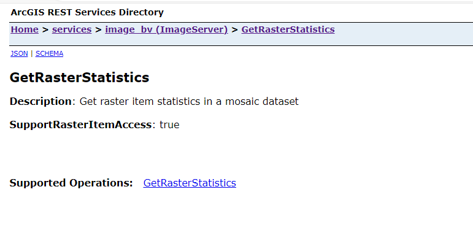
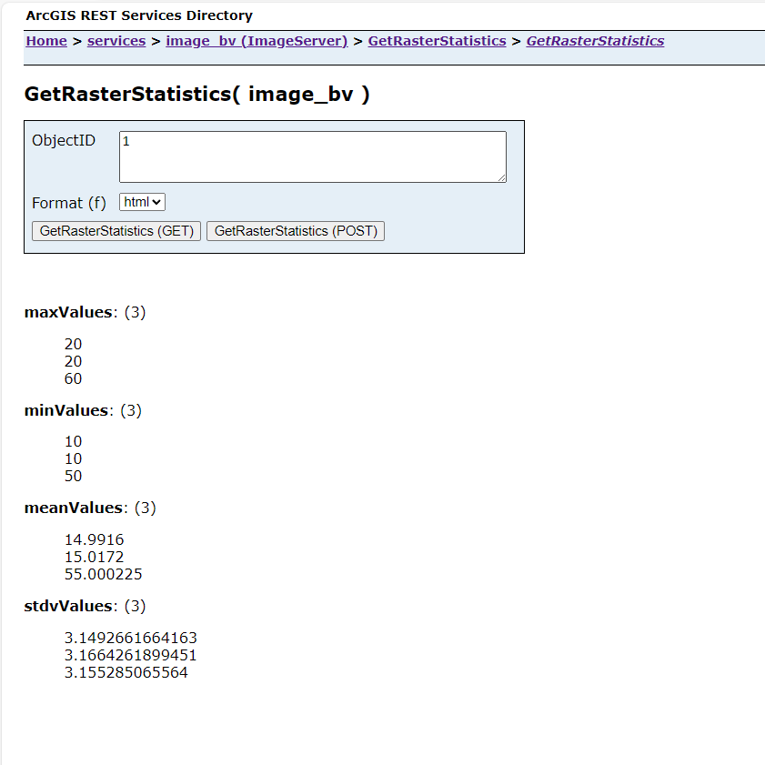

# .NET Get Raster Statistics REST SOE

This sample illustrates how to develop a REST server object extension (SOE) with Image Service. The SOE generates could performance the raster statistics. 

Deploying the SOE from the .soe file (`..\bin\debug\net8.0\ein-x64\GetRasterStatisticsSOE_ent.soe`) require you to open Visual Studio and build to generate the SOE. However, you can load the project (`..\GetRasterStatisticsSOE\GetRasterStatisticsSOE.csproj`) in Visual Studio to debug, modify, and recompile the SOE code.

## Features

* Mosaic Data
* How to initialize Image Server: 

```cs
 public void Construct(IPropertySet props)
 {
    
     IImageServerInit imageServer = (IImageServerInit)_serverObjectHelper.ServerObject;
     IName mosaicName = imageServer.ImageDataSourceName;
     if (mosaicName is IMosaicDatasetName)
     {
         IMosaicDataset md = (IMosaicDataset)mosaicName.Open();
         _mosaicCatalog = md.Catalog;
         _supportRasterItemAccess = true;
     }
     else
         _supportRasterItemAccess = false;
 }
```


## Sample data

Any Image Service published from ArcGIS Pro or from ArcGIS Admin Rest API. 


## Instructions

### Deploy the SOE

1. Log in to ArcGIS Server Manager and click the ***Site*** tab.
2. Click ***Extensions***.
3. Click ***Add Extension***.
4. Click ***Choose File*** and choose the ***GetRasterStatisticsSOE_ent.soe*** file (`..\bin\debug\net8.0\ein-x64\GetRasterStatisticsSOE_ent.soe`).
5. Click ***Add***.

### Enable the SOE on a map service

1. Make sure you have published Image Service.
2. Log in to ArcGIS Portal Home Application and click the ***Services*** tab. Select the Image service and select ***Settings***->***Extensions*** and then expand the ***Extensions***.
3. In the list of available capabilities, find ***GetRasterStatisticsSOE_ent.soe*** and enable it.
4. Click the ***Save and Restart*** button to restart the service.

### Test the SOE in the ArcGIS Server Services Directory

1. Open a browser and navigate to the REST services endpoint of the Image service (URL: `http://<serverdomain>/<webadaptorname>/rest/services/name/ImageServer`).
2. Scroll to the bottom of the above page. Find ***GetRasterStatistics*** in ***Supported Extensions***.
3. Click the SOE name, which leads to the following URL:

   ```
   http://<serverdomain>/<webadaptorname>/rest/services/name/ImageServer/exts/GetRasterStatistics
   
   ```

   This SOE root resource page displays the SOE's description: Get raster item statistics in a mosaic dataset. And showing SupportRasterItemAccess: true



4. Click the ***GetRasterStatistics*** operation.

5. Type in a number in the ***ObjectID*** box.  Click the ***GetRasterStatistics(GET)*** button.Raster Statistics results show as below screen shot:



