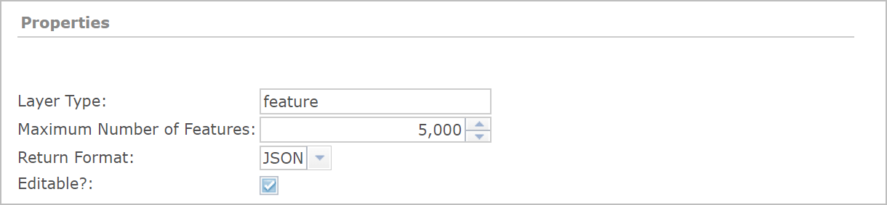
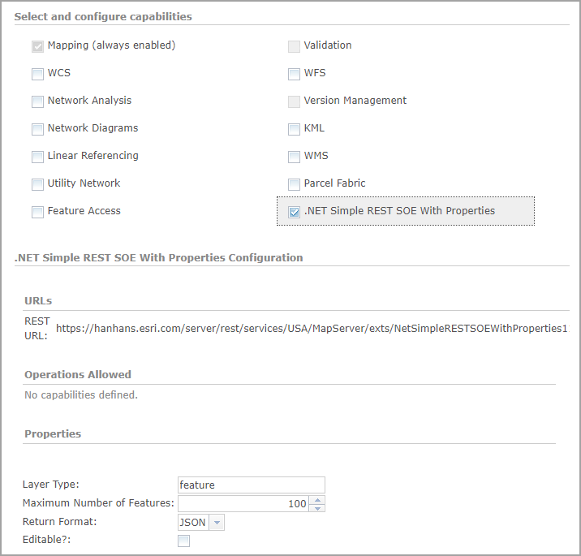
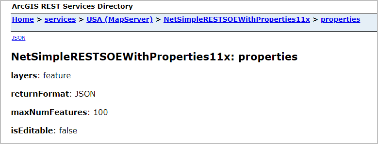

# .NET simple REST SOE with properties

This sample illustrates how to develop a REST server object extension (SOE) with properties and a custom property page for ArcGIS Server Manager. These properties appear in ArcGIS Server Manager and can be changed by the server administrator.



<!--Creating a custom property page requires the knowledge of JavaScript and web forms development using HTML. If you are not familiar with JavaScript, you can start from the default properties (`HasManagerPropertiesConfigurationPane = false`) and explore whether the default properties will meet your needs. They appear as textboxes in server manager, whereas the custom property page allows more widgets, such as checkbox, drop-down select box, etc., which provides a better user interface for managing those properties.-->

Deploying the SOE from the .soe file (`..\bin\Release\NetSimpleRESTSOEWithProperties11x_ent.soe`) does not require you to open Visual Studio. However, you can load the project (`..\NetRESTSOEProperties.csproj`) in Visual Studio to debug, modify, and recompile the SOE code.


## Features
  * SOE properties
  * Custom property page


## Sample data
  Any dynamic map service published from ArcGIS Pro. This instruction uses the [USA map service](../../../ReadMe.md#1-usa-service) as the sample service to test with the SOE.


## Instructions
- ### Deploy the SOE
1. Log in to ArcGIS Server Manager and click the ***Site*** tab.
2. Click ***Extensions***.
3. Click ***Add Extension***.
4. Click ***Choose File*** and choose the ***NetSimpleRESTSOEWithProperties11x_ent.soe*** file (`..\bin\Release\NetSimpleRESTSOEWithProperties11x_ent.soe` or `..\bin\Debug\NetSimpleRESTSOEWithProperties11x_ent.soe`).
5. Click ***Add***.

- ### Enable the SOE on a map service
1. Make sure you have published the USA map service using ArcGIS Pro. If not, refer to [USA map service](../../../ReadMe.md#1-usa-service)
2. Log in to ArcGIS Server Manager and click the ***Services*** tab. Select USA map service and select ***Capabilities***.
3. In the list of available capabilities, find ***.Net Simple REST SOE with Properties*** and check the box to enable it.
4. Make sure the SOE is selected. Notice four properties appear in the ***Properties*** section.

   
5. Click the ***Save and Restart*** button to restart the service.

### Test the SOE in the ArcGIS Server Services Directory

1. Open a browser and navigate to the REST services endpoint of the USA map service (URL: `http://<serverdomain>/<webadaptorname>/rest/services/USA/MapServer`).
2. Scroll to the bottom of the above page. Click ***NetSimpleRESTSOEWithProperties11x*** in ***Supported Extensions***.

   This leads to the following URL:

   ```
   http://<serverdomain>/<webadaptorname>/rest/services/USA/MapServer/exts/NetSimpleRESTSOEWithProperties11x
   ```

   This SOE root resource page displays the SOE's name, description, and its child resources.
3. Click the ***properties*** sub-resource and it returns the name and value of the four properties.

   
4. Navigate back to the service's ***Capabilities*** page in ArcGIS Server Manager again.

   Modify the values of the properties and click the ***Save and Restart*** button to restart the service.

   Repeat step 3 and you will notice the updated property values are returned.
