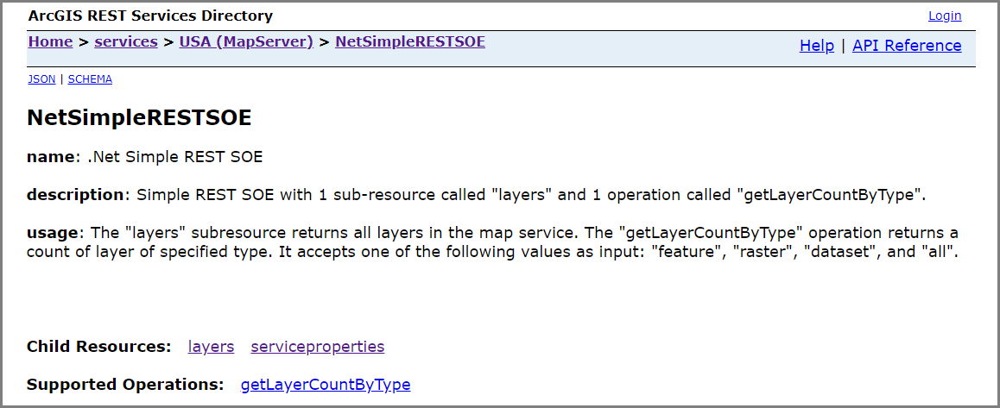
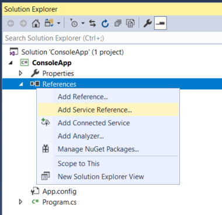
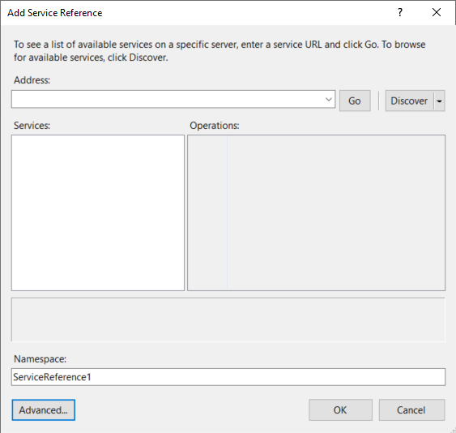
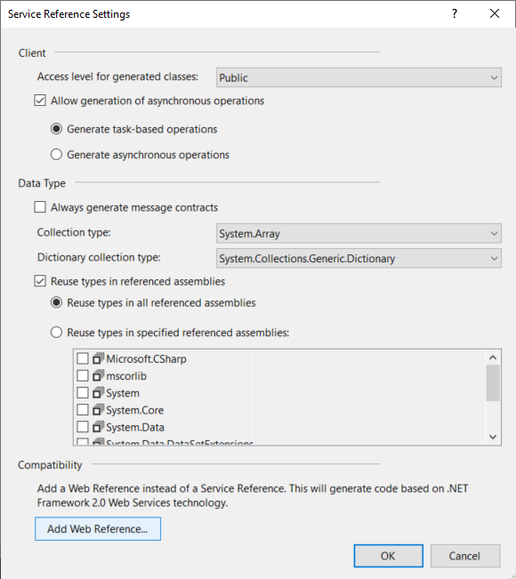
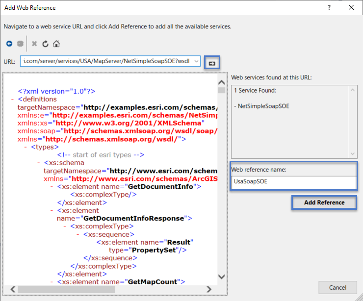
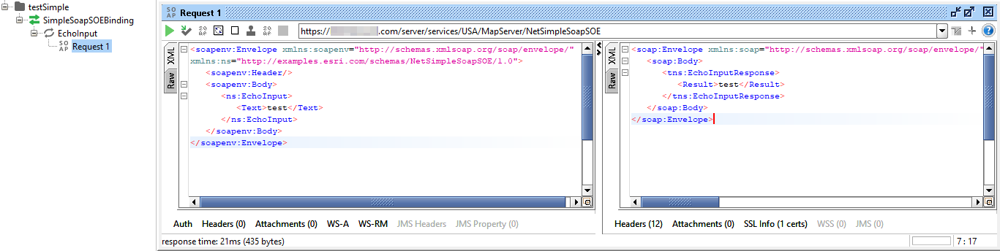

# .NET simple SOAP SOE
This sample illustrates how to develop a SOAP server object extension (SOE) with a new service method. This new method takes the input text to echo as a SOAP response.

<!---->
This sample is divided into the following parts:

- The SOE implementation, which receives SOAP messages, processes requests, and generates SOAP responses.
- A simple desktop client to consume the custom SOE via SOAP.

Deploying the SOE from the .soe file (`..\SimpleSoapSOE\bin\Release\NetSimpleSoapSOE_ent.soe`) does not require you to open Visual Studio. However, you can load the project (`..\SimpleSoapSOE\NetSimpleSoapSOE.csproj`) in Visual Studio to debug, modify, and recompile the SOE code.


## Features
  * IRequestHandler2
  * IMessage
  * IXMLSerializeData
  * Create SOAP SOE methods
  * Build a .NET SOAP client application


## Sample data
  Any dynamic map service published from ArcGIS Pro. This instruction uses the [USA map service](https://github.com/Esri/arcgis-enterprise-sdk-resources/tree/master/Samples) as the sample service to test with the SOE.


## Instructions

### Deploy the SOE

1. Log in to ArcGIS Server Manager and click the ***Site*** tab.
2. Click ***Extensions***.
3. Click ***Add Extension***.
4. Click ***Choose File*** and choose the ***NetSimpleSoapSOE_ent.soe*** file (`..\SimpleSoapSOE\bin\Release\NetSimpleSoapSOE_ent.soe` or `..\SimpleSoapSOE\bin\Debug\NetSimpleSoapSOE_ent.soe`).
5. Click ***Add***.

### Enable the SOE on a map service

1. Make sure you have published the USA map service using ArcGIS Pro. If not, refer to [USA map service](https://github.com/Esri/arcgis-enterprise-sdk-resources/tree/master/Samples)
2. Log in to ArcGIS Server Manager and click the ***Services*** tab. Select USA map service and select ***Capabilities***.
3. In the list of available capabilities, find ***.NET Simple SOAP SOE*** and check the box to enable it.
4. Click the ***Save and Restart*** button to restart the service.

### Use a .NET SOAP client to test the SOE

1. Create a new console application in Visual Studio.
2. Add the SOAP SOE's WSDL as Web Reference:
<<<<<<< HEAD
    1. Make sure the USA map service's Sharing properties is shared with ***Everyone(public)***.
    2. Copy the SOE's SOAP URL from the service page in ArcGIS Server Manager.
=======
   1. Make sure the USA map service's ***Sharing properties*** is shared with ***Everyone(public)***.
   2. Copy the SOE's SOAP URL from the service page in ArcGIS Server Manager.

>>>>>>> master
   The URL should be a valid WSDL URL in the following format:

   ```
   https://<serverdomain>/<webadaptorname>/services/USA/MapServer/NetSimpleSoapSOE?wsdl
   ```

   2. Right click ***References*** > ***Add Service Reference...***

       
   3. Click ***Advanced...***

       
   4. Click ***Add Web Reference...***

      
   5. Paste the URL obtained from step i in the ***URL*** text box.

      Click the arrow button.

      In the ***Web reference name:*** text box, type in a name for the SOE's SOAP endpoint.

      Click ***Add Reference***.

      
3. Copy the following code in your console application:

    ```c#
    while(true)
    {
        Console.WriteLine("Please enter your input:");
        string inputText = Console.ReadLine();
        //UsaSoapSOE namespace is the Web Reference Name defined in step 2.
        //USA_NetSimpleSoapSOE is automatically-determined by your service name and SOE name.
        //Use the IntelliSense to help your find the reference to it if your service is not called USA.
        UsaSoapSOE.USA_NetSimpleSoapSOE soapSOE = new UsaSoapSOE.USA_NetSimpleSoapSOE();
        string soapSoeResponseContent = soapSOE.EchoInput(inputText);
        Console.WriteLine("SOAP SOE response: " + soapSoeResponseContent);
    }
    ```
4. Run this console application. You should be able to receive the echoed response as the following command line outputs:

    ```
    Please enter your input:
    test1
    SOAP SOE response: test1
    Please enter your input:
    test2
    ```

### Use other SOAP client to test the SOE

Other SOAP clients, such as [SoapUI](https://www.soapui.org/downloads/soapui.html), can also be used to test this SOAP SOE. By providing the SOAP client the SOE's SOAP WSDL URL, an XML request can be sent from the client application and a valid response should be returned.


