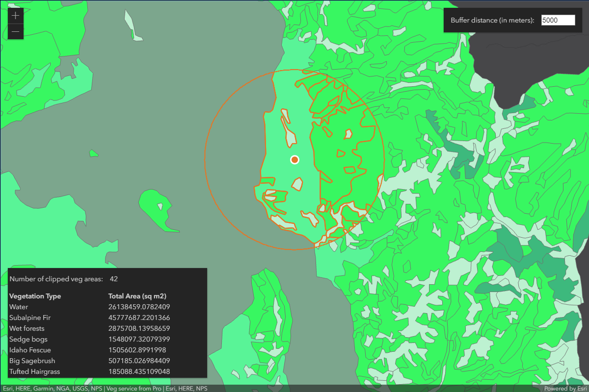
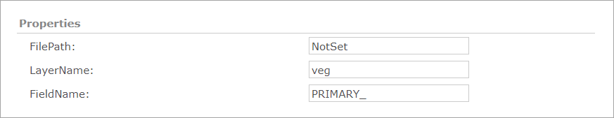
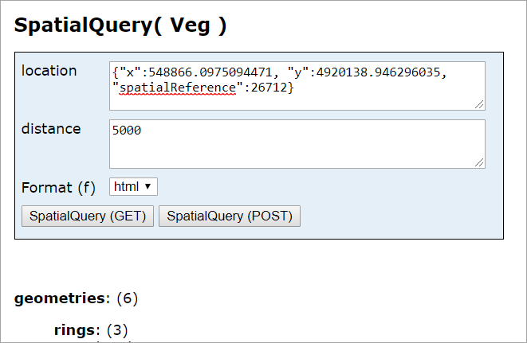

# .NET spatial query REST SOE

This sample illustrates how to develop a REST server object extension (SOE) with a spatial query operation. The spatial query operation returns all the features of a map service layer that fall within the user-defined search distance of a location point. The location point and the search distance are the input parameters of the REST operation, which generate a search buffered area. This SOE will return the features that are within the buffered area and also a summary of the total areas by those features' vegetation types. At last, a JavaScript client application is provided with this sample to demonstrate how to consume this SOE's spatial query operation.



## Features

* Spatial Query
* Conversion.ToGeometry()
* ISpatialFilter
* ITopologicalOperator
* Default SOE properties

## Sample data

This sample uses the [Vegetation map service](https://github.com/Esri/arcgis-enterprise-sdk-resources/tree/master/Samples) as the sample service to test with the SOE.


## Instructions

### Deploy the SOE

1. Log in to ArcGIS Server Manager and click the ***Site*** tab.
2. Click ***Extensions***.
3. Click ***Add Extension***.
4. Click ***Choose File*** and choose the ***SpatialQueryREST_ent.soe*** file (`..\bin\Release\SpatialQueryREST_ent.soe` or `..\bin\Debug\SpatialQueryREST_ent.soe`).
5. Click ***Add***.

### Enable the SOE on a map service

1. Make sure you have published the Vegetation map service using ArcGIS Pro. If not, refer to [Vegetation map service](https://github.com/Esri/arcgis-enterprise-sdk-resources/tree/master/Samples).
2. Log in to ArcGIS Server Manager and click the ***Services*** tab. Select the Vegetation map service and select ***Capabilities***.
3. In the list of available capabilities, find ***.Net Spatial Query REST SOE*** and check the box to enable it.
4. Keep the SOE selected to check the SOE's properties. Leave them as their default values.

   
5. Click the ***Save and Restart*** button to restart the service.

### Test the SOE in the ArcGIS Server Services Directory

1. Open a browser and navigate to the REST services endpoint of the Vegetation map service (URL: `http://<serverdomain>/<webadaptorname>/rest/services/Veg/MapServer`).
2. Scroll to the bottom of the above page. Click ***SpatialQueryREST*** in ***Supported Extensions***.
3. Click ***SpatialQuery*** at ***Supported Operations***, which leads to the following URL:

   ```
   http://<serverdomain>/<webadaptorname>/rest/services/Veg/MapServer/exts/SpatialQueryREST/SpatialQuery
   ```
3. In location box, paste the following text: `{"x":548866.0975094471, "y":4920138.946296035, "spatialReference":26712}`
4. In distance box, paste the following test: `5000`
5. Click the ***SpatialQuery(Get)*** button. You should be able to see a valid result:

   
   
### Test the SOE in a JavaScript REST application
1. Open the [SpatialQueryClient.html](SpatialQueryClient.html) file in an editor.
2. Modify ***soeURL*** at Ln 51 and ***serviceURL*** at Ln 52 to reflect your own service. 
3. Save the code and deploy this JavaScript application.
4. Open this application on a browser and click on the map.
5. You should be able to see the clipped features on the map and a summary table showing the vegetation type and total area as the following:

   
