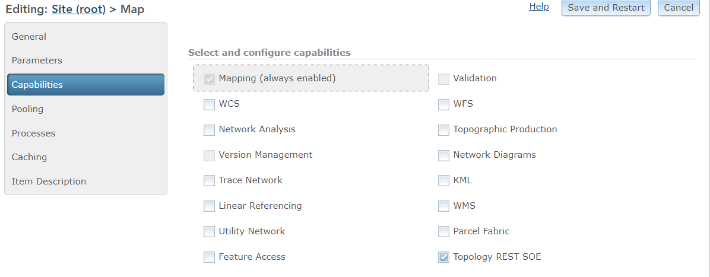
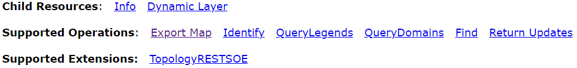
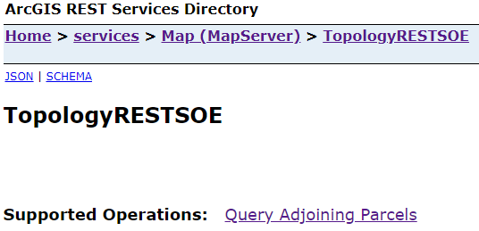
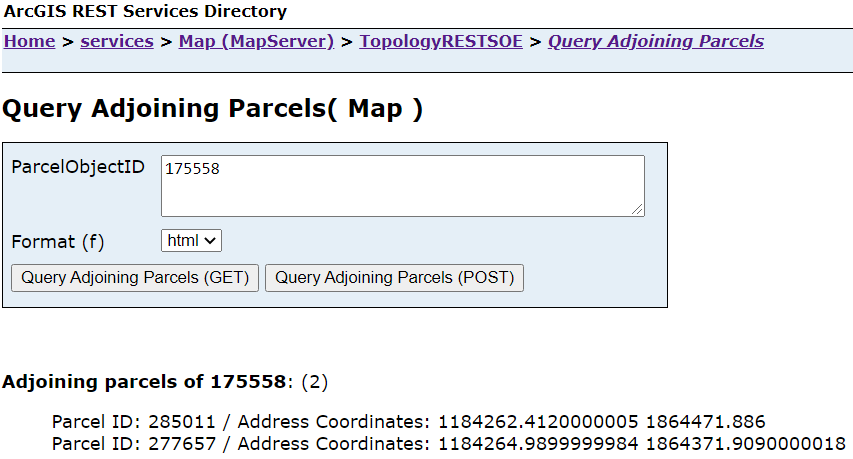

# Topology REST SOE

This sample demonstrates how to use the topology API to build a topology graph and traverse it to return topological elements within the graph extent. The REST server object extension (SOE) has one operation called **Query Adjoining Parcels**. It takes a parcel feature’s **ObjectID** as the input parameter, then builds a topology graph around the specified parcel feature, next performs graph traversal, and finally returns a list of adjoining parcels and their addresses from the result of graph traversal.

Deploying the SOE from the .soe file (`..\TopologyRESTSOE\bin\Release\net6.0\TopologyRESTSOE_ent.soe`) does not require you to open Visual Studio. However, you can load the project (`..\TopologyRESTSOE\TopologyRESTSOE.csproj`) in the Visual Studio to debug, modify, and recompile the SOE code. Constants' values may need to change. 


## Features

* Opening a topology from the feature dataset (`ITopology`, `ITopologyContainer`)
* Building a topology graph (`ITopologyGraph`)
* Traversing a topology graph (`HitTest()`, `ITopologyElement`, `esriTopologyParent`)


## Sample data

The SOE example uses the sample file geodatabase available in [ArcGIS Online](https://www.arcgis.com/home/item.html?id=e3c819fb20f04211805adfae425f2b4c). Download and extract this data to ***C:\Data\\***, so the final geodatabase path will be ***C:\Data\CookCounty.gdb***. *(NOTE: The ArcGIS server account may need permission to access the file geodatbase.)*

## Instructions

### Deploy the SOE

1. Log in to the ArcGIS Server Manager and click the ***Site*** tab.
2. Click ***Extensions***.
3. Click ***Add Extension***.
4. Click ***Choose File*** and choose the ***TopologyRESTSOE_ent.soe*** file (`..\TopologyRESTSOE\bin\Release\net6.0\TopologyRESTSOE_ent.soe`).
5. Click ***Add***.

### Enable the SOE on a map service

1. Make sure you have a pre-published map service using ArcGIS Pro. If not, refer to [USA map service](https://github.com/Esri/arcgis-enterprise-sdk-resources/tree/master/Samples) to publish a new map service.
2. Log in to the ArcGIS Server Manager and click the ***Services*** tab. Then Select the map service and select ***Capabilities***.
3. In the list of available capabilities, find ***Topology REST SOE*** and check the box to enable it.
4. Click the ***Save and Restart*** button to restart the service.

   

### Test the SOE in the ArcGIS Server Services Directory

1. Open a browser and navigate to the REST services endpoint of the map service (URL: `http://<serverdomain>/<webadaptorname>/rest/services/< Map>/MapServer`).
2. Scroll to the bottom of the above page. Find ***TopologyRESTSOE*** in ***Supported Extensions***.

   

3. Click the SOE name, which leads to the following URL, and then click the ***Query Adjoining Parcels*** operation
   ```
   http://<serverdomain>/<webadaptorname>/rest/services/<servicename>/MapServer/exts/TopologyRESTSOE
   ```
   This SOE root resource page displays the SOE's name, description, usage, along with the Child Resources and Supported Operations.

   

4. Enter the parcel ObjectID and hit the ***Query Adjoining Parcels (GET)*** button. You will see a list of Parcel Ids and their addresses as a result.
   

   Location of the parcel(175558) and its adjoining neighbors in the ArcGIS Pro
   
