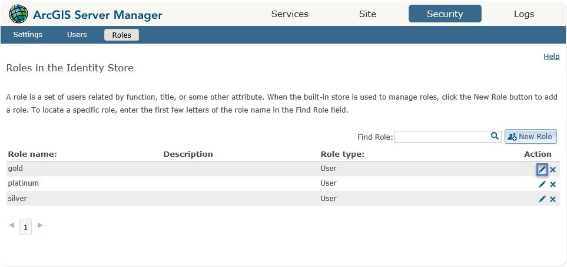
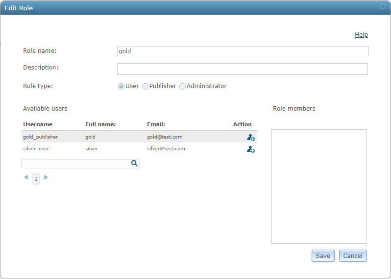
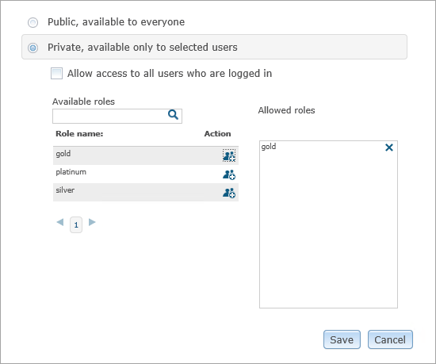
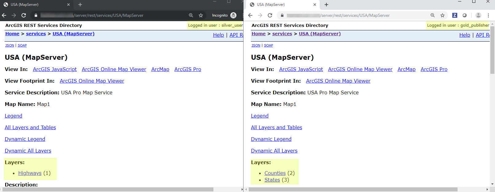

# .NET layer access SOI

This sample illustrates the following areas:
* **How to handle REST, SOAP binary, and SOAP string requests.**
   Typically, ArcObjects-based clients, such as ArcMap, send SOAP binary requests and the `HandleBinaryRequest()` method has to be implemented, whereas non-ArcObjects-based clients send SOAP XML requests, which requires the `HandleStringRequest()` method to be implemented.
* **How to implement fine-grained layer level controls based on the groups that the logged-in user belongs to.**
   This SOI is able to grant different users the access to certain layers of a map service based on the rules defined in an external permission file ([permission.json](permission.json)).


Deploying the SOI from the .soe file (`..\bin\Release\NetLayerAccessSOI_ent.soe`) does not require you to open Visual Studio. However, you can load the project (`..\NetLayerAccessSOI.csproj`) in Visual Studio to debug, modify, and recompile the SOI code.

> **Note:** This sample is not comprehensive in what operations are intercepted. Developers should use this as the basis for learning how to implement security-related functionality, but all production code should be carefully vetted to ensure that all appropriate operations are handled and no information is inadvertently leaked or made accessible.

## Features

* Handle REST requests and responses in SOIs
* Get logged-in user information
* [disableCaching](#set-up-testing-environment)

## Sample data

Any dynamic map service published from ArcGIS Pro. This instruction uses the [USA map service](../../../ReadMe.md#1-usa-service) as the sample service to test with the SOI.

## Instructions

### Set up testing environment

1. Make sure you have published the USA map service using ArcGIS Pro. If not, refer to [USA map service](../../../ReadMe.md#1-usa-service).
2. Set the service's ***disableCaching*** property to true.

   As this sample SOI restricts user access to certain layers, it also alters the service's directory page content, which by default is cached. Therefore, you must disable service caching to view the changes on the service's directory page. This setting is only necessary when the service directory page content changes dynamically.
    1. Open the ArcGIS Server Administrator Directory (`http://<serverdomain>/<webadaptorname>/admin`) and sign in.
    2. Click ***services*** and click the ***USA*** map service.

       This leads to `http://<serverdomain>/<webadaptorname>/admin/services/USA.MapServer`
    3. Click ***edit***.
    4. In the properties section of the service JSON, add the property ***"disableCaching": "true"*** and click ***Save Edits***:

        ```
        "properties": {
          "disableCaching": "true",
          "maxDomainCodeCount": "25000",
          //... more properties
        },
        ```
        > **Note:** This step is very important. If ***disableCaching*** is not set to true, the service directory page content may not be displayed properly.
3. Grant proper user access to the USA map service.

#### Option 1: For a stand-alone ArcGIS Server
This environment is configured with [users and roles from the built-in store](https://enterprise.arcgis.com/en/server/latest/administer/windows/securing-services-with-users-and-roles-specific-to-arcgis-server.htm#GUID-9D46D38D-DA48-47BE-A776-DD84C1CD0F4B).

1. Browse to ***ArcGIS Server Manager*** > ***Security*** tab.
2. Click the ***Users*** tab and ***Roles*** tab to make sure there are roles set and the roles have members assigned.

   To check role members, click the ***edit*** button under a role.

   

   The ***Edit Role*** wizard will appear and show all the users assigned to this role.

   

   You can also create users and roles under the ***Users*** and ***Roles*** tabs.
3. Browse to ***ArcGIS Server Manager*** > ***Services*** tab.
4. Right-click the ***Sharing Properties*** button next to the map service to secure it for logged-in users.

   
5. You can either choose ***Allow access to all users who are logged in*** or choose a role by clicking the ***Add*** button under ***Action*** so that the role is listed under ***Allowed roles***.

   

#### Option 2: For ArcGIS Enterprise
This environment is configured with [built-in users using the portal's identity store](https://enterprise.arcgis.com/en/portal/latest/administer/windows/about-configuring-portal-authentication.htm#ESRI_SECTION1_AA40A239CE81485CB4F7A91BBDDFE845).

1. [Create groups](https://enterprise.arcgis.com/en/portal/latest/administer/windows/create-groups.htm).

   Sign in to the Portal for ArcGIS website. On the ***Groups*** page, create two groups, one group called silver and another one called gold.
2. [Invite users](https://enterprise.arcgis.com/en/portal/latest/administer/windows/manage-groups.htm#ESRI_SECTION1_123F1B9DC1DF41A3A2EA6EAE6486CF9E) to the groups created from the last step.
3. [Share the map service](https://enterprise.arcgis.com/en/portal/latest/use/share-items.htm#ESRI_SECTION1_0CF790E7414B48BEB0E69484A76D6A03) with the groups.

   Find the map service published from step 1 at ArcGIS Server or the ***Content*** page of the Portal for ArcGIS website. Ensure that silver and gold group members have access to this map service.
4. Find the [permission.json](permission.json) file and edit it.

   It should reflect the service name, user roles with their authorized layers based on step 3, for example:

    ```json
    {
        "permissions": [
          {
            "fqsn": "USA.MapServer",
            "permission": [
              {
                "role": "silver",
                "authorizedLayers": "1"
              },
              {
                "role": "gold",
                "authorizedLayers": "2,3"
              }
            ]
          }
        ]
    }
    ```
5. Copy the permission.json file to the ArcGIS Server folder (default location C:\arcgisserver).


### Deploy the SOI

1. Log in to ArcGIS Server Manager and click the ***Site*** tab.
2. Click ***Extensions***.
3. Click ***Add Extension***.
4. Click ***Choose File*** and choose the ***NetLayerAccessSOI_ent.soe*** file (`..\bin\Release\NetLayerAccessSOI_ent.soe` or `..\bin\Debug\NetLayerAccessSOI_ent.soe`).
5. Click ***Add***.

### Enable the SOI on a map service

1. Log in to ArcGIS Server Manager and click the ***Services*** tab. Select USA map service and select ***Capabilities***.
2. In the ***Interceptors*** section, select ***DotNet Layer Access SOI Example*** in the ***Available Interceptors*** box and click the right arrow button to move it to ***Enabled Interceptors***.
3. Click the ***Save and Restart*** button to restart the service.

### Test the SOI

1. Open a browser and navigate to the REST services endpoint of the USA map service (URL: `http://<serverdomain>/<webadaptorname>/rest/services/USA/MapServer`).
2. Since you haven't logged in yet, this directory page doesn't render any layers for the USA map service.
3. Click the upper right corner to log in with a valid user that belongs to the groups defined in permission.json.
4. Now you will see that there are layers showing up on the directory page as follows, depending on which group the logged in user is on:

   
5. Test with [***Export Map***](https://developers.arcgis.com/rest/services-reference/export-map.htm), [***Find***](https://developers.arcgis.com/rest/services-reference/find.htm) or other operations, and observe the different results when different groups of users perform the operation.

## Troubleshooting tips

1. Ensure that the ***disableCaching*** property is set to ***true***. Otherwise, the map service directory page content may not display properly. To check how to set this property, see [set up testing environment](#set-up-testing-environment).
2. When you test this SOI, make sure you access the service as a logged-in user. Anonymous access to the map service’s resources will not result in a valid response.
