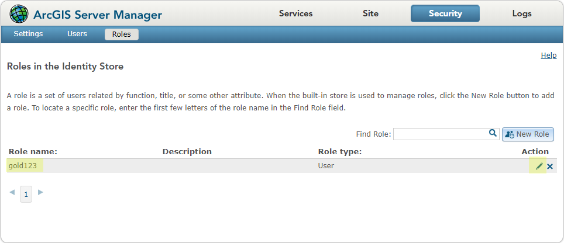
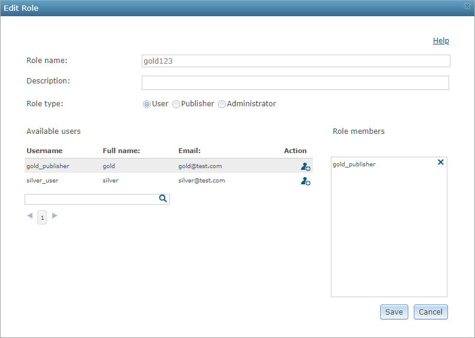
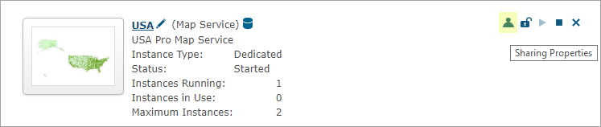

# .Net operation access SOI

This sample illustrates how to add an extra layer of security control for individual operations that users are allowed to access. This SOI only allows three operations - [***Find***](https://developers.arcgis.com/rest/services-reference/find.htm), [***Identify***](https://developers.arcgis.com/rest/services-reference/identify-map-service-.htm), and [***Export Map***](https://developers.arcgis.com/rest/services-reference/export-map.htm) to be accessible to certain groups of users that are defined in the code, and blocks unauthorized users to access those operations. It also blocks all other service operations.

Deploying the SOI from the .soe file (`..\bin\Release\NetOperationAccessSOI_ent.soe`) does not require you to open Visual Studio. However, you can load the project (`..\NetOperationAccessSOI.csproj`) in Visual Studio to debug, modify, and recompile the SOI code.


## Features

  * Get logged-in user information
  * Block REST requests

## Sample data
  Any dynamic map service published from ArcGIS Pro. This instruction uses the [USA map service](../../../ReadMe.md#1-usa-service) as the sample service to test with the SOI.

## Instructions

### Set up testing environment

1. Make sure you have published the USA map service using ArcGIS Pro. If not, refer to [USA map service](../../../ReadMe.md#1-usa-service).
2. Grant proper user access to the USA map service.

#### Option 1: For a stand-alone ArcGIS Server
This environment is configured with [users and roles from the built-in store](https://enterprise.arcgis.com/en/server/latest/administer/windows/securing-services-with-users-and-roles-specific-to-arcgis-server.htm#GUID-9D46D38D-DA48-47BE-A776-DD84C1CD0F4B).

1. Browse to ***ArcGIS Server Manager*** > ***Security*** tab.
2. Click the ***Users*** tab and ***Roles*** tab to make sure that the role ***gold123*** is created and has members assigned.

   To check role members, click the ***edit*** button next to a role.

   

   The ***Edit Role*** wizard will appear and show all the users assigned to this role.

   

   You can also create users and roles under the ***Users*** and ***Roles*** tabs.
3. Browse to ***ArcGIS Server Manager*** > ***Services*** tab.
4. Right-click the ***Sharing Properties*** button next to the map service to secure it for logged-in users.

   
5. You can either choose ***Allow access to all users who are logged in*** or choose a role by clicking the ***Add*** button under ***Action*** so that the role is listed under ***Allowed roles***.
6. Similarly, you can also create another role ***platinum123***, assign users to it, and share the map service with this role.

#### Option 2: For ArcGIS Enterprise
This environment is configured with [built-in users using the portal's identity store](https://enterprise.arcgis.com/en/portal/latest/administer/windows/about-configuring-portal-authentication.htm#ESRI_SECTION1_AA40A239CE81485CB4F7A91BBDDFE845).

1. [Create groups](https://enterprise.arcgis.com/en/portal/latest/administer/windows/create-groups.htm).\
Sign in to the Portal for ArcGIS website. On the ***Groups*** page, create a new group named ***gold123***.
2. [Invite users](https://enterprise.arcgis.com/en/portal/latest/administer/windows/manage-groups.htm#ESRI_SECTION1_123F1B9DC1DF41A3A2EA6EAE6486CF9E) to the group created from the last step.
3. [Share the map service](https://enterprise.arcgis.com/en/portal/latest/use/share-items.htm#ESRI_SECTION1_0CF790E7414B48BEB0E69484A76D6A03) with the group.

   Find the map service published from step 1 at ArcGIS Server or the ***Content*** page of the Portal for ArcGIS website. Ensure that the group ***gold123*** has access to this map service.
4. Similarly, you can also create another group named ***platinum123***, assign users to it, and share the map service with this group.

### Deploy the SOI

1. Log in to ArcGIS Server Manager and click the ***Site*** tab.
2. Click ***Extensions***.
3. Click ***Add Extension***.
4. Click ***Choose File*** and choose the ***NetOperationAccessSOI_ent.soe*** file (`..\bin\Release\NetOperationAccessSOI_ent.soe` or `..\bin\Debug\NetOperationAccessSOI_ent.soe`).
5. Click ***Add***.

### Enable the SOI on a map service

1. Log in to ArcGIS Server Manager and click the ***Services*** tab. Select USA map service and select ***Capabilities***.
2. In the ***Interceptors*** section, select ***DotNet Operation Access SOI Example*** in the ***Available Interceptors*** box and click the right arrow button to move it to ***Enabled Interceptors***.
3. Click the ***Save and Restart*** button to restart the service.

### Test the SOI

1. Open a browser and navigate to the REST services endpoint of the USA map service (URL: `http://<serverdomain>/<webadaptorname>/rest/services/USA/MapServer`).
2. Scroll to the bottom of the above page and click ***Export Map*** in ***Supported Extensions***.

   This leads you to the following URL:

   ```
   http://<serverdomain>/<webadaptorname>/rest/services/USA/MapServer/export?bbox=-178.85719640187426,13.522152002873426,-56.484036397641795,81.72479317856566
   ```
3. Since you haven't logged in yet, this operation doesn't generate any valid export image.
4. Click the upper right corner to log in with a valid user account that belongs to the group ***gold123***.
5. Repeat step 2 and you will see the ***Export Map*** operation generates a valid response now.
5. Test with other service operations with different user account, and see how this SOI blocks requests and grants access.
