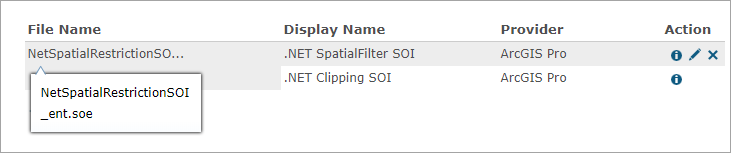
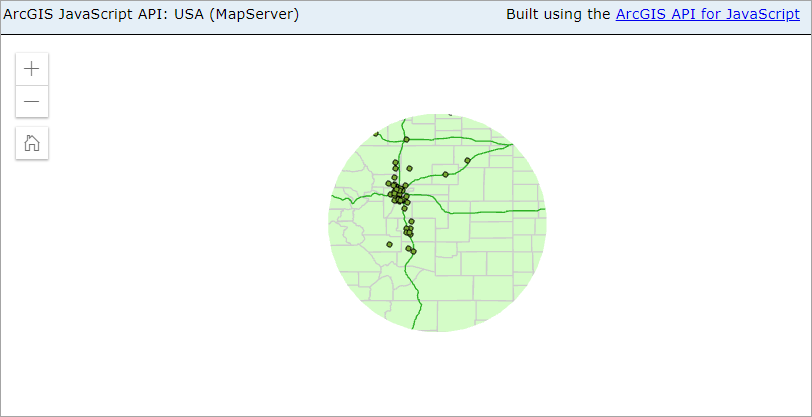
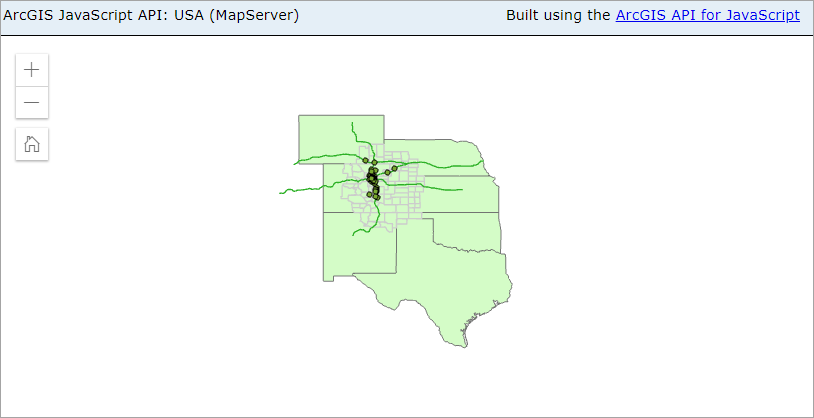

# .NET spatial restriction SOI

This sample illustrates how to develop an SOI to apply certain spatial restrictions on the [Export Map](https://developers.arcgis.com/rest/services-reference/export-map.htm), [Identify](https://developers.arcgis.com/rest/services-reference/identify-map-service-.htm), and [Find](https://developers.arcgis.com/rest/services-reference/find.htm) REST operations of a map service. It contains two sample SOIs, Clipping SOI and SpatialFilter SOI. Clipping SOI masks out layers outside of a clip polygon to draw or query, whereas SpatialFilter SOI draws or queries only features that meet the spatial filter criteria defined from the SOI. The spatial restriction logic provides a fine-grained resource access control with the support of spatial factors. 

>*Note* : This sample SOI is only applicable to map services published from ArcGIS Pro to a 10.8 or later versions of ArcGIS Server. See [what's new in the ArcGIS REST API at 10.8](https://developers.arcgis.com/rest/services-reference/what-s-new.htm).

Deploying the SOI from the .soe file (`..\bin\Release\NetSpatialRestrictionSOI_ent.soe`) does not require you to open Visual Studio. However, you can load the project (`..\NetSpatialRestrictionSOI.csproj`) in Visual Studio to debug, modify, and recompile the SOI code.

## Features

* Preprocess REST requests
* Spatial Filter

## Sample data

This instruction uses the [USA map service](../../../ReadMe.md#1-usa-service) as the sample service to test with the SOI.

## Instructions

### Deploy the SOIs

1. Log in to ArcGIS Server Manager and click the ***Site*** tab.
2. Click ***Extensions***.
3. Click ***Add Extension***.
4. Click ***Choose File*** and choose the ***NetSpatialRestrictionSOI_ent.soe*** file (`..\bin\Release\NetSpatialRestrictionSOI_ent.soe` or `..\bin\Debug\NetSpatialRestrictionSOI_ent.soe`).
5. Click ***Add***.

   

### Enable the Clipping SOI on a map service

1. Make sure you have published the USA map service using ArcGIS Pro. If not, refer to [USA map service](../../../ReadMe.md#1-usa-service)
2. Log in to ArcGIS Server Manager and click the ***Services*** tab. Select USA map service and select ***Capabilities***.
3. In the ***Interceptors*** section, select ***Clipping SOI*** in the ***Available Interceptors*** box and click the right arrow button to move it to ***Enabled Interceptors***.
4. Click the ***Save and Restart*** button to restart the service.

### Test the Clipping SOI

1. Open a browser and navigate to the REST services endpoint of the USA map service (URL: `http://<serverdomain>/<webadaptorname>/rest/services/USA/MapServer`).
2. Scroll to the bottom of the above page and click ***Export Map*** in ***Supported Extensions***.

   This leads you to the following URL:

   ```
   http://<serverdomain>/<webadaptorname>/rest/services/USA/MapServer/export?bbox=-178.85719640187426,13.522152002873426,-56.484036397641795,81.72479317856566
   ```
   
   The exported image shows the map in a circle area. Alternatively, try to view this map service in ***ArcGIS JavaScript*** or ***ArcGIS Online Map Viewer*** and you should see similar result:

   

3. You can play around the ***Export Map***, ***Identify*** and ***Find*** operations to observe the SOI's effects. 

### Enable the SpatialFilter SOI on a map service

1. Navigate back to the USA map service in ArcGIS Server Manager.
2. In the ***Interceptors*** section, select ***Clipping SOI*** in the ***Enabled Interceptors*** box and click the left arrow button to disable this SOI.
3. Select ***SpatialFilter SOI*** in the ***Available Interceptors*** box and click the right arrow button to move it to ***Enabled Interceptors***.
4. Click the ***Save and Restart*** button to restart the service.

### Test the SpatialFilter SOI

1. Open a browser and navigate to the REST services endpoint of the USA map service (URL: `http://<serverdomain>/<webadaptorname>/rest/services/USA/MapServer`).
2. Scroll to the bottom of the above page and click ***Export Map*** in ***Supported Extensions***.

   This leads you to the following URL:

   ```
   http://<serverdomain>/<webadaptorname>/rest/services/USA/MapServer/export?bbox=-178.85719640187426,13.522152002873426,-56.484036397641795,81.72479317856566
   ```
   
   The exported image shows the map in a limited area. Alternatively, try to view this map service in ***ArcGIS JavaScript*** or ***ArcGIS Online Map Viewer*** and you should see similar result:

   

3. You can play around the ***Export Map***, ***Identify*** and ***Find*** operations to observe the SOI's effects.
