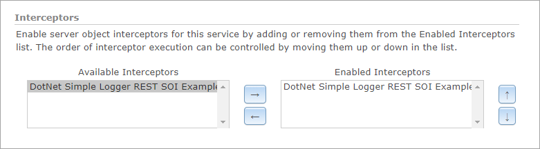
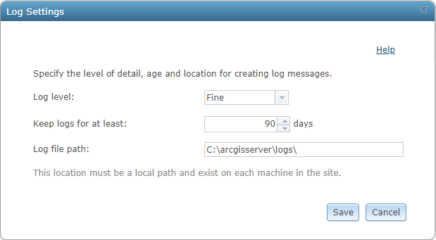
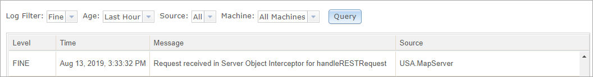

# .NET simple logger SOI

This sample illustrates the basic framework for creating a server object interceptor (SOI). The SOI adds a message to the ArcGIS Server logs whenever a REST request is received before forwarding the request to the underlying default implementation.

Deploying the SOI from the .soe file (`..\bin\Release\NetSimpleLoggerSOI_ent.soe`) does not require you to open Visual Studio. However, you can load the project (`..\NetSimpleLoggerSOI.csproj`) in Visual Studio to debug, modify, and recompile the SOI code.


## Features

* `ServerLogger.LogMessage`
* `IRESTRequestHandler.HandleRESTRequest`
* How to audit requests in SOIs

## Sample data

Any dynamic map service published from ArcGIS Pro. This instruction uses the [USA map service](../../../ReadMe.md#1-usa-service) as the sample service to test with the SOI.


## Instructions

### Deploy the SOI

1. Log in to ArcGIS Server Manager and click the ***Site*** tab.
2. Click ***Extensions***.
3. Click ***Add Extension***.
4. Click ***Choose File*** and choose the ***NetSimpleLoggerSOI_ent.soe*** file (`..\bin\Release\NetSimpleLoggerSOI_ent.soe` or `..\bin\Debug\NetSimpleLoggerSOI_ent.soe`).
5. Click ***Add***.

### Enable the SOI on a map service

1. Make sure you have published the USA map service using ArcGIS Pro. If not, refer to [USA map service](../../../ReadMe.md#1-usa-service)
2. Log in to ArcGIS Server Manager and click the ***Services*** tab. Select USA map service and select ***Capabilities***.
3. In the ***Interceptors*** section, select ***DotNet Simple Logger REST SOI Example*** in the ***Available Interceptors*** box and click the right arrow button to move it to ***Enabled Interceptors***.

   
4. Click the ***Save and Restart*** button to restart the service.

### Test the SOI

1. Set ArcGIS Server ***Log Level***:
   1. Browse to ArcGIS Server Manager > ***Logs*** > ***View Logs*** page.
   2. Click the ***Settings*** button.
   3. Make sure you set ***Log Level*** to ***Fine*** (or any level below, such as ***Verbose*** or ***Debug***). Click ***Save***.
      
2. Perform a REST service operation to trigger the SOI logging:
   1. Open a browser and navigate to the REST services endpoint of the USA map service (URL: `http://<serverdomain>/<webadaptorname>/rest/services/USA/MapServer`).
   2. Scroll to the bottom of the above page and click ***Export Map*** in ***Supported Extensions***.

      This leads you to the following URL:

      ```
      http://<serverdomain>/<webadaptorname>/rest/services/USA/MapServer/export?bbox=-178.85719640187426,13.522152002873426,-56.484036397641795,81.72479317856566
      ```
3. Check ArcGIS Server logs:
   1. Browse to ArcGIS Server Manager > ***Logs*** > ***View Logs*** page.
   2. Set the ***Log Filter*** to ***Fine*** (or any level below, such as ***Verbose*** or ***Debug***) and click ***Query***.
   3. Now the SOI's log message "Request received in Server Object Interceptor for handleRESTRequest" for the operation accomplished in step 2 can be found:

      
