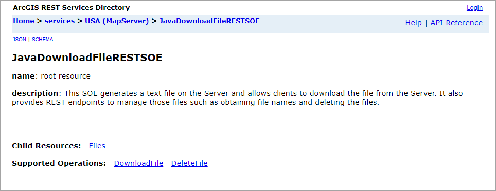
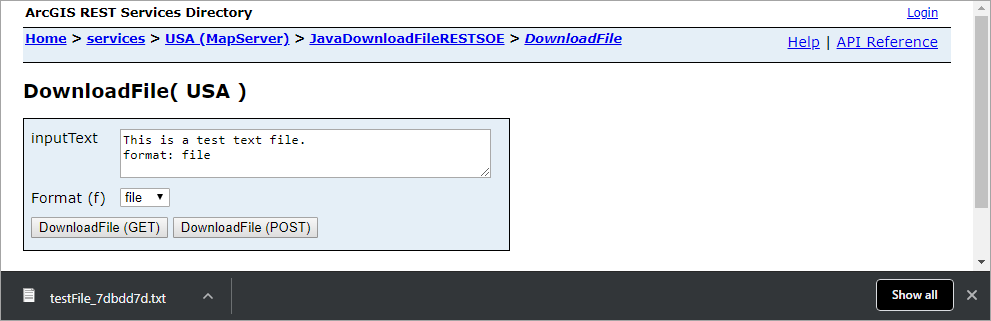
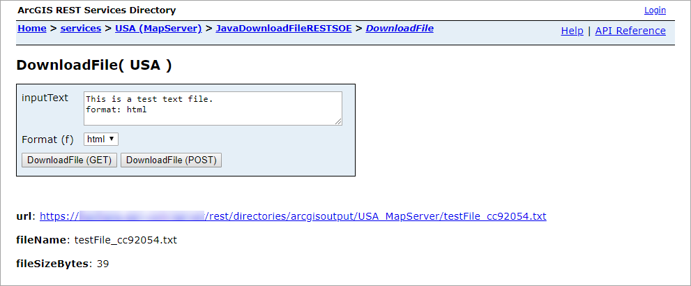
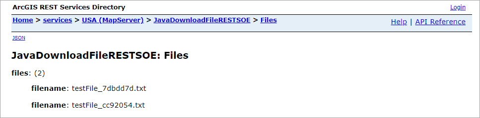
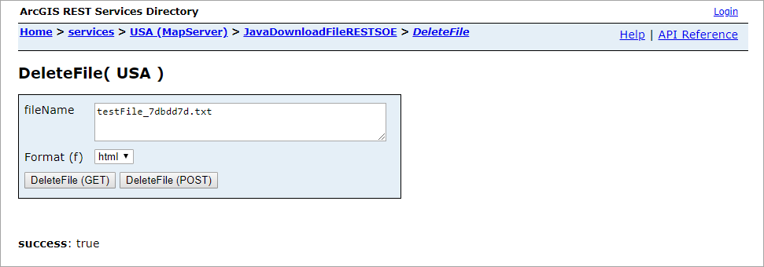

# Java download file REST SOE

This sample illustrates how to develop a REST server object extension (SOE) with the capability of downloading server resources. The SOE generates a text file on the Server and allows clients to download the file from the Server. It also provides REST endpoints to manage those files such as obtaining file names and deleting the files.

Deploying the SOE from the .soe file (`../downloadfilerestsoe/lib/JavaDownloadFileRESTSOE_ent.soe`) does not require you to open the IDE. However, you can load the project (`../downloadfilerestsoe`) in Eclipse to debug, modify, and rebuild the SOE code.

## Features

* [outputFormat (IRequestHandler.handleRESTRequest)](https://enterprise.arcgis.com/en/sdk/latest/windows/webframe.html#API%20Reference.html)
* [Returning formats other than JSON](https://enterprise.arcgis.com/en/sdk/latest/windows/webframe.html#33a68497-6c21-430f-a783-4d3333e46cb4.html#Returning)
* [Content-Type](https://developer.mozilla.org/en-US/docs/Web/HTTP/Headers/Content-Type)
* [ArcGIS Server output directory](https://enterprise.arcgis.com/en/server/latest/administer/linux/about-server-directories.htm)

## Sample data

Any dynamic map service published from ArcGIS Pro. This instruction uses the [USA map service](../../../ReadMe.md#1-usa-service) as the sample service to test with the SOE.


## Instructions

### Deploy the SOE

1. Log in to ArcGIS Server Manager and click the ***Site*** tab.
2. Click ***Extensions***.
3. Click ***Add Extension***.
4. Click ***Choose File*** and choose the ***DownloadFileRESTSOE_ent.soe*** file (`../downloadfilerestsoe/lib/JavaDownloadFileRESTSOE_ent.soe` or the SOE export path).
5. Click ***Add***.

### Enable the SOE on a map service

1. Make sure you have published the USA map service using ArcGIS Pro. If not, refer to [USA map service](../../../ReadMe.md#1-usa-service).
2. Log in to ArcGIS Server Manager and click the ***Services*** tab. Select USA map service and select ***Capabilities***.
3. In the list of available capabilities, find ***Java Download File REST SOE*** and check the box to enable it.
4. Click the ***Save and Restart*** button to restart the service.

### Test the SOE in the ArcGIS Server Services Directory

1. Open a browser and navigate to the REST services endpoint of the USA map service (URL: `http://<serverdomain>/<webadaptorname>/rest/services/USA/MapServer`).
2. Scroll to the bottom of the above page. Find ***JavaDownloadFileRESTSOE*** in ***Supported Extensions***.
3. Click the SOE name, which leads to the following URL:

   ```
   http://<serverdomain>/<webadaptorname>/rest/services/USA/MapServer/exts/JavaDownloadFileRESTSOE
   ```

   This SOE root resource page displays the SOE's description, the ***Files*** child resource, and two operations, ***DownloadFile*** and ***DeleteFile***.

   
4. Click the ***DownloadFile*** operation.
5. Type in some contents in the ***inputText*** box. Choose ***file*** as the ***Format(f)*** parameter. Click the ***DownloadFile(GET)*** button. A text file named "testFile_xxxxxx.txt" is generated and downloaded to your local drive now.

   
6. Navigate back to the ***DownloadFile*** operation page.
7. Type in some contents in the ***inputText*** box. Choose ***html*** as the ***Format(f)*** parameter. Click the ***DownloadFile(GET)*** button. A text file named "testFile_xxxxxx.txt" is generated and can be accessed via the url provided in the response.

   
8. Navigate back to the root resource page again. Click the ***Files*** resource. You will see the two files generated in step 5 and step 7 are listed. Take a note of a filename.

   

9. Navigate back to the root resource page again. Click the ***DeleteFile*** operation.
10.Type in the filename from step 8 and click the ***DeleteFile(GET)*** button. The response ***success: true*** indicates that the file is successfully deleted from server. You can also repeate step 8 to confirm it.

   
