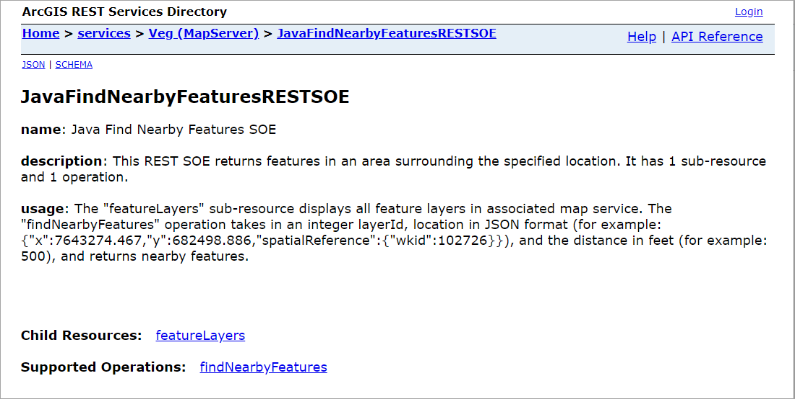
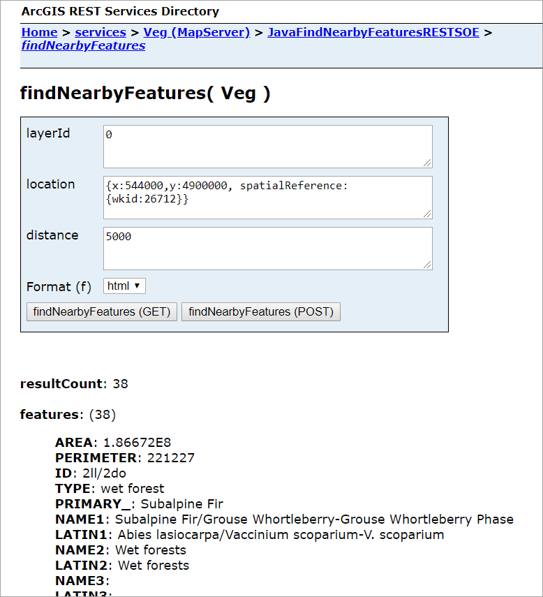

# Java find nearby features REST SOE
This sample illustrates how to develop a REST server object extension (SOE) with a new spatial query operation. The spatial query operation returns all the features of a map service layer that fall within the user-defined search distance of a location point.

Deploying the SOE from the .soe file (`../findnearbyfeaturesrestsoe/FindNearbyFeaturesRESTSOE_ent.soe`) does not require you to open the IDE. However, you can load the project (`../findnearbyfeaturesrestsoe`) in Eclipse to debug, modify, and rebuild the SOE code.


## Features
  * ServerUtilities.createOperation()
  * ServerUtilities.createResource()
  * SpatialFilter
  * IMapServer.QueryData()


## Sample data
This sample uses the [Veg map service](../../../ReadMe.md#2-veg-service) as the sample service to test with the SOE.


## Instructions

### Deploy the SOE

1. Log in to ArcGIS Server Manager and click the ***Site*** tab.
2. Click ***Extensions***.
3. Click ***Add Extension***.
4. Click ***Choose File*** and choose the ***FindNearbyFeaturesRESTSOE_ent.soe*** file (`../findnearbyfeaturesrestsoe/lib/FindNearbyFeaturesRESTSOE_ent.soe` or the SOE export path).
5. Click ***Add***.

### Enable the SOE on a map service

1. Make sure you have published the Veg map service using ArcGIS Pro. If not, refer to [Veg map service](../../../ReadMe.md#2-veg-service)
2. Log in to ArcGIS Server Manager and click the ***Services*** tab. Select Veg map service and select ***Capabilities***.
3. In the list of available capabilities, find ***Java Find Nearby Features REST SOE*** and check the box to enable it.
4. Click the ***Save and Restart*** button to restart the service.

### Test the SOE in the ArcGIS Server Services Directory

1. Open a browser and navigate to the REST services endpoint of the Veg map service (URL: `http://<serverdomain>/<webadaptorname>/rest/services/Veg/MapServer`).
2. Scroll to the bottom of the above page and click ***JavaFindNearbyFeaturesRESTSOE*** in ***Supported Extensions***. 
   
   This leads to the SOE's root page, at the following URL:

   ```
   http://<serverdomain>/<webadaptorname>/rest/services/Veg/MapServer/exts/JavaFindNearbyFeaturesRESTSOE
   ```
   
   

3. Click the ***featureLayers*** child resource to test the child resource response.    
4. Navigate back to the SOE's root page and click ***findNearbyFeatures*** in ***Supported Operations***. 

   Type `0` in the ***layerId*** input box, `{x:544000,y:4900000, spatialReference:{wkid:26712}}` in the ***location*** input box, and `50000` in the ***distance*** box. This indicates the spatial query is performed within 5000 meters of the location point (x:544000, y:4900000) for the first layer. Click the ***findNearFeatures*** button. You will see the JSON of 38 features returned.

   
   
