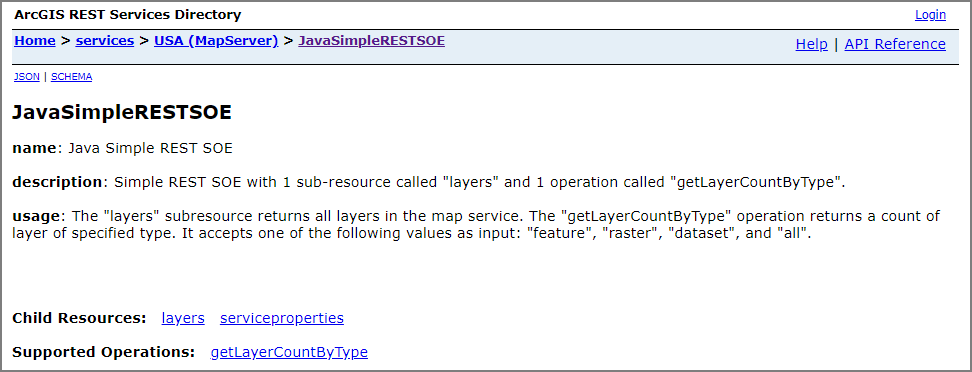
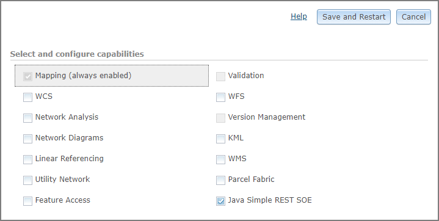
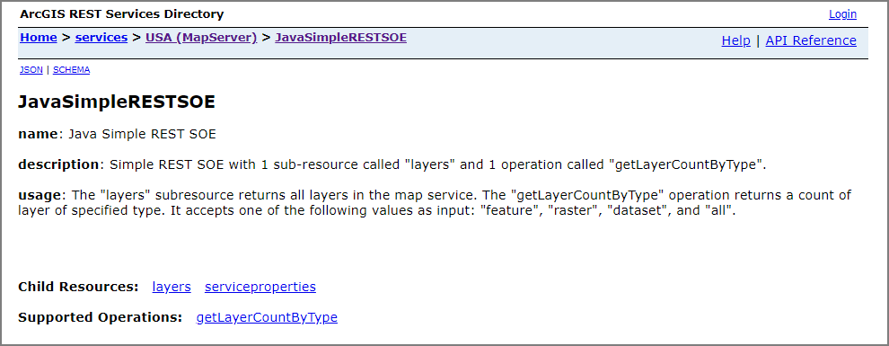
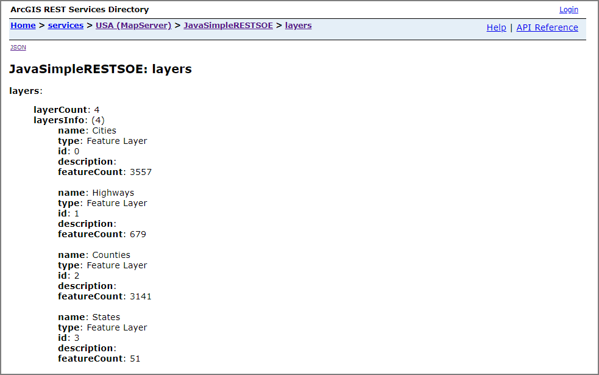
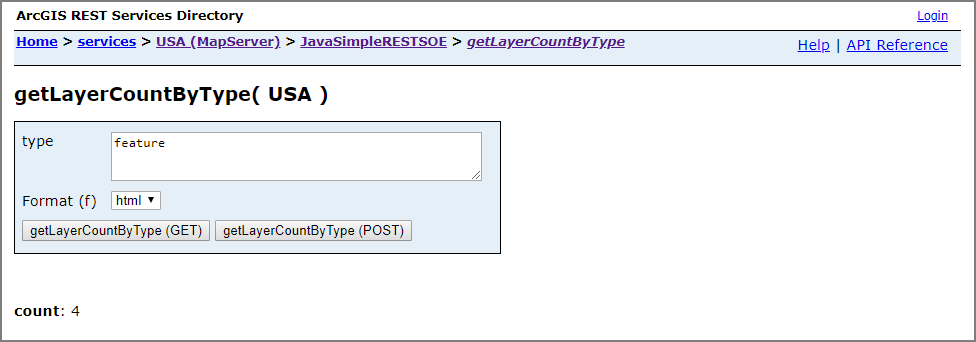

# Java simple REST SOE

This sample illustrates how to develop a REST server object extension (SOE) with new service operation and service resources. The SOE is capable of taking custom input parameters and returning certain information of the service, such as service configuration properties, layer count, layer types, etc.


Deploying the SOE from the .soe file (`../simplerestsoe/target/simplerestsoe.soe`) does not require you to open a Java IDE. However, you can open the project (`../simplerestsoe`) in a Java IDE, such as Eclipse or IntelliJ, to debug, modify, and recompile the SOE code.


## Features

* Construct a response error object
* Create an SOE resource
* Create an SOE operation
* Get service layer count
* Get service configuration properties


## Sample data

Any dynamic map service published from ArcGIS Pro. This instruction uses the [USA map service](https://github.com/Esri/arcgis-enterprise-sdk-resources/tree/master/Samples) as the sample service to test with the SOE.


## Instructions

### Deploy the SOE

1. Log in to ArcGIS Server Manager and click the ***Site*** tab.
2. Click ***Extensions***.
3. Click ***Add Extension***.
4. Click ***Choose File*** and choose the ***simplerestsoe.soe*** file (`../simplerestsoe/target/simplerestsoe.soe`).
5. Click ***Add***.

   

### Enable the SOE on a map service

1. Make sure you have published the USA map service using ArcGIS Pro. If not, refer to [USA map service](https://github.com/Esri/arcgis-enterprise-sdk-resources/tree/master/Samples)
2. Log in to ArcGIS Server Manager and click the ***Services*** tab. Select USA map service and select ***Capabilities***.
3. In the list of available capabilities, find ***Java Simple REST SOE*** and check the box to enable it.
4. Click the ***Save and Restart*** button to restart the service.

   

### Test the SOE in the ArcGIS Server Services Directory

1. Open a browser and navigate to the REST services endpoint of the USA map service (URL: `http://<serverdomain>/<webadaptorname>/rest/services/USA/MapServer`).
2. Scroll to the bottom of the above page. Find ***JavaSimpleRESTSOE*** in ***Supported Extensions***.

   
3. Click the SOE name, which leads to the following URL:

   ```
   http://<serverdomain>/<webadaptorname>/rest/services/USA/MapServer/exts/JavaSimpleRESTSOE
   ```

   This SOE root resource page displays the SOE's name, description, usage, along with the Child Resources and Supported Operations.

   
4. Click the ***layers*** sub-resource. It returns the information of all the layers in JSON format.

   
5. Navigate back to the root resource page. Try with the ***serviceproperties*** sub-resource similarly.
6. Navigate back to the root resource page again. Click the ***getLayerCountByType*** operation; type in either "feature", "raster" or "all," and click either the ***getLayerCountByType (GET)*** or ***getLayerCountByType (POST)*** button. The operation will return the number of layers of the type you specified.

   
