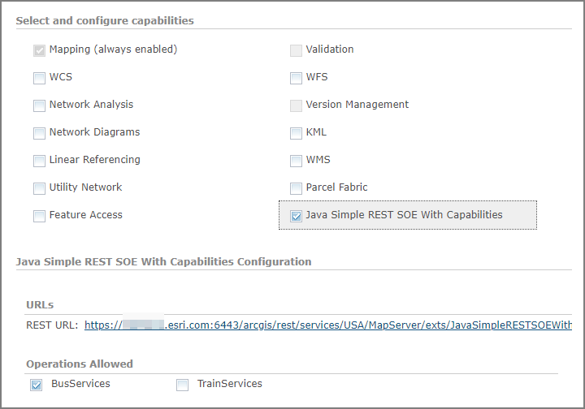
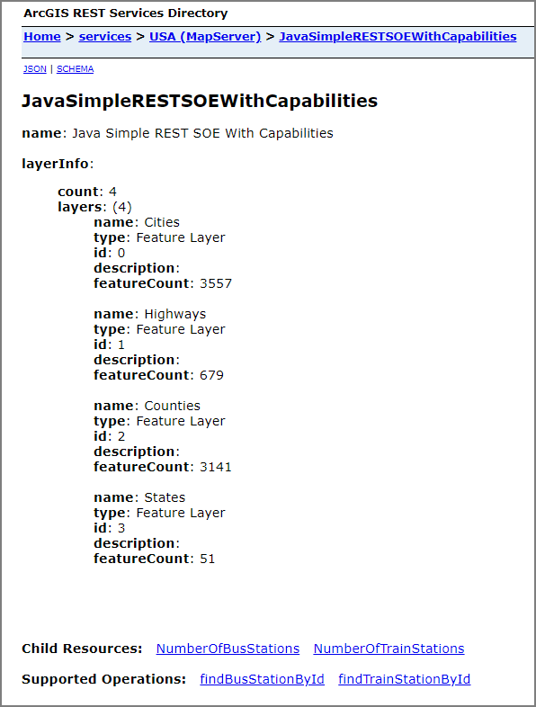

# Java simple REST SOE with capabilities

This sample illustrates how to develop a REST server object extension (SOE) with capabilities. The SOE capabilities group its child resources and operations so that the server administrator can control access to those SOE resources and operations via Capabilities.

In this sample, two capabilities are defined in the SOE as follows:

```bash
├── BusServices (default capabilities)
│   ├── Operations
│   │   └── findBusStationById
│   └── Resources
│       └── NumberOfBusStations
└── TrainServices
    ├── Operations
    │   └── findTrainStationById
    └── Resources
        └── NumberOfTrainStations
```

Deploying the SOE from the .soe file (`../simplerestsoewithcapabilities/target/simplerestsoewithcapabilities.soe`) does not require you to open a Java IDE. However, you can open the project (`../simplerestsoewithcapabilities`) in a Java IDE, such as Eclipse or IntelliJ, to debug, modify, and recompile the SOE code.

## Features

* SOE capabilities
* Default capabilities
* Required capabilities

## Sample data

Any dynamic map service published from ArcGIS Pro. This instruction uses the [USA map service](../../../ReadMe.md#1-usa-service) as the sample service to test with the SOE.


## Instructions

### Deploy the SOE

1. Log in to ArcGIS Server Manager and click the ***Site*** tab.
2. Click ***Extensions***.
3. Click ***Add Extension***.
4. Click ***Choose File*** and choose the ***simplerestsoewithcapabilities.soe*** file (`../simplerestsoewithcapabilities/target/simplerestsoewithcapabilities.soe`).
5. Click ***Add***.

### Enable the SOE on a map service

1. Make sure you have published the USA map service using ArcGIS Pro. If not, refer to [USA map service](../../../ReadMe.md#1-usa-service)
2. Log in to ArcGIS Server Manager and click the ***Services*** tab. Select USA map service and select ***Capabilities***.
3. In the list of available capabilities, find ***.Net Simple REST SOE with Capabilities*** and check the box to enable it.
4. Make sure the SOE is selected.

   In the ***Operations Allowed*** section, two SOE capabilities show up: ***BusServices*** and ***TrainServices***.

   As only ***BusServices*** is defined as the default capabilities in the SOE, it's enabled by default. Leave ***TrainServices*** unchecked to compare the difference.

   
5. Click the ***Save and Restart*** button to restart the service.

### Test the SOE in the ArcGIS Server Services Directory

1. Open a browser and navigate to the REST services endpoint of the USA map service (URL: `http://<serverdomain>/<webadaptorname>/rest/services/USA/MapServer`).
2. Scroll to the bottom of the above page. Find ***JavaSimpleRESTSOEWithCapabilities*** in ***Supported Extensions***.
3. Click the SOE name, which leads to the following URL:

   ```
   http://<serverdomain>/<webadaptorname>/rest/services/USA/MapServer/exts/JavaSimpleRESTSOEWithCapabilities
   ```

   This SOE root resource page displays the SOE's name, layer information JSON, along with the Child Resources and Supported Operations.

   
4. Click the ***NumberOfBusStations*** sub-resource and it returns a valid result, confirming this sub-resource is accessible.
5. Navigate back to the SOE page and click the ***findBusStationById*** operation.
   Provide text in the ***busStationId*** text box and click the ***findBusStationById(GET)*** button. The text you entered in the text box will be returned, confirming this operation is accessible.
6. Similarly, access the ***NumberOfTrainStations*** sub-resource and ***findTrainStationById*** operation.

   In each case, the SOE will return an error message indicating that these are inaccessible. This is because they are associated with the ***TrainServices*** capability, which is not enabled on this SOE.
7. Edit the map service to enable the ***TrainServices*** capability. Test your access to the ***NumberOfTrainStations*** sub-resource and ***findTrainStationById*** operation. You'll find that these now are accessible and able to return valid results.

