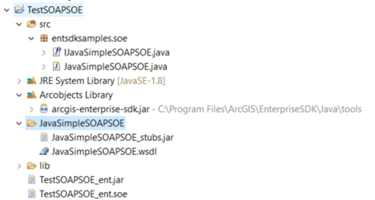
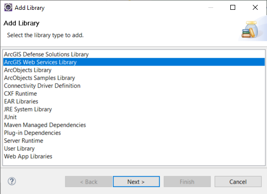
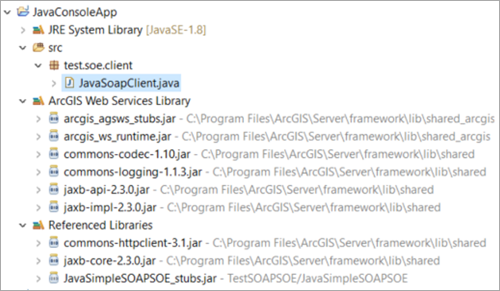

# Java simple SOAP SOE
This sample illustrates how to develop a SOAP server object extension (SOE) with a new method. This SOE exposes the new method which returns the number of layers in the SOAP response, based on the layer type defined in the request.


Deploying the SOE from the .soe file (`../simplesoapsoe/lib/TestSOAPSOE_ent.soe`) does not require you to open the IDE. However, you can load the project (`../simplesoapsoe`) in Eclipse to debug, modify, rebuild, and export the SOE project.

## Features

* SOAP SOE interface
* Create SOAP SOE methods
* Build a Java SOAP client application

## Sample data

Any dynamic map service published from ArcGIS Pro. This instruction uses the [USA map service](../../../ReadMe.md#1-usa-service) as the sample service to test with the SOE.

## Instructions

### Export the SOE

1. Open the simplesoapsoe project in Eclipse.
2. Right click the project and choose ***Export...*** option in the menu.
3. Export the entsdksamples.soe package (including JavaSimpleSOAPSOE.java and IJavaSimpleSOAPSOE.java) into a JAR file.

   Make sure no other resource is selected to export.
4. Use the command line prompt to export the generated JAR file from the last step, for example:
    ```bash
    C:\Program Files\ArcGIS\EnterpriseSDK\Java\tools\soepackager>soepackager_ent.bat -p C:\temp\simplesoapsoe\TestSOAPSOE_ent.jar -o C:\temp\simplesoapsoe -j "C:\Program Files\java\jdk1.8.0_201"
    ```
5. Notice that ***TestSOAPSOE_ent.soe*** is generated. A new folder called ***JavaSimpleSOAPSOE*** is also generated. This folder contains a JAR file we will use to build the Java SOAP client application.
   

### Deploy the SOE

1. Log in to ArcGIS Server Manager and click the ***Site*** tab.
2. Click ***Extensions***.
3. Click ***Add Extension***.
4. Click ***Choose File*** and choose the ***TestSOAPSOE_ent.soe*** file (`..\simplesoapsoe\lib\TestSOAPSOE_ent.soe` or the .soe file from [Export the SOE](#Export-the-SOE)).
5. Click ***Add***.

### Enable the SOE on a map service

1. Make sure you have published the USA map service using ArcGIS Pro. If not, refer to [USA map service](../../../ReadMe.md#1-usa-service).
2. Log in to ArcGIS Server Manager and click the ***Services*** tab. Select USA map service and select ***Capabilities***.
3. In the list of available capabilities, find ***Java Simple SOAP SOE*** and check the box to enable it.
4. Click the ***Save and Restart*** button to restart the service.

- ### Develop a Java SOAP client to test the SOE
1. Create a new console application in Eclipse.
2. Add libraries to the project:
   1. Add the ***SOAP stubs*** JAR to the project:
      1. Right click the console application project > ***Build Path*** > ***Configure Build Path...*** > ***Libraries*** tab.
      2. In the ***Java Build Path*** wizard, click ***Add JARs...***.
      3. In the ***JAR Selection*** wizard, choose the SOAP SOE > ***JavaSimpleSOAPSOE*** folder > ***JavaSimpleSOAPSOE_stubs.jar***.
      4. Click ***Apply***.
   2. Add ***ArcGIS Web Services Library*** to the project:
      1. In the ***Java Build Path*** wizard, click ***Add Library...***.
      2. Choose ***ArcGIS Web Services Library***. Click ***Next*** and then ***Finish***.  
         
      3. Click ***Apply***.
   3. Add the ***HttpClient*** and ***Jaxb*** libraries to the project:
      1. In the ***Java Build Path*** wizard, click ***Add External JARs...***.
      2. Navigate to `<ServerInstall>/framework/lib/shared` location (by default `C:/Program Files/ArcGIS/Server/framework/lib/shared`), choose ***commons-httpclient-3.1.jar*** and ***jaxb-core-2.3.0.jar***.
      3. Click ***Apply and Close***.
      4. Now, the client application's project libraries should look like this:
         
3. Copy the following code in the console application:

    ```java
        // TODO Auto-generated method stub
        JavaSimpleSOAPSOEServiceBindingStub binding = new JavaSimpleSOAPSOEServiceBindingStub(
            "http://<serverdomain>/<webadaptorname>/services/USA/MapServer/JavaSimpleSOAPSOE");
        int response = binding.getLayerCountByType("all");
        System.out.println(response);
    ```
4. Run this console application. The code will output 4 as there are four layers in the map service.

   The request parameter can be "all", "feature", "raster", or "dataset". Both "all" and "feature" will return 4 as the SOAP response.

### Use other SOAP client to test the SOE

Other SOAP clients, such as [SoapUI](https://www.soapui.org/downloads/soapui.html), can also be used to test this SOAP SOE. By providing the SOAP client the SOE's SOAP WSDL URL, an XML request can be sent from the client application and a valid response should be returned.


