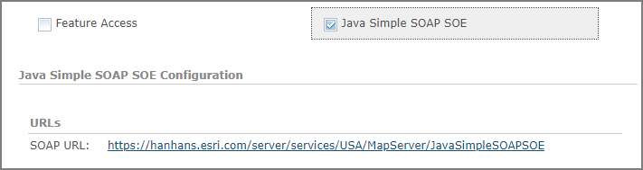
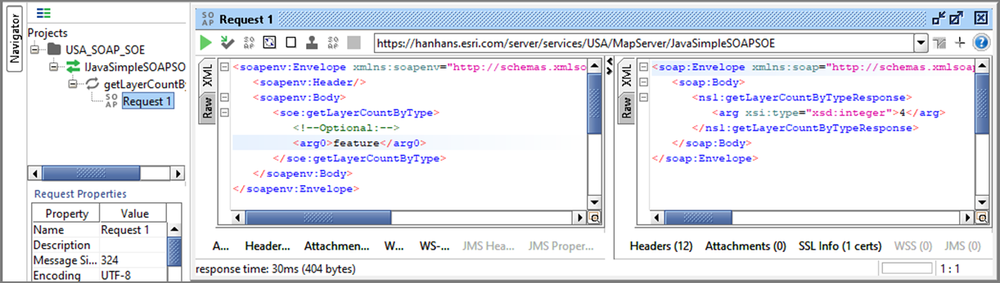

# Java simple SOAP SOE
This sample illustrates how to develop a SOAP server object extension (SOE) with a new method. This SOE exposes the new method which returns the number of layers in the SOAP response, based on the layer type defined in the request.



Deploying the SOE from the .soe file (`../simplesoapsoe/target/simplesoapsoe.soe`) does not require you to open a Java IDE. However, you can open the project (`../simplesoapsoe`) in a Java IDE, such as Eclipse or IntelliJ, to debug, modify, and recompile the SOE code.

## Features

* SOAP SOE interface
* Create SOAP SOE methods

## Sample data

Any dynamic map service published from ArcGIS Pro. This instruction uses the [USA map service](../../../ReadMe.md#1-usa-service) as the sample service to test with the SOE.

## Instructions

### Deploy the SOE

1. Log in to ArcGIS Server Manager and click the ***Site*** tab.
2. Click ***Extensions***.
3. Click ***Add Extension***.
4. Click ***Choose File*** and choose the ***simplesoapsoe.soe*** file (`..\simplesoapsoe\target\simplesoapsoe.soe`).
5. Click ***Add***.

### Enable the SOE on a map service

1. Make sure you have published the USA map service using ArcGIS Pro. If not, refer to [USA map service](../../../ReadMe.md#1-usa-service).
2. Log in to ArcGIS Server Manager and click the ***Services*** tab. Select USA map service and select ***Capabilities***.
3. In the list of available capabilities, find ***Java Simple SOAP SOE*** and check the box to enable it.
4. Click the ***Save and Restart*** button to restart the service.

### Use SOAP client to test the SOE

A variety of SOAP clients, such as [SoapUI](https://www.soapui.org/downloads/soapui.html), can be used to test this SOAP SOE. By providing the SOAP client the SOE's SOAP WSDL URL, an XML request as the following can be sent from the client application:

``` xml
<soapenv:Envelope xmlns:soapenv="http://schemas.xmlsoap.org/soap/envelope/" xmlns:soe="http://www.soe.entsdksamples">
   <soapenv:Header/>
   <soapenv:Body>
      <soe:getLayerCountByType>
         <arg0>all</arg0>
      </soe:getLayerCountByType>
   </soapenv:Body>
</soapenv:Envelope>
```

 And you should see a valid response returned:

 ``` xml
<soap:Envelope xmlns:soap="http://schemas.xmlsoap.org/soap/envelope/" xmlns:xsd="http://www.w3.org/2001/XMLSchema" xmlns:xsi="http://www.w3.org/2001/XMLSchema-instance" xmlns:ns1="http://www.soe.entsdksamples">
   <soap:Body>
      <ns1:getLayerCountByTypeResponse>
         <arg xsi:type="xsd:integer">4</arg>
      </ns1:getLayerCountByTypeResponse>
   </soap:Body>
</soap:Envelope>
 ```


