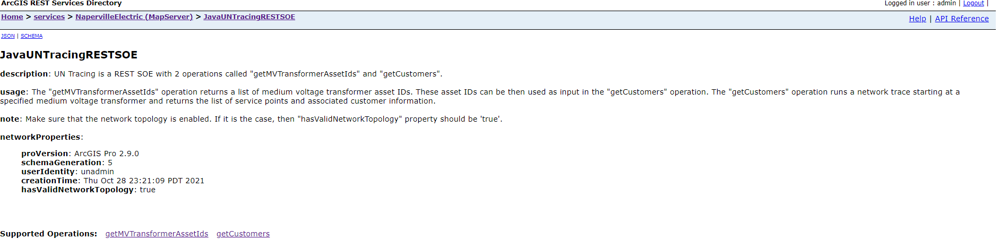
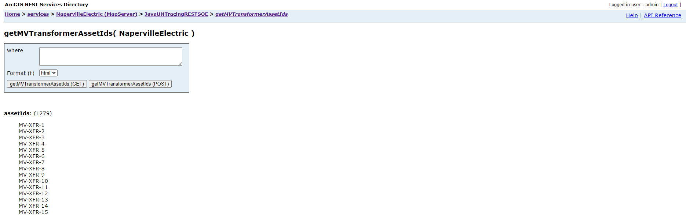
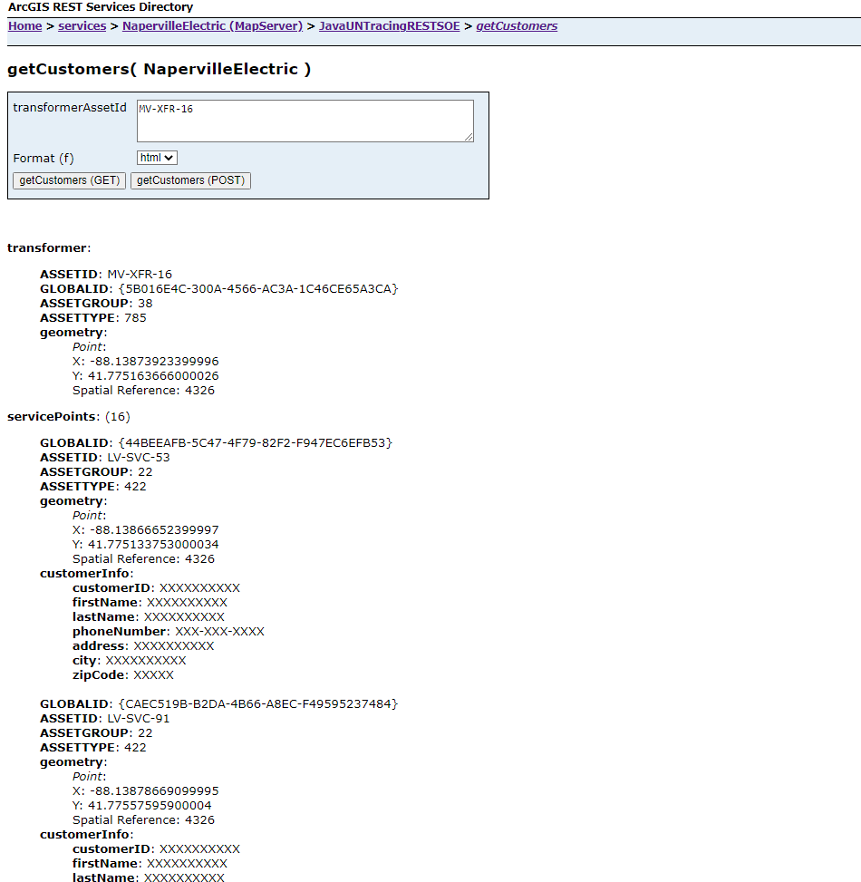

# Java utility network tracing REST SOE

This sample demonstrates how to use the utility network tracing capabilities to get the list of customers serviced by a single medium-voltage transformer. The UNTracing REST SOE has two operations called ***getMVTransformerAssetIds*** and ***getCustomers***. The first operation queries the Electric Device layer to return a list of medium-voltage transformer asset IDs that can then be used in the second operation to retrieve the list of service points and customers connected to that transformer. Also, the root resource of this SOE returns information about the utility network.

The administrator that deploys this SOE must enable it on the map service that also has the Utility Network capability enabled. 

Deploying the SOE from the .soe file (`..\untracingrestsoe\target\JavaUNTracingRESTSOE.soe`) does not require you to open a Java IDE. However, you can open the project (`..\untracingrestsoe`) in a Java IDE, such as Eclipse or IntelliJ, to debug, modify, and recompile the SOE code. Constants' values may need to change. 

The Utility Network owner must make sure that the network topology has been enabled.


## Features
  * Opening a Utility Network dataset (`IFeatureDataset`, `IDataset`)
  * Getting network properties (`IBaseNetworkProxy`, `IDEBaseNetworkProxy`, `IBaseNetworkTopologyProxy`)
  * Creating and initializing a network tracer (`IBaseNetworkProxy`, `IUtilityNetworkQuery`, `ITracer`, `IDEDataset`)
  * Configuring and executing a network trace (`ITracer`, `UNTraceConfiguration`, `UNCondition`, `UNOutputFilter`)
  * Processing network trace results (`IUNTraceResults`)


## Sample data
This sample requires the [Electric Utility Network Foundation](https://doc.arcgis.com/en/arcgis-solutions/latest/reference/use-electric-utility-network-foundation.htm) Naperville demo data to be loaded in an Enterprise Geodatabase and published as a service on ArcGIS Enterprise. Please follow the instructions provided in the above link to download, configure and publish the data.


## Instructions

### Deploy the SOE

1. Log in to ArcGIS Server Manager and click the ***Site*** tab.
2. Click ***Extensions***.
3. Click ***Add Extension***.
4. Click ***Choose File*** and choose the ***JavaUNTracingRESTSOE.soe*** file (`..\untracingrestsoe\target\JavaUNTracingRESTSOE.soe`).
5. Click ***Add***.

### Enable the SOE on a map service

1. Make sure you have published the Naperville electric utility network service whose data source is from an Enterprise Geodatabase using ArcGIS Pro. If not, refer to [Electric Utility Network Foundation](https://doc.arcgis.com/en/arcgis-solutions/latest/reference/use-electric-utility-network-foundation.htm).
2. Log in to ArcGIS Server Manager and click the ***Services*** tab. Select the Naperville map service and select ***Capabilities***.
3. In the list of available capabilities, find ***Java UN Tracing REST SOE*** and check the box to enable it.
4. Click the ***Save and Restart*** button to restart the service.

### Test the SOE in the ArcGIS Server Services Directory

1. Open a browser and navigate to the REST services endpoint of the Naperville service (URL: `http://<serverdomain>/<webadaptorname>/rest/services/<Naperville>/MapServer`).
2. Scroll to the bottom of the above page and click ***JavaUNTracingRESTSOE*** in ***Supported Extensions***. 
   
   This leads to the SOE's root page, at the following URL:

   ```
   http://<serverdomain>/<webadaptorname>/rest/services/<servicename>/MapServer/exts/JavaUNTracingRESTSOE
   ```
   
   
   
   Make sure that the ***hasValidNetworkTopology*** property returns 'true'. This indicates that the network topology is enabled. Otherwise, the Utility Network owner will need to enable the network topology before using this SOE. 

3. Click ***getMVTransformerAssetIds*** in ***Supported Operations***. 

   Optionally, type a valid WHERE clause for querying transformer devices in the ***where*** input box.
   
   Click the ***getMVTransformerAssetIds*** button. You will receive a response returning the asset IDs of all medium-voltage transformers satisfying the specified where clause:
   
   
   
   One of these transformer asset IDs can then be used to get the list of serviced customers.

4. Click ***getCustomers*** in ***Supported Operations*** on the SOE's root page. 

   Type a valid transformer asset ID in the ***transformerAssetId*** input box. 
  
   Click the ***getCustomers*** button. You will receive a response returning more information about the transformer, along with the list of service points containing mocked customer information:
   
   

