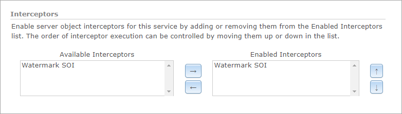
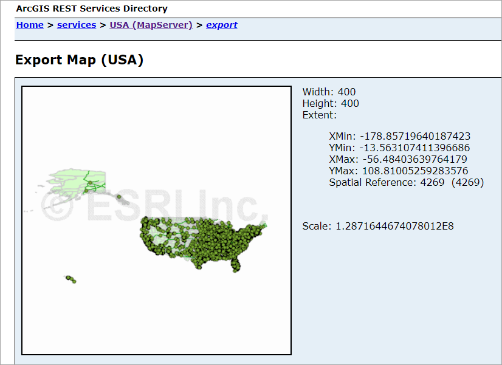
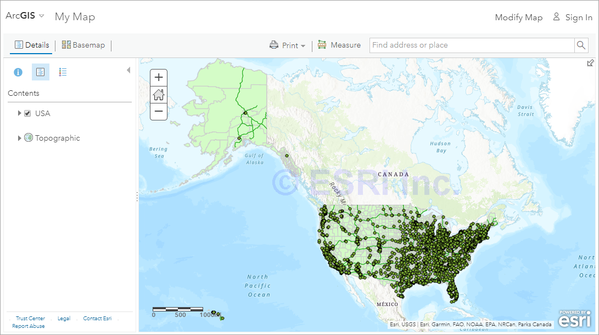

# Java apply watermark SOI

This sample illustrates how to apply a watermark to every image returned from the [Export Map](https://developers.arcgis.com/rest/services-reference/export-map.htm) operation on a map service.

Deploying the SOI from the .soe file (`../ApplyWatermarkSOI/lib/ApplyWatermarkSOI_ent.soe`) does not require you to open the IDE. However, you can load the project (`../ApplyWatermarkSOI`) in the IDE to debug, modify, and rebuild the SOI project.

## Features

* Postprocess REST response
* OutputFormat

## Sample data

Any dynamic map service published from ArcGIS Pro. This instruction uses the [USA map service](../../../ReadMe.md#1-usa-service) as the sample service to test with the SOI.

## Instructions

### Deploy the SOI

1. Log in to ArcGIS Server Manager and click the ***Site*** tab.
2. Click ***Extensions***.
3. Click ***Add Extension***.
4. Click ***Choose File*** and choose the ***ApplyWatermarkSOI_ent.soe*** file (`../ApplyWatermarkSOI/lib/ApplyWatermarkSOI_ent.soe` or the SOI's export path).
5. Click ***Add***.

### Enable the SOI on a map service

1. Make sure you have published the USA map service using ArcGIS Pro. If not, refer to [USA map service](../../../ReadMe.md#1-usa-service)
2. Log in to ArcGIS Server Manager and click the ***Services*** tab. Select USA map service and select ***Capabilities***.
3. In the ***Interceptors*** section, select ***Watermark SOI*** in the ***Available Interceptors*** box and click the right arrow button to move it to ***Enabled Interceptors***.

   
4. Click the ***Save and Restart*** button to restart the service.

### Test the SOI

1. Open a browser and navigate to the REST services endpoint of the USA map service (URL: `http://<serverdomain>/<webadaptorname>/rest/services/USA/MapServer`).
2. Scroll to the bottom of the above page and click ***Export Map*** in ***Supported Extensions***.

   This leads you to the following URL:

   ```
   http://<serverdomain>/<webadaptorname>/rest/services/USA/MapServer/export?bbox=-178.85719640187426,13.522152002873426,-56.484036397641795,81.72479317856566
   ```
3. The watermark ***© ESRI Inc.*** will appear in the middle of the exported image.

   

4. Try viewing this service in ArcGIS JavaScript application or ArcGIS Online Map Viewer, and you will see the watermark is always applied:

   
