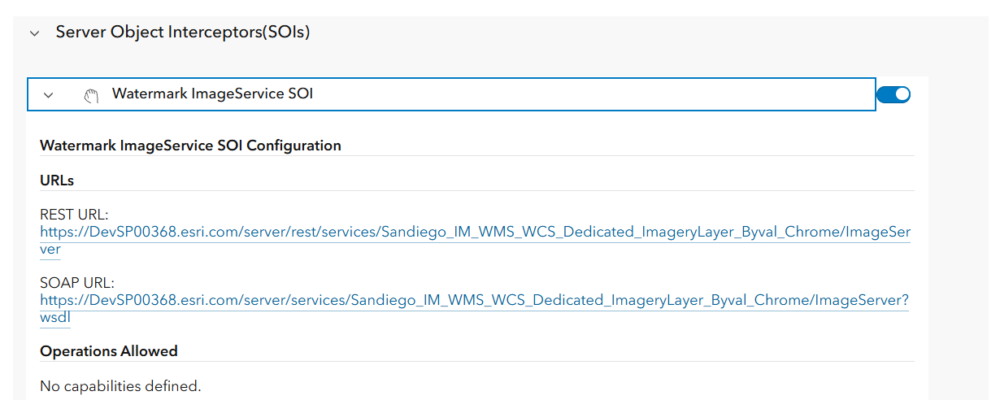
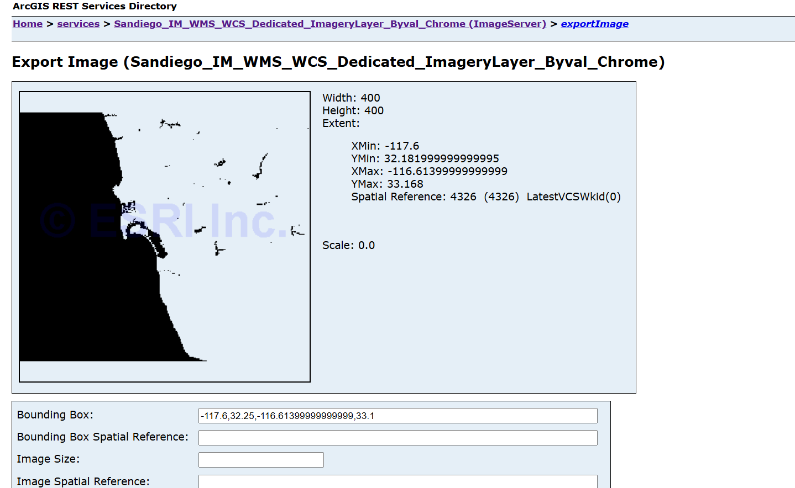

# Java apply watermark Image Service SOI

This sample illustrates how to apply a watermark to every an image service returned from the [Export Map](https://developers.arcgis.com/rest/services-reference/export-map.htm) operation on an image service.

Deploying the SOI from the .soe file (`../JavaApplyWatermarkImageServiceSOI/target/JavaApplyWatermarkImageServiceSOI.soe`) does not require you to open a Java IDE. However, you can open the project (`../JavaApplyWatermarkImageServiceSOI`) in a Java IDE, such as Eclipse or IntelliJ, to debug, modify, and recompile the SOI project.


## Features

* Postprocess REST response
* OutputFormat

## Sample data

Any Image service published from ArcGIS Pro or Admin rest end and Geo-processing tool. This instruction uses a Image Service as the sample service to test with the SOI.

## Instructions

### Deploy the SOI

1. Log in to ArcGIS Server Manager and click the ***Site*** tab.
2. Click ***Extensions***.
3. Click ***Add Extension***.
4. Click ***Choose File*** and choose the ***JavaApplyWatermarkImageServiceSOI.soe*** file (`../JavaApplyWatermarkImageServiceSOI/target/JavaApplyWatermarkImageServiceSOI.soe`).
5. Click ***Add***.

### Enable the SOI on a Image Service

1. Make sure you have published the Image service using ArcGIS Pro or Admin rest end and geoprocessing tool. 
2. Log in to ArcGIS portal home application and select the Image Service.Click the ***Settings*** tab. Select Extensions and expand it and find the ***SOI*** and expand it.
3. In the ***SOI*** section, select ***JavaApplyWatermarkImageServiceSOI*** in the ***Available Interceptors*** box and enable it ***Enabled Interceptors***.
   
4. Click the ***Save and Restart*** button to restart the service.


### Test the SOI

1. Open a browser and navigate to the REST services endpoint of the Image service (URL: `http://<serverdomain>/<webadaptorname>/rest/services/Name/ImageServer`).
2. Scroll to the bottom of the above page and click ***Export Map*** in ***Supported Extensions***.

   This leads you to the following URL:

   ```
   http://<serverdomain>/<webadaptorname>/rest/services/Name/ImageServer/export?bbox=-178.85719640187426,13.522152002873426,-56.484036397641795,81.72479317856566
   ```
3. The watermark ***(c) ESRI Inc.*** will appear as background.

