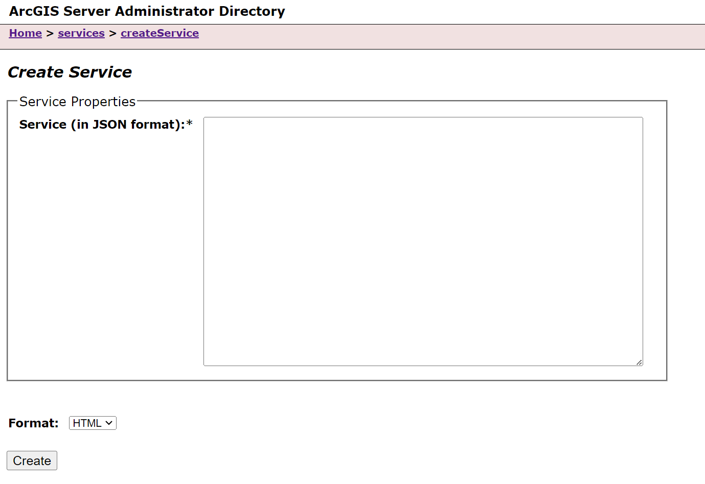

# Create a Feature Service using a Custom Data Feeds Provider
There are three options for creating a custom data provider (CDP) feature service:
- Create from a registered CDP in ArcGIS Server Administrator Directory
- Create from a registered CDP in ArcGIS Server Manager
- Create through the CDF command line tool (_available in version ArcGIS Enterprise SDK version 11.3_)

## Create a Feature Service in ArcGIS Server Administrator Directory

After you've registered your custom data provider with ArcGIS Server,
you can create a read-only feature service that references your data
provider and serves data to ArcGIS clients.

Complete the following steps to create a feature service in ArcGIS Server 
Administrator. Custom data feature services may also be created in ArcGIS 
Server Manager.

1.  In a web browser, navigate to the **ArcGIS Server Administrator
    Directory**, and sign in as an administrator.
2.  Click **services** > **createService**.

    

3.  On the **Create Service** page, copy and paste the following JSON
    into the **Service (in JSON format)** text box.

    ```json
    {
        "serviceName": "<name of service>",
        "type": "FeatureServer",
        "description": "",
        "capabilities": "Query",
        "provider": "CUSTOMDATA",
        "clusterName": "default",
        "minInstancesPerNode": 0,
        "maxInstancesPerNode": 0,
        "instancesPerContainer": 1,
        "maxWaitTime": 60,
        "maxStartupTime": 300,
        "maxIdleTime": 1800,
        "maxUsageTime": 600,
        "loadBalancing": "ROUND_ROBIN",
        "isolationLevel": "HIGH",
        "configuredState": "STARTED",
        "recycleInterval": 24,
        "recycleStartTime": "00:00",
        "keepAliveInterval": 1800,
        "private": false,
        "isDefault": false,
        "maxUploadFileSize": 0,
        "allowedUploadFileTypes": "",
        "properties": {
            "disableCaching": "true"
        },
        "jsonProperties": {
            "customDataProviderInfo": {
                "dataProviderName": "<name of provider>",
                "dataProviderHost": "",
                "dataProviderId": ""
            }
        },
        "extensions": [],
        "frameworkProperties": {},
        "datasets": []
    }
    ```
4.  Provide values for the **dataProviderHost** and **dataProviderID**
    fields if your custom data provider uses them.
5.  Click the **Create** button.
6.  Verify that a feature service was created by navigating to the
    **ArcGIS Server Services Directory**, and ensure the service is
    listed.

You will be able to use the URL (
`https://<domain_name_or_machine_name>/<webadaptor_name>/rest/services/<provider_name>/FeatureServer)` of
this feature service in ArcGIS clients like ArcGIS Pro, ArcGIS Online,
and ArcGIS Enterprise. 

## Create a Feature Service in ArcGIS Server Manager
Sign into ArcGIS Server Manager and navigate to **Services** > **Publish Service**. 
From here, follow the built in Server Manager work flow to publish a service 
"From a registered custom data provider".

## Create a Feature Service in the Custom Data CLI
In ArcGIS Enterprise SDK v11.3, the option to create a feature service from a 
custom data provider in the command line is available. When registering a custom 
data provider from the command line, you can specify options for service creation.
See [Custom Data CLI Reference](../custom-data-cli-reference/) for more details on 
positionals and options.

1.  Navigate to the **app-level** directory of your custom data provider. 

2.  Use the command `cdf register <name> <server-admin-url> <token> -s "service-name" --host "host-value" --id "id-value"`