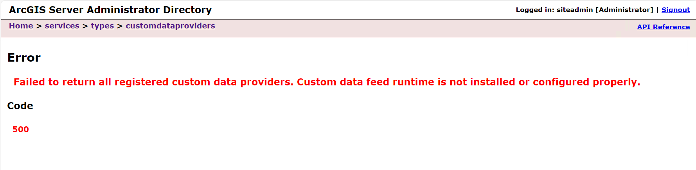
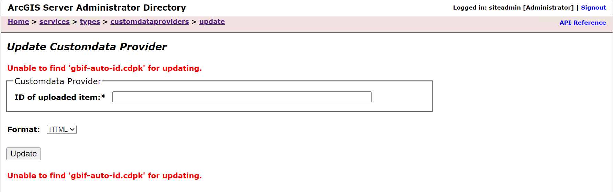

This is a non-comprehensive list of some commonly encountered issues. When you encouter an error
while using Custom Data Feeds on ArcGIS Server, the first step is to check the CDF log files 
that are located at: _ArcGIS/Server/framework/runtime/customdata/logs_.

## Changing the Custom Data Feeds Logging Levels

Logging levels adhere to the ordering specifified in RFC5424 in order of most to least important:
`error`, `warn`, `info`, `http`, `verbose`, `debug`, and `silly`. The default logging level is `info`.

To change the logging level of your CDF app, navigate to `src/app/index.js` and find the line: 
```js
   const koop = new Koop({ logLevel: 'info' });
```
Change `info` to the desired logging level.

## Common Custom Data Feeds Runtime Issues

### **Issue:** Custom Data Providers Are Not Listed in ArcGIS Server Administrator Directory

  **Suggestions:**
  1.  Make sure that the CDF runtime has been installed. CDF runtime is not automatically 
      installed with ArcGIS Server.
  2.  Verify that Node.js is running on port 6483. On Linux, the `ss` command allows you to view 
      which ports are in use. Use `netstat -ano` on Windows to view process and port numbers.

### **Issue:** Custom Data Provider Update Error

  **Suggestions:**
  1. The CDF CLI tool uses the name you provide in the `createProvider` command to set the name of
     the provider in configuration file. This name is used when creating the **.cdpk** and when
     registering your provider on ArcGIS Server. The update process looks for a previously registered 
     provider name that matches the name of the provider in the new, updated **.cdpk**. Ensure 
     that you are using the same provider name in your updated provider that you used in the provider 
     being updated.

### **Issue:** Node Server Failed to Start

  **Suggestions:**
  1. Ensure that all required packages are installed at the custom data provider level.
     You may have a package globally installed on your development machine allowing your 
     custom data app to work correctly in development. The machine that ArcGIS Server is installed
     on may not have that package installed globally, and therefore cannot start the Node.js server.  
  2. Check that you are running the same version of Node.js on your development environment as
     the version running on ArcGIS Server. Some versions have native functionality that others do 
     not, and your app may be using native functionality where other versions of Node.js require a
     package installation. For example, the Fetch API is included with Node.js v18 and higher.
  3. Ensure that you have not installed any packages at the "app level" or modified the **package.json**
     file at the app level. All packages you need for your custom data provider should be installed 
     at the "provider level" directory. Check the logs for any NPM package errors.

## Common Custom Data Feeds CLI Issues

### **Issue:** Custom Data Feeds `cdf` Command Not Found in Command Prompt
  **Suggestions:**
  1. Make sure that you installed a supported version of Node.js (preferably v18.17.0) either directly with the available
     binaries on the Node.js website or via [NVM](https://github.com/nvm-sh/nvm) (Linux) or [NVM for Windows](https://github.com/coreybutler/nvm-windows) 
     (Windows). When installing the ArcGIS Enterprise SDK, a utility checks your machine for a supported version of Node.js. If the installer prompt 
     warns that a supported version of Node.js is not found, cancel the installation, and install Node.js first.
  2. Node.js should always be installed before the ArcGIS Enterprise SDK is installed. Uninstall ArcGIS Enterprise 
     SDK from your development machine, and install Node.js. Then reinstall ArcGIS Enterprise SDK.
  3. If this issue arises in a Linux envionrment, it may be because the user who installed Node.js was not the user who installed CDF CLI tool.
     Ensure that the same user installs both Node.js and the ArcGIS Enterprise SDK.
  4. Manually run `activate_cdf.bat` if in Windows or `activate_cdf.sh` if in Linux. The script is found at: */arcgis/enterprisesdk/customdatacli*

### **Issue:** `'UNABLE_TO_GET_ISSUER_CERT_LOCALLY'` or `'UNABLE_TO_VERIFY_LEAF_SIGNATURE'` Error When Using CDF CLI
  This error may be encountered when using the `register` and `unregister` CLI commands because these commands contact ArcGIS Server Admin APIs.
  Node.js returns this error when it cannot verify the SSL certificate on the machine on which ArcGIS Server is deployed. If ArcGIS Server is running in a 
  disconnected Enterprise deployment or the certificate on the ArcGIS Server machine was created with a custom authority, Node.js will not be able to 
  verify it from the developer environment. 

  **Suggestions:**
  1. If you are working on an intranet, and your organization's security policy allows, you may temporarily disable SSL requirements by
     setting the environment variable `NODE_TLS_REJECT_UNAUTHORIZED` to `false`. On Windows Powershell, use the command: `$Env:NODE_TLS_REJECT_UNAUTHORIZED=0`.
     On Mac/Linux/Git Bash/Windows Command Prompt, use the command: `export NODE_TLS_REJECT_UNAUTHORIZED=0`. This variable returns to the default value of `true` after the terminal 
     session ends.
  2. Another, more secure option, is to add the certificate to the list of trusted certificates. You will need to obtain the **.pem** file for the certificate 
     on the machine on which ArcGIS Server is running. On Windows Powershell, use the command: `$Env:NODE_EXTRA_CA_CERTS = "C:\path\to\cert.pem"`. On Mac/Linux/Git Bash/Windows Command Prompt,
     use the command: `export NODE_EXTRA_CA_CERTS=/path/to/cert.pem`.