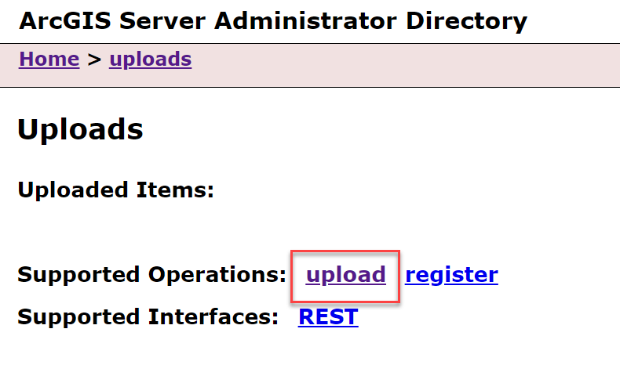
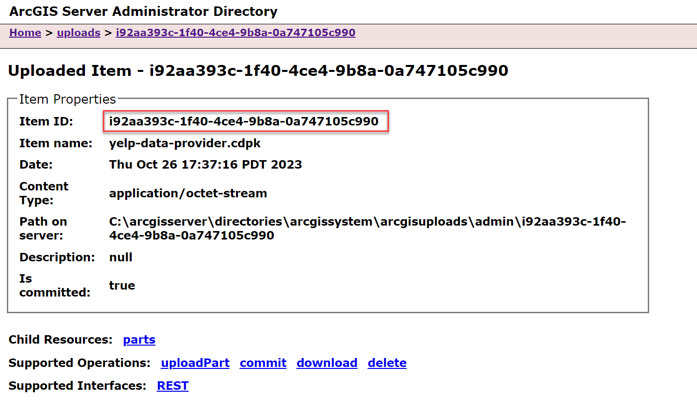
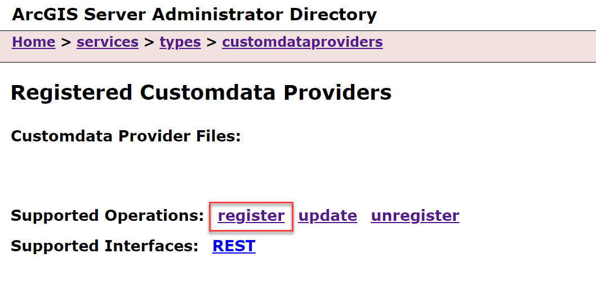
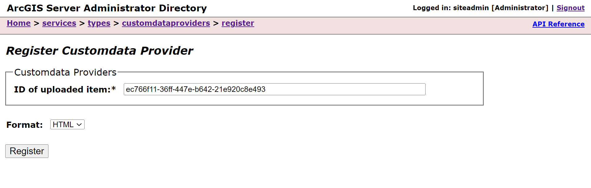

# Register a Custom Data Provider
There are three options for registering a custom data provider:
- Register through ArcGIS Server Administrator Directory using your custom data package file (**.cdpk**)
- Register through ArcGIS Server Manager using your **.cdpk**
- Register through the CDF command line tool (_available in version ArcGIS Enterprise SDK version 11.3_)

## Registration in ArcGIS Server Administrator

1.  Navigate to the ArcGIS Server Administrator Directory in a web
    browser, and sign in as an administrator.

2.  Click **uploads** \> **upload**.

    

    

3.  On the **Upload Item** page, click **Choose File** and select your
    **.cdpk** file. Optionally, provide a description in the
    **Description** text box.

    

4.  Click the **Upload** button. Once the file is uploaded, you will be directed to
    a page with the following header: **Uploaded item** - \<item_id\>.
    Copy the item id.

    

5.  Browse back to the root of the Administrator Directory and then
    click **services** \> **types** \> **customdataproviders**.

6.  On the **Registered Customdata Providers** page, click **register**
    and paste the item id into the **Id** of the **uploaded item**
    field.

      
    
    

7.  Click the **Register** button.

## Registration in ArcGIS Server Manager
Sign into ArcGIS Server Manager and navigate to **Sites** > **Custom Data Feeds**. 
From here, follow the built in Server Manager help system.

## Registration with the Command Line Interface
In ArcGIS Enterprise SDK v11.3, the option to register a custom data provider from 
the command line is available. When registering a custom data provider from the 
command line, you do not need to use the `cdf export <name>` command.
See [Custom Data CLI Reference](../custom-data-cli-reference/) for more details 
postionals and options.

1.  Navigate to the **app-level** directory of your custom data provider. 

2.  Use the command `cdf register <name> <server-admin-url> <token>`
