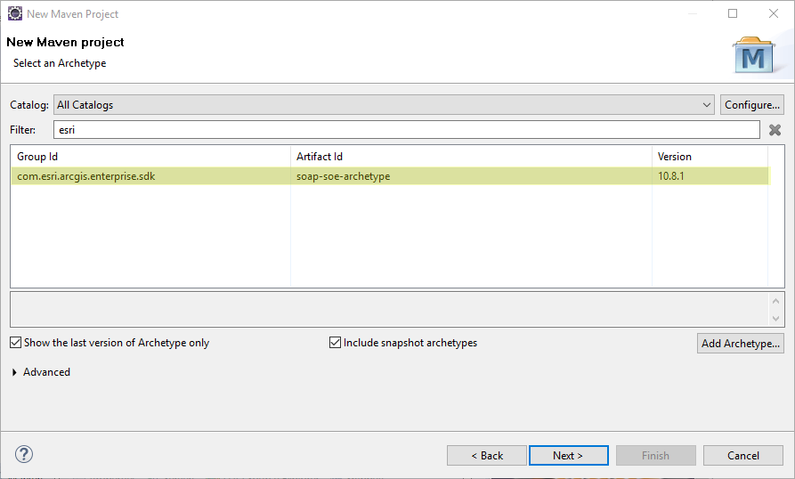
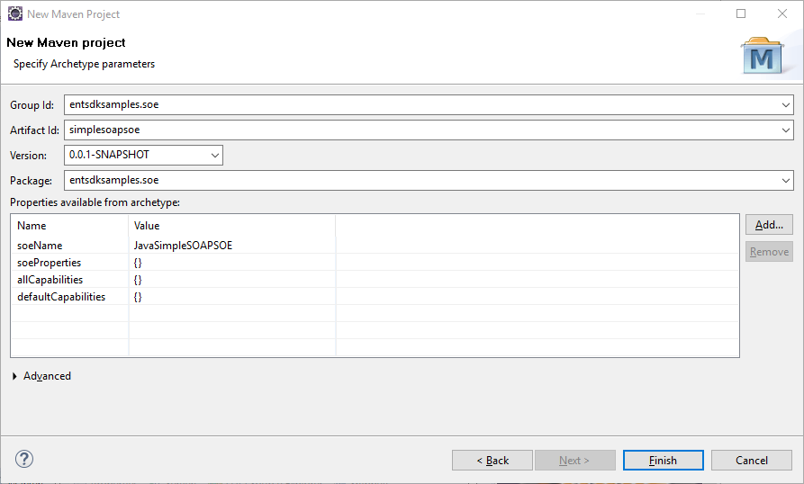
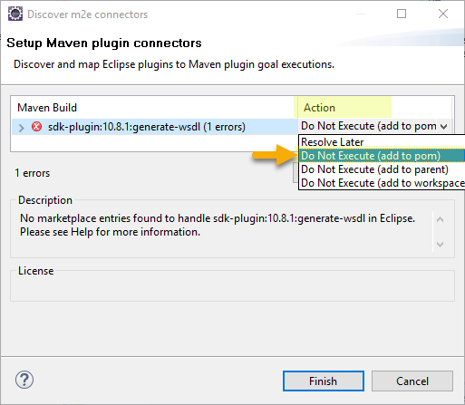
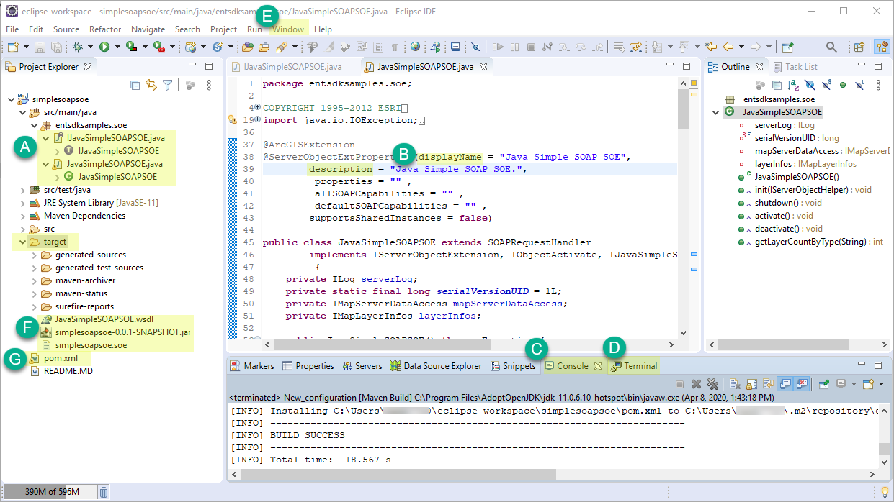
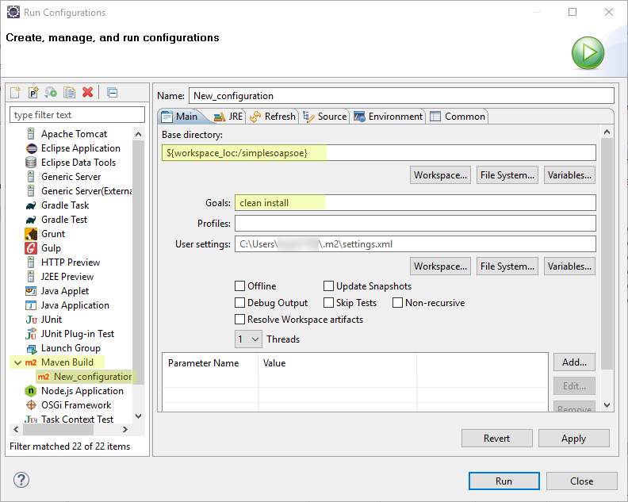

# Build SOAP SOEs using Eclipse

This topic describes how to create, build, and deploy a SOAP server object extension (SOE) under the Maven framework using Eclipse. It also describes how to consume the SOE from the ArcGIS Server Services Directory.

1. [Create the SOAP SOE project](#create-the-soap-soe-project)
2. [Build the SOAP SOE project](#build-the-soap-soe-project)
3. [Deploy the SOE to ArcGIS Server](#deploy-the-soe-to-arcgis-server)

The SOE that you will create in this topic is also provided as a sample, named Simple SOAP SOE in ArcGIS Enterprise SDK(`..\EnterpriseSDK\Samples\Java\serverobjectextensions\simplesoapsoe`).

### Create the SOAP SOE project

To create a SOAP SOE using Eclipse, complete the following steps:

1. Ensure that ArcGIS Enterprise SDK, Java, and Maven are all installed on your development environment. See more details in the [Installation](../installation-java/) section.
2. Open Eclipse and select **File** > **New** > **Maven Project**. The **New Maven Project** wizard appears.
3. Uncheck **Create a simple project (skip archetype selection)** and click **Next**.
4. If the `soap-soe-archetype` has already been added, skip this step. 

    Otherwise, click the **Add Archetype** button on the right, type the following values in the **Add Archetype** wizard, and click **OK**:
    - GroupId: `com.esri.arcgis.enterprise.sdk`
    - ArtifactId: `soap-soe-archetype`
    - Version: `10.9.1` (use `10.9.0` for 10.9 SDK and `10.8.1` for 10.8.1 SDK)

     

5. The `soap-soe-archetype` is now added. Select this archetype and click **Next**.

   

6. Enter the information in the parameters below and click **Finish**:

    
    - GroupId — entsdksamples.soe
    - ArtifactId — simplesoapsoe
    - Package — entsdksamples.soe
    - soeName — JavaSimpleSOAPSOE

7. Choose **Action** > **Do not Execute (add to pom)** and click **Finish**, if the following **Discover m2e connectors** dialog box appears.

   

8. A new SOE project is created now. You should see the `entsdksamples.soe` package, and the `JavaSimpleSOAPSOE` class and `IJavaSimpleSOAPSOE` interface under the `src\main\java` folder. 

### Build the SOAP SOE project

Building an SOE project will package the project's classes, dependencies, and resources into a `.soe` file, which can be deployed to ArcGIS Server. Since it's a Maven project, the Maven build lifecycle must be followed to build the SOAP SOE. Read more about [project build](../about-maven-integration/#project-build). 

You can build the SOE project by using either the **Maven Build** tool or the **Terminal** view in Eclipse.

As the project is created from `soap-soe-archetype`, it automatically loads the boilerplate code that implements a ready-to-use SOE. For now, we can just customize the `displayName` and `description` of the SOE and leave the rest of the code as is.

1. Open the SOE class `JavaSimpleSOAPSOE`, located in the `src\main\java` folder (see **A** in the example above).
2. Set the `displayName` and `description` to `Java Simple SOAP SOE` (see **B**).
3. Follow these steps to build the project.

    - To build the project using **Maven Build**, do the following:

        a. Right-click the project and choose **Run As** > **Run Configuration**.

        b. Double-click **Maven Build** from the list on the left side of the **Run Configuration** wizard.

        c. The **New_configuration** wizard appears. Click **Workspace** to set the current project as the workspace. Type `clean install` in **Goals**, click **Apply**, and click **Run**.

        
        
        d. The project is built successfully, with detailed log messages in the **Console** view (see **C**).
    
    - Alternatively, to build the project in the **Terminal** view, do the following:

        a. Click the **Terminal** tab at the bottom of Eclipse (see **D**). If you can't find this tab, you need to add this view from **Window** > **Show View** > **Other** > **Terminal** (see **E**).

        b. On the **Terminal** view, click **Open a Terminal**, which is a blue button on the right. A terminal is activated.

        c. Ensure the current directory is pointing to the project's base directory.

        d. Type `mvn clean install`. This command does a clean build of the project and you should see `Build Success`. 

4. Once the build finishes, a new folder named `target` appears in the project's base directory, and you can find the SOE file `simplesoapsoe.soe` and the WSDL file `JavaSimpleSOAPSOE.wsdl` in this folder (see **F**). If you don't see those files, right-click and refresh the `target` folder or the project.

If you would like to add third-party libraries as dependencies, you can add them to the project's `pom.xml` (see **G**). The POM contains project configuration information, such as the Java compiler (JDK) used, plug-ins used, project's dependencies, and project's version. Learn more about [POM dependency management](../about-maven-integration/#enterprise-sdk-maven-artifacts).

> Note: If the SOAP SOE references classes from a third-party dependency as the SOAP method's parameters or return values, the dependency must be included under both the project's `dependencies` and the `sdk-plugin`'s `dependencies` in the POM. Learn more details in the [Enterprise SDK Maven plug-in](../about-maven-integration/#enterprise-sdk-maven-artifacts) section.

### Deploy the SOE to ArcGIS Server

The SOE you created must be deployed to ArcGIS Server and enabled on a map service. To learn how to deploy an SOE, see the [Deploy extensions](../deploy-extensions-java/) topic in the ArcGIS Enterprise SDK help. Note that the term “deploy” is used here to mean uploading the `.soe` file to ArcGIS Server and registering it as an extension to map services. To learn how to enable an SOE on a map service, see the [Enable extensions](../enable-extensions-java/) topic in the ArcGIS Enterprise SDK help.

### Also See

-   [Install the Java IDE](../install-the-java-ide/)
-   [SOE with properties](../soe-properties-java/)
-   [Log messages](../log-messages-java/)
-   [Debug extensions](../debug-extensions-dedicated-java/)