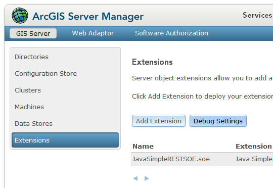
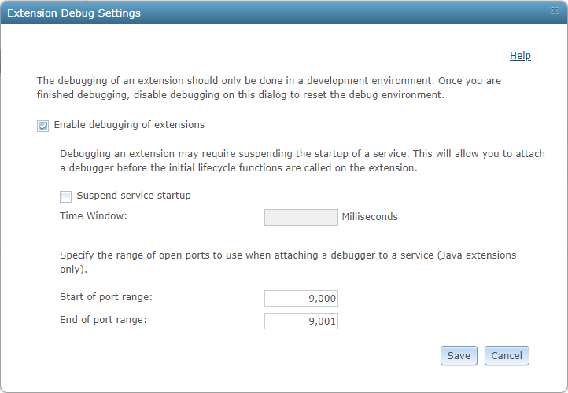
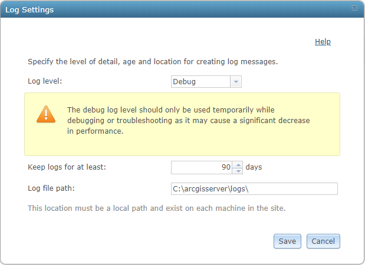
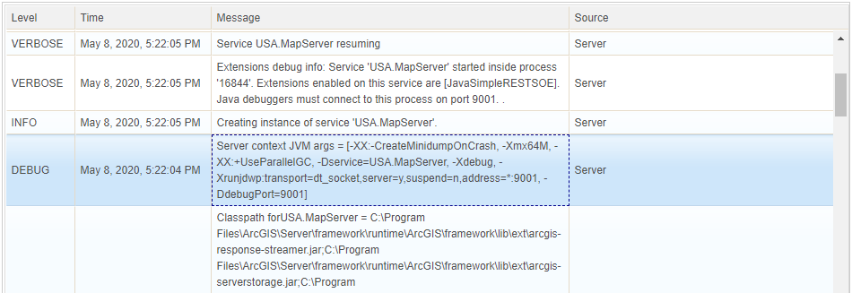
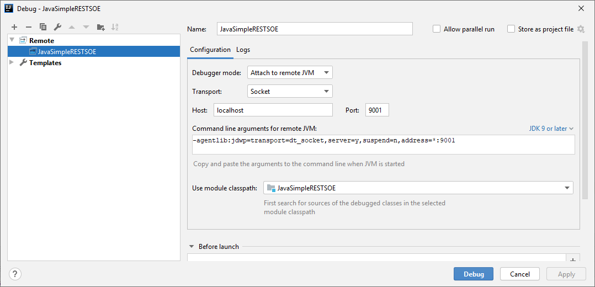
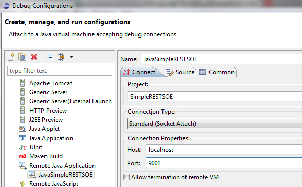
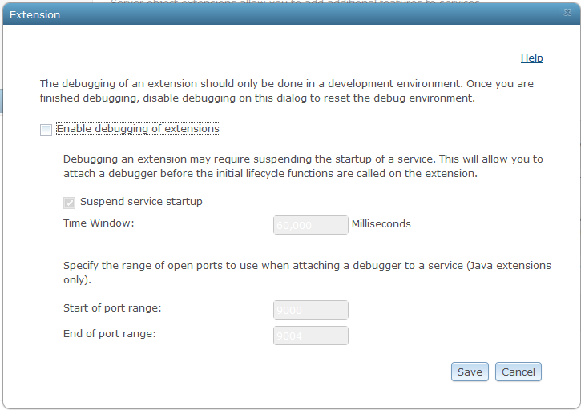
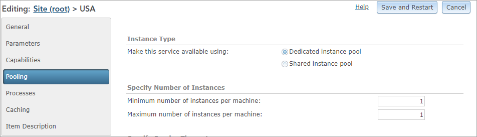

# Debug extensions with dedicated instances

This topic describes how to debug Java extensions with dedicated instances. The debugging workflow for server object extensions and interceptors, does not include a separate application to manage runtime debug settings. Instead, all debug management options are now available in ArcGIS Server Manager.

### How to enable debugging

1.  Sign in to ArcGIS Server Manager.

2.  Ensure that the extension to debug into is deployed to ArcGIS Server.

3.  Publish a map service and enable the above extension on it.

4.  Browse to **Site** -> **Extensions**. Click the **Debug Settings** button.

    

5.  Click **Enable debugging of extensions** to enable debugging.

    

6.  Specify a port range. 

    After this setting is saved, when you start a service with an SOE or SOI enabled, ArcGIS Server will select one of the available ports from this range, bind your service and extension’s process to this port, and listen to the incoming connection request on this port. If you start another service with an extension enabled afterward, ArcGIS Server will bind the new service and extension’s process to the next available port within the port range. 
    
    If all the ports within the port range have been bound to the existing processes when a new service is being started with an SOE or SOI enabled, the service will still start successfully with the extension enabled but will not bind any port to its process.

7.  Click **Save**. Debugging is now enabled on ArcGIS Server.

8.  Enable `Debug` level logs at **Server Manager** > **Logs** > **Settings** > **Log level** and click **Save**.

    

### How to debug extensions using Java IDEs

First, you must find the port number that ArcGIS Server is listening on, as follows:

1.  Restart the map service that your extension is enabled on, which allows the port number to show up in server logs.
    
    You must restart your service with the extension enabled after you [enable debugging](#how-to-enable-debugging). Otherwise, the port number will not show up in server logs.

2.  Access the server logs in ArcGIS Server Manager.

3.  Set **Log Filter** to `Debug` and **Source** to `Server Framework`. Click **Query**.

4.  Pick up the port number from the log entry that mentions the name of the map service your extension is enabled on and the name of your extension. In the example below, the port number selected by ArcGIS Server is 9001:

    

    If you find this log message but it doesn't show `DdebugPort=...`, it's likely that there is no available port within the port range defined in **Debug settings** to bind to the service process. See [Debug tips](#debug-tips) on how to fix it.

5.  Next, attach the debugger to the extension's running process in the Java IDE. 

    The following section demonstrates how to attach the debugger in IntelliJ and Eclipse: 

    - Debug extensions using IntelliJ

        a.  Open the SOE or SOI project in IntelliJ.

        b.  Click **Run** > **Debug** > **Edit Configurations..**.

        c.  Click the **Add New Configuration** button (**+**).

        d.  Choose **Remote** in the **Add New Configuration** menu. 

        e.  Enter the port number obtained from the previous steps in the **Port** text box. 

        If your server and Java IDE are installed on the same machine, you can leave `localhost` as the **Host** value. If your server is installed on a different machine from your Java IDE, type in the host name of your server machine.

        

        f.  Click **Debug**.

        Now the debugger is attached to the process. The message "Connected to the target VM, address: 'localhost:9001', transport: 'socket'" appears in the **Debug** tool window. You can perform service operations now to trigger the extension's breakpoint.

    - Debug extensions using Eclipse

        a. Open the SOE or SOI project in Eclipse.

        b.  Right-click your project and select **Debug As…**.

        c.  Click **Remote Java Application** in the list of types of applications.

        d.  If this item doesn't contain any debug configurations, double-click **Remote Java Application**. This creates a debug configuration based on your project.

        

        e.  In the **Port** text box, type in the port number copied from server logs.

        f.  If your server and Java IDE are installed on the same machine, you can leave `localhost` as the **Host** value. If your server is installed on a different machine from your Java IDE, type in the host name of your server machine.

        g.  Click **Debug**.

        Now the debugger is attached to the process. You can perform service operations to trigger the extension's breakpoint.

### How to disable debugging

1.  Sign in to ArcGIS Server Manager.
2.  Browse to Site -> Extensions. Click the **Debug Settings** button.

    

3.  Uncheck the **Enable debugging of extensions** check box to disable debugging.

    

4.  Click **Save**. Debugging is now disabled in ArcGIS Server.
5.  Restart the map service that your SOE is enabled on for the above changes to take effect.

### How to debug the extension's `init()` method

Since the extension's `init()` method happens during service initialization, you must launch the debug session before the service completes initialization. To resolve this timing gap, you must use the additional **Suspend service startup** setting at **Extension Debug Settings**.  

1. Follow the same instructions at [How to enable debugging](#how-to-enable-debugging) until step 5. 

2. Check the **Suspend service startup** checkbox and provide the time window in milliseconds that you need to start debugging after the service is started.

    

   When the service with the extension enabled starts, ArcGIS Server freezes initialization of the map service for the duration specified by this time window, thus allowing you enough time to start a debugging session in your IDE and connect the IDE's debugger to the service process hosting the extension via the port.

   > Note: This time window should be long enough to allow you to finish all the steps at [How to debug extensions using Java IDEs](#how-to-debug-extensions-using-java-ides).

3. Add a breakpoint at your extension's `init()` method where you want to start debugging.

4. Continue the instructions in [How to enable debugging](#how-to-enable-debugging) and [How to debug extensions using Java IDEs](#how-to-debug-extensions-using-java-ides).

### Debug Tips

-   Set log level to **Debug**.

    Before turning debugging on, open the **Logs** page in Manager and verify that the log level in both **Settings** and **Log Filter** are set to **Debug**. Setting log level to **Debug** ensures that logs at all the levels can be captured, especially for the logs showing port number.

-   Adjust the port range.

    After debugging is turned on in Manager, Server allocates a port number to all instances of services that are newly created or re-started. If you have numerous services running, you must provide a wider port range in the **Site** -> **Extensions** -> **Debug Settings** dialog box in Manager to accommodate all those instances, including those of your SOE's map service. 

    Alternatively, for duration of your debugging session, you can stop non-required services and reduce the number of instances of your SOE's map service to one. This allows for a shorter port range and generates fewer logs for you to sift through to determine the port number.

    If you can't find the port number in server logs as the screenshot above, all the ports within the port range may be in use. In this scenario, start again with a different range of ports.

-   Set the service to run as one instance.

    It's easier to debug extensions with the service that's running as only one service instance. To limit the number of instances that the service can run, set both **Minimum number of instances per machine** and **Maximum number of instances per machine** to 1 in Manager.

    

-   Remember to disable debugging.
    
    Remember to turn debugging off in the **Site** -> **Extensions** -> **Debug Settings** dialog box in Manager, after your debugging session is over.
