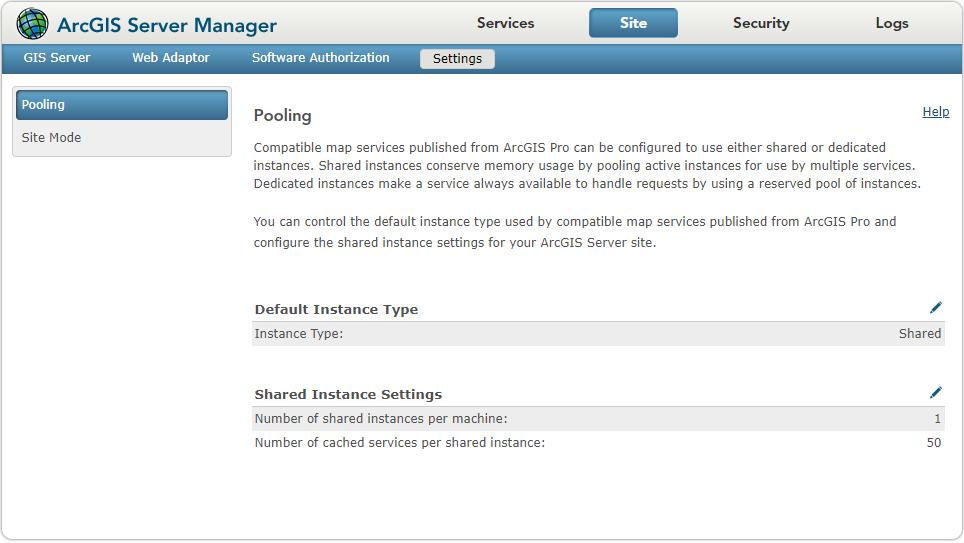
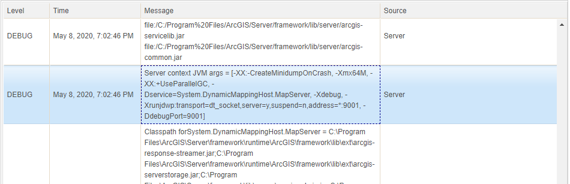

# Debug extensions with shared instances

Debugging Java extensions with shared instances is very similar to debugging with dedicated instances except that when you need to find the port number or debug the extension's initialization code. You should still first [enable debugging](#how-to-enable-debugging) and [attach the debugger via a port in your Java IDE](#how-to-debug-extensions-using-java-ides). Before you continue this topic, you should get familiar with [debugging extensions with dedicated instances](../debug-extensions-dedicated-java/). In addition, you should understand the [life cycle of extensions using shared instances](../develop-extensions-for-shared-instances-java/#life-cycle-of-extensions-using-shared-instances).

### How to enable debugging

This section is the same as debugging extensions with dedicated instances. To learn more, see [How to enable debugging](../debug-extensions-dedicated-java/#how-to-enable-debugging).

### How to debug extensions using Java IDEs

First, you must find the port number that ArcGIS Server is listening on, as follows:

1.  Set **Number of shared instances per machine** to `1` at **Server Manager** >** Site** > **Settings** > **Pooling**.

  

  This step is optional, but it helps limit the number of shared instances running on the server, which in turn limits the number of ports assigned to the shared instances. Since debugging an extension only needs one shared instance running, you can set **Number of shared instances per machine** to `1`. 

  You can leave the **Number of cached services per shared instance** setting in the above page as the default. However, if you want to debug the life cycle of the extension which is enabled with multiple map services set for shared instances, you can set it to `1`. Otherwise, you can leave this setting as the default.

  To learn more about these two settings, see [Configure the shared instance pool](https://enterprise.arcgis.com/en/server/latest/administer/windows/configure-service-instance-settings.htm#ESRI_SECTION1_100EBEA6FF554B0BAFE3662F08772BC3).

2.  Restart the DynamicMappingHost service. This will make the port number appear in server logs.
  
  The shared instance pool is managed by the DynamicMappingHost service, which can be stopped or started manually via [Admin API](https://developers.arcgis.com/rest/enterprise-administration/server/service.htm):
  
  Stop - `https://machine:port/webadaptor/admin/services/System/DynamicMappingHost.MapServer/stop`
  Start - `https://machine:port/webadaptor/admin/services/System/DynamicMappingHost.MapServer/start`

  The DynamicMappingHost service powers DynamicMappingHost processes, which are shared by those map services set to use shared instances. Since you have set **Number of shared instances per machine** to `1`, there will be only one DynamicMappingHost process running and one port assigned to it. When you restart DynamicMappingHost, a port will be assigned to the DynamicMappingHost process and its port number will show up in a `Debug` level log message in server logs.

  > Note: Even if you enable the extension with multiple map services using shared instances and start or stop those map services individually, your port number will stay the same. The port number will only be reassigned when you restart DynamicMappingHost. 

  Only after you [enable debugging](#how-to-enable-debugging), the debugging port number can show up in server logs at the restart of DynamicMappingHost. Otherwise, the port number will not show up and you will have to start over again.

3.  Access the server logs in ArcGIS Server Manager.

4.  Set **Log Filter** to `Debug` level and click **Query**.

5.  Pick up the port number from the log entry that mentions DynamicMappingHost. In the example below, the port number selected by ArcGIS Server is 9001:

  

6.  Next, attach the debugger to the extension's running process in the Java IDE. This part is the same as [Debug extensions with dedicated instances](../debug-extensions-dedicated-java/). You can refer to above link for instructions on debugging extensions in Eclipse or IntelliJ.

### How to disable debugging

This section is the same as debugging extensions with dedicated instances. To learn more, see [How to disable debugging](../debug-extensions-dedicated-java/#how-to-disable-debugging).

### How to debug the extension's `init()` method

Since restarting DynamicMappingHost does not automatically activate the service extension, there is no need to use the additional **Suspend service startup** setting at **Extension Debug Settings**, compared to debugging with dedicated instances. The `init()` method will be called the first time the extension is accessed. For example, you can add a breakpoint at your extension's `init()` method where you would like to start debugging, and trigger this breakpoint by doing these:

- Sending a REST or SOAP request to the SOE.
- Sending a REST, SOAP, or OGC request to the service with which the SOI is enabled.

If you want to debug the `init()` method again, you can restart the individual map service at ArcGIS Server Manager, and trigger the breakpoint again.

### Debug tips

-   Set log level to **Debug**.

    Before turning debugging on, open the **Logs** page in Manager and verify that the log level in both **Settings** and **Log Filter** are set to **Debug**. Setting log level to **Debug** ensures that logs at all the levels can be captured, especially for the logs showing port number.

-   Adjust the port range.

    After debugging is turned on in Manager, Server allocates a port number to all instances of services that are newly created or re-started, including dedicated and shared instances. If you have numerous services running, you must provide a wider port range in the **Site** -> **Extensions** -> **Debug Settings** dialog box in Manager to accommodate all those instances. 

    Alternatively, for duration of your debugging session, you can stop non-required services and reduce the number of shared instances to one. This allows for a shorter port range and generates fewer logs for you to sift through to determine the port number.

    If you can't find the port number in server logs as the screenshot above, all the ports within the port range may be in use. In this scenario, start again with a different range of ports.

-   Remember to disable debugging.
    
    Remember to turn debugging off in the **Site** -> **Extensions** -> **Debug Settings** dialog box in Manager, after your debugging session is over.