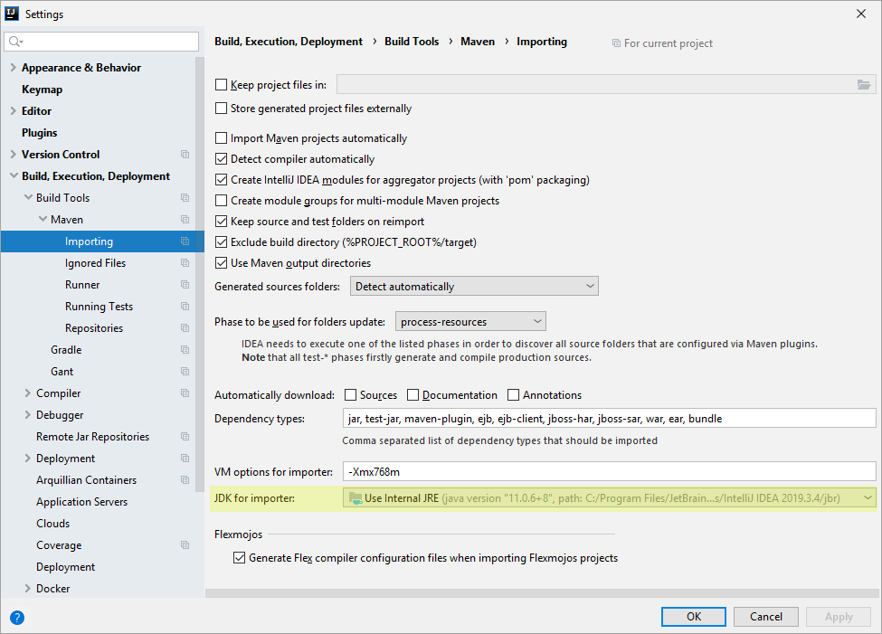
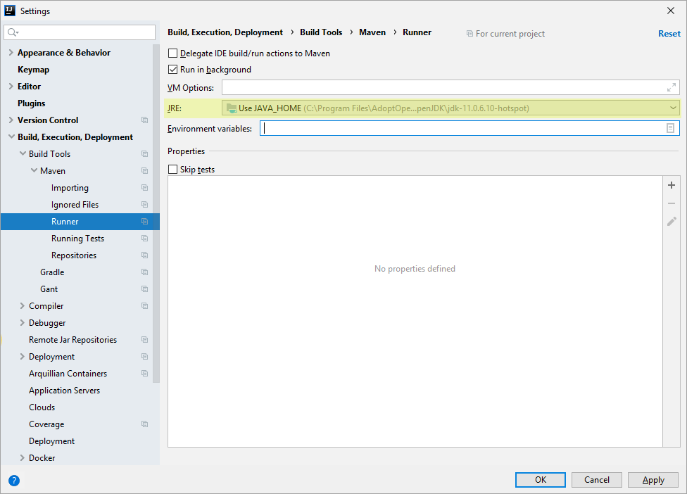
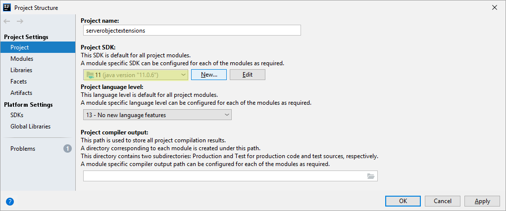
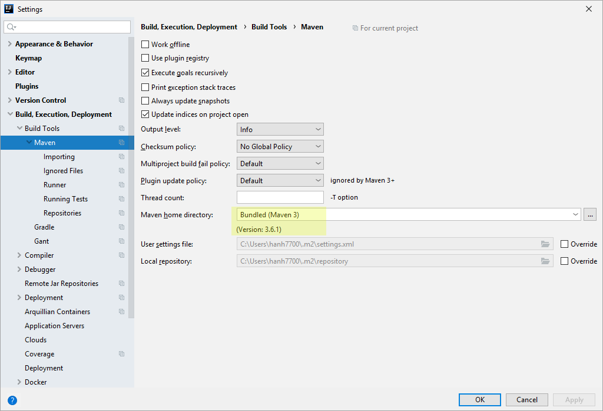

# Install the Java IDE

You can now choose and install the Java integrated development environment(IDE) for your development environment. Most Java IDEs that support the Maven framework and JDK11 can be used to develop SOEs and SOIs, such as Eclipse, IntelliJ IDEA, and NetBeans. Since each IDE may provide different Maven wizards or user interfaces, the steps to create and manage the Maven SOE or SOI project in different Java IDEs may be slightly different.

Enterprise SDK documentation only demonstrates using [Eclipse](https://enterprise.arcgis.com/en/system-requirements/latest/windows/arcgis-enterprise-sdk-system-requirements.htm#ESRI_SECTION1_DB48BF058BC249DCA4A76A498373AEC6) and [IntelliJ IDEA](https://enterprise.arcgis.com/en/system-requirements/latest/windows/arcgis-enterprise-sdk-system-requirements.htm#ESRI_SECTION1_DB48BF058BC249DCA4A76A498373AEC6).

You can download the Java IDE from the IDE's website and install the IDE. 

### IntelliJ troubleshooting tips

This section provides some tips on using IntelliJ IDEA to build and manage your Maven SOE or SOI project. 

#### JDK settings in IntelliJ

First, you must ensure the [supported version of Java](../system-requirements-java/) is configured for your SOE or SOI project. Failure to do so will cause project compile errors and build failures. Before you continue, ensure you have the Java environment set up properly. You can refer to [Install Java and Maven](../install-java-and-maven/) for more details. The following tips can be used to troubleshoot JDK-related errors in IntelliJ. 

  - From the project's **POM**
  1. Open the project's `pom.xml` file.
  2. Ensure the following properties are set:
    ``` xml
    <properties>
      <project.build.sourceEncoding>UTF-8</project.build.sourceEncoding>
      <maven.compiler.source>11</maven.compiler.source>
      <maven.compiler.target>11</maven.compiler.target>
    </properties>
    ```
  - From **Settings**
  1. Open the **File** menu and click **Settings**.
  2. Browse to **Build, Execution, Deployment** > **Build Tools** > **Maven** on the left side of the **Settings** window.
  3. Click **Importing** under the **Maven** menu. Ensure the supported version of Java is configured for **JDK for importer**.

   

  4. Click **Runner** under the **Maven** menu. Ensure the supported version of Java is configured for **JRE**.

  

  - From **Project Structure**
  1. Open the **File** menu and click **Project Structure**.
  2. Browse to **Project Settings** > **Project** on the left side of the **Project Structure** window.
  3. Ensure the supported version of Java is configured for **Project JDK**.

  

#### Maven settings in IntelliJ
Before you configure the Maven settings at IntelliJ, you must ensure the [supported version of Maven](../system-requirements-java/) is installed correctly. Then, you can follow these steps to configure the supported version of Maven with your project in IntelliJ:

  1. Open the **File** menu and click **Settings**.
  2. Browse to **Build, Execution, Deployment** > **Build Tools** > **Maven** on the left.
  3. Ensure the supported version of Maven is configured for **Maven home directory**.
  
   

#### Typical errors

- "Failed to execute goal org.apache.maven.plugins:maven-clean-plugin:3.1.0:clean (default-clean) on project xxx: Failed to clean project: Failed to delete C:\Users\xxx\IdeaProjects\xxx\target\xxx.jar"

  This error indicates that IntelliJ is unable to delete the generated jar file from the `target` folder. It usually happens when you do a Maven clean or a clean install of the project. You can try closing all the IntelliJ windows to completely shut down IntelliJ, and then either manually delete the jar file or reopen the project to do a Maven clean. If this doesn't work, you can copy and paste the entire project to a different location and try again with the copied project.

- "Cannot resolve symbol …" error for all the Java classes from ArcGIS Enterprise SDK (arcgis-enterprise-sdk.jar)

   Try the following: 
   
   In IntelliJ, click the **File** menu > choose **Invalidate Caches/Restart...** > click **Invalidate and Restart** in the prompted dialog box.