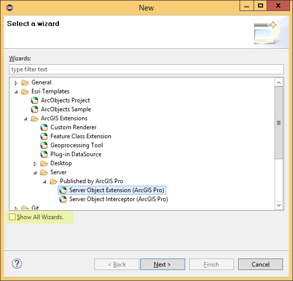
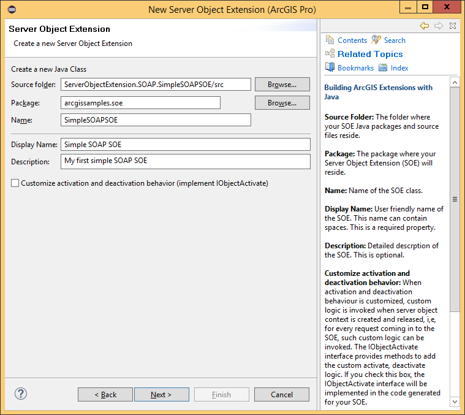
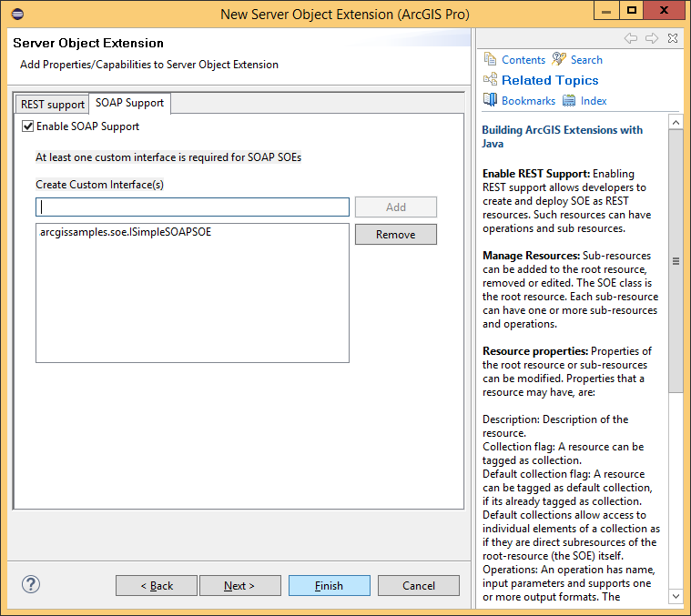

# Develop SOAP SOEs

This topic describes how to create a SOAP server object extension (SOE) and export it using the ArcGIS Eclipse IDE wizard that is available via the ArcGIS Enterprise SDK. It also describes deployment of the SOE and its use via a Java console application.

### About developing SOAP SOEs using Java

The pattern for developing SOAP SOEs is to create a Java class that extends the com.esri.arcgis.server.SOAPRequestHandler base class, implements the mandatory IServerObjectExtension interface, and also implements a custom ArcGIS extension interface that provides your SOE’s business methods. The SOAPRequestHandler base class provides functionality to handle SOAP requests and generate responses, thus relieving your SOE from this boilerplate burden and allowing you to focus on implementing your SOE's business logic. The presence of the custom interface allows your SOE to expose its business logic methods to clients through SOAP.  

The SOE that you will end up creating in this walkthrough is also provided as a sample, called SimpleSOAPSOE, in the ArcGIS Enterprise SDK.

### Create a SOAP SOE using the Eclipse SOE wizard

To create a SOAP SOE using the Eclipse SOE wizard, complete the following steps:

1.  Ensure that your PATH environment variable includes reference to `<JDK home>/bin`.
2.  Ensure that the ArcGIS Enterprise SDK is installed on your computer. 

	The SDK provides access to libraries required for developing Java extensions, as well as the Eclipse plugin that provide wizards to create and export SOEs.
3.  Ensure that ArcGIS Eclipse plugin is installed in your copy of Eclipse. 

	The minimum supported version of Eclipse is Oxygen. For instructions on how to install the ArcGIS Eclipse plugin, see the [Use ArcGIS Eclipse Plugin](../legacy-use-arcgis-eclipse-plugin/) topic.
4.  Create a new Eclipse Java project, or use an existing one.
5.  Add the ArcGIS Enterprise SDK library to your Eclipse project. 

	This library becomes available only after the ArcGIS Eclipse plugin is installed.
6.  Create a new SOAP SOE, and call it SimpleSOAPSOE.

### Configure a SOAP SOE using the Eclipse SOE wizard

1.  With your project selected, right-click your source folder (typically src), and select New > Other from the context window. The New dialog box appears with a list of wizards. 

2.  Expand the Esri templates, ArcGIS Extension, Server and Published by ArcGIS Pro folders, then find the **Server Object Extension (ArcGIS Pro)** wizard.

    

    These wizards become available only after the ArcGIS Eclipse plugin is installed. If you already installed the ArcGIS Eclipse plugin but still don't see the **Server Object Extension (ArcGIS Pro)** wizard, make sure you check the **Show All Wizards** checkbox and reopen this New dialog box.

3.  Select Server Object Extension (ArcGIS Pro), and click Next in the wizard to get started. This opens the New Server Object Extension wizard. On the first page of this wizard, you'll create your Java SOE class. See the following screen shot:

    

4.  Enter a package name and class name for your SOE.
5.  Enter a display name (can contain spaces) and some user-friendly description.
6.  There is an option to implement the IObjectActivate interface. This interface provides methods to invoke custom logic upon SOE creation and destruction. Since your SimpleSOAPSOE will not have any custom logic at creation or destruction time, leave this check box unchecked, and click Next.

      

7.  Select the SOAP Support tab.
8.  Click Enable SOAP Support, enter a name for your custom interface, and click Add to have the interface added to the SOE. An interface is required for SOAP SOEs since methods declared here will be exposed as SOAP operations and would be made accessible via SOAP after the SOE is deployed to ArcGIS for Server. A SOAP SOE can have multiple interfaces but one is sufficient for the SimpleSOAPSOE.
9.  Click Finish. A dialog box may appear asking if you would like to add the ArcGIS library to your build path. Click OK to add the required arcgis-enterprise-sdk.jar to your project’s build path.
10. Verify that the wizard generated two Java classes, one holding the custom ArcGIS extension interface, ISimpleSOAPSOE.java, and the other holding the SOE class, SimpleSOAPSOE.java.

### Add initialization and business logic to the SOE

Java SOAP SOEs support the use of primitives (as defined by W3C), Java, and the ArcGIS Enterprise SDK data types as input and return parameters in SOAP operations. You can send and receive these types to and from your SOE via SOAP. The SimpleSOAPSOE you just created will accept and return only primitives such as int and String. To use data types, see the FindNearbyFeatures SOAP SOE sample.

The SimpleSOAPSOE class generated by the wizard includes only the `init()` and `shutdown()` methods, which belong to the IServerObjectExtension interface. These methods are called by the ArcGIS Server framework when the SOE is instantiated and destroyed, respectively. These are common to SOAP and REST SOEs.


#### Implement SOE initialization logic

The following code snippet includes the `init()` and `shutdown()` methods of the SOE. The `init()` method prepares the ArcGIS Enterprise SDK members that the SOE requires at run time, including a handle to the map service that the SOE extends.

```java
public class SimpleSOAPSOE extends SOAPRequestHandler implements
    IServerObjectExtension, ISimpleSOAPSOE{
    private static final long serialVersionUID = 1L;
    private ILog serverLog;
    private IMapServerDataAccess mapServerDataAccess;
    private IMapLayerInfos layerInfos;

    public SimpleSOAPSOE()throws Exception{
        super();
    }

    /**
     * init() is called once, when the instance of the SOE is created.
     */
    public void init(IServerObjectHelper soh)throws IOException, AutomationException{
        this.serverLog = ServerUtilities.getServerLogger();
        this.mapServerDataAccess = (IMapServerDataAccess)soh.getServerObject();

        IMapServer ms = (IMapServer)this.mapServerDataAccess;
        IMapServerInfo mapServerInfo = ms.getServerInfo(ms.getDefaultMapName());
        this.layerInfos = mapServerInfo.getMapLayerInfos();

        serverLog.addMessage(8000, 200, "Initialized " + this.getClass().getName() +
            " SOE.");
    }

    /**
     * shutdown() is called once when the Server Object's context is being shut down and is about to go away.
     */
    public void shutdown()throws IOException, AutomationException{

        serverLog.addMessage(8000, 200, "Shutting down " + this.getClass().getName()
            + " SOE.");
        this.serverLog = null;
        this.mapServerDataAccess = null;
    }
```

#### Implement business logic for the SOAP SOE

To implement business logic for the SOAP SOE, complete the following steps:

1.  Ensure your newly generated `ISimpleSOAPSOE` interface looks like the following code snippet and contains no method declarations:

    ```java
    package arcgissamples.soe;

    import com.esri.arcgis.interop.extn.ArcGISExtension;

    @ArcGISExtension public interface ISimpleSOAPSOE{}
    ```

2.  Add a `getLayerCountByType()` method to this interface.  
    This method counts the number of layers of the type specified by the type parameter. So, it takes in a String (acceptable values are feature, raster, all) and returns the number of layers of the matching type, in the associated map service. See the following code sample:

    ```java
    package arcgissamples.soe;

    import com.esri.arcgis.interop.extn.ArcGISExtension;

    @ArcGISExtension public interface ISimpleSOAPSOE{
        public int getLayerCountByType(String type)throws Exception;
    }
    ```

#### Implement SOAP operations

Implement the `getLayerCountByType()` method in your `SimpleSOAPSOE` class as shown in the following code sample: 

```java
public int getLayerCountByType(String type)throws Exception{
    if (type != null && !type.isEmpty()){
        String aoType = "";
        if (type.equalsIgnoreCase("all")){
            return layerInfos.getCount();
        }
        else if (type.equalsIgnoreCase("feature")){
            aoType = "Feature Layer";
        }
        else if (type.equalsIgnoreCase("raster")){
            aoType = "Raster Layer";
        }
        else if (type.equalsIgnoreCase("dataset")){
            aoType = "Network Dataset Layer";
        }

        int count = 0;
        for (int i = 0; i < layerInfos.getCount(); i++){
            if (layerInfos.getElement(i).getType().equalsIgnoreCase(aoType)){
                count++;
            }
        }

        return count;
    }
    else{
        throw new Exception(
            "Invalid layer type provided. Available types are: \"all\", \"feature\", \"raster\", \"dataset\".");
    }
}
```

### Export the SOE to a .soe file

Once the implementation of the SOAP operation is complete, the SOE needs to be packaged into a .soe container file. The **Export SOE** wizard could be used to accomplish this. For more details on using this wizard, please see the [Export SOEs and SOIs](../legacy-export-soes-and-sois/) topic.

### Deploy the SOE to ArcGIS Server

The SOE you just created must be deployed to ArcGIS Server and enabled on a map service. To learn how to deploy an SOE, see the [Deploy extensions](../deploy-extensions-java/) topic of the ArcGIS Enterprise SDK Help System. Note that the term “Deploy” is used here to signify uploading of the .soe file to ArcGIS Server and registering it as an extension to map services. To learn how to enable an SOE on a map service, see the [Enable extensions](../enable-extensions-java/) topic of the ArcGIS Enterprise SDK Help System.

### Consume the SOE in a Java console application

To consume the SOE in a Java console application, complete the following steps:

1.  Create an Eclipse project, and add the stubs JAR (created in your output folder by the Eclipse Export SOE wizard) to your project’s class-path.
2.  Add the following jar files to the project's build path.
    - $AGSSERVER/framework/lib/shared_arcgis/arcgis_agsws_stubs.jar 
    - $AGSSERVER/framework/lib/shared_arcgis/arcgis_ws_runtime.jar
    - $AGSSERVER/framework/lib/shared/jsr173_1.0.jar
    - $AGSSERVER/framework/lib/shared/jaxb-impl-2.1.jar
    - $AGSSERVER/framework/lib/shared/jaxb-api-2.1.jar
    - $AGSSERVER/framework/lib/shared/commons-logging-1.1.1.jar
    - $AGSSERVER/framework/lib/shared/activation-1.1.jar
    - $AGSSERVER/framework/lib/shared/commons-codec-1.3.jar, and 
    - commons-httpclient-3.0.1.jar (download from Apache's website).  
    
    The above jars are required for compilation and execution of SOAP client applications. The $AGSSERVER environment variable points to the directory ArcGIS Server is installed in. If ArcGIS Server is not installed locally, copy over these jars from a computer that has ArcGIS Server installed.
3.  Create a Java application that uses stubs to interact with the SOAP SOE. The following code snippet shows a simple Java application that consumes a SOAP SOE using stubs from the JAR file created by the Eclipse wizard:

    ```java
    package arcgissamples.soe.soapclient;

    import arcgissamples.soe.SimpleSOAPSOEServiceBindingStub;

    public class SimpleSOAPSOEClient{
        public static void main(String[] args){
            String serviceName = "";
            String url = "http://localhost:6080/arcgis/services/" + serviceName + 
                "/MapServer/SimpleSOAPSOE";
            SimpleSOAPSOEServiceBindingStub stub = new SimpleSOAPSOEServiceBindingStub
                (url);
            stub.enableRequestResponseLogging(true);

            System.out.println("Number of Feature Layers in map service: " +
                stub.getLayerCountByType("feature"));
            System.out.println("Number of Raster Layers in map service: " +
                stub.getLayerCountByType("raster"));
            System.out.println("Number of other layers in map service: " +
                stub.getLayerCountByType("datasets"));
            System.out.println("Total number of layers in map service: " +
                stub.getLayerCountByType("all"));
        }
    }
    ```

4.  Modify the Java application by providing the name of the map service on which your SOE is enabled.
5.  Execute the Java application.
6.  Undeploy the SOE when you're finished. To learn how to undeploy the SOE, see the [Deploy extensions](../deploy-extensions-java/) topic of the ArcGIS Enterprise SDK Help System.

> Note: The above workflow of using arcgis_agsws_stubs.jar and arcgis_ws_runtime.jar to build a Java SOAP client has been deprecated since 10.8.1. At 10.8.1 or later versions, you should follow the instructions at [arcgis-enterprise-sdk-resources](https://github.com/Esri/arcgis-enterprise-sdk-resources/tree/master/Samples/java/) to build your own Java SOAP proxy.