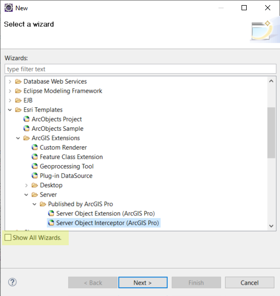
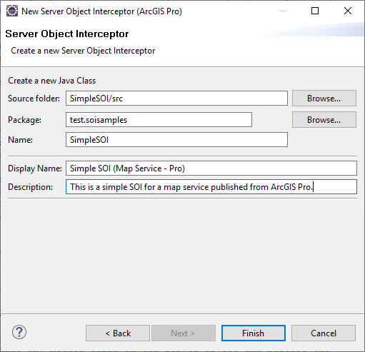
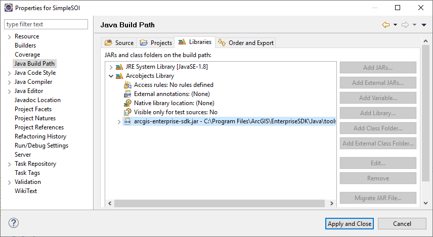
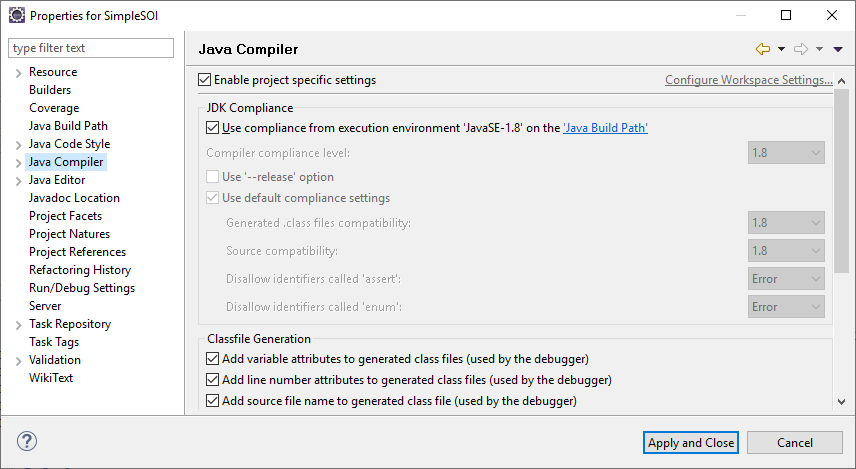

# Develop SOIs

Before you start developing SOIs, ensure that Eclipse and ArcGIS Enterprise SDK are installed on the development machine. If not, see [Install ArcGIS Enterprise SDK](../legacy-install-arcgis-enterprise-sdk/) and [Use ArcGIS Eclipse plugin](../legacy-use-arcgis-eclipse-plugin/).  

Then, perform the following steps to create a simple SOI in Eclipse:  

1.  Create a Java project or use an existing Java project.  

2.  Create an SOI and call it SimpleSOI.  

    1.  Right-click your project and select **New > Other** from the context window.

    2.  Select **Esri Templates > ArcGIS Extensions > Server > Published by ArcGIS Pro > Server Object Interceptor (ArcGIS Pro)**.

          

		These wizards become available only after the ArcGIS Eclipse plugin is installed. If you have already installed the ArcGIS Eclipse plugin but still don't see the **Server Object Interceptor (ArcGIS Pro)** wizard, make sure you check the **Show All Wizards** checkbox and reopen this New dialog box.

    3.  These wizards become available only after the ArcGIS Eclipse plug-in is installed.  

        If you don't see the Published by ArcGIS Pro option, make sure you follow the post-installation guide for Java.  

    4.  Click **Next**. This opens **New Server Object Interceptor (ArcGIS Pro)** wizard. Use this wizard to define your SOI **Name**, **Display Name**, and **Description**.  

        **Name** is the SOI class name. The **Display Name** and **Description** will appear on ArcGIS Server Manager when the SOI is deployed.  

          

    5.  Click **Finish**. Now the SOI class is created.  

3.  Check the project **Java Build Path**.  

    Right-click the **project > Properties**. Select **Java Build Path** in the **Properties** window:  

      

    Make sure Java 8 and arcgis-enterprise-sdk.jar are added in Libraries.  

    If you don't see arcgis-enterprise-sdk.jar, you can manually add it by selecting **Add Library > Arcobjects Library > ArcGIS Enterprise SDK**.  

4.  Check the project **Java Compiler**.  

    Still in the **Properties** window, select the **Java Compiler** tab:  

      

-   ### SOI class annotation

    After the SOI class is created from the template, the annotation, interfaces, and methods required for the SOI class are automatically implemented. The following SOI class annotation with several properties automatically populated is used to help the server administrator identify and understand the SOI deployed in ArcGIS Server Manager.  

    ```java
	@ArcGISExtension 
	@ServerObjectExtProperties(
		displayName = "Simple SOI (Map Service - Pro)", 
		description = "This is a simple SOI for a map service published from ArcGIS Pro.",
		interceptor = true, 
		servicetype = "MapService") 
	public class SimpleSOI implements IServerObjectExtension, IRESTRequestHandler, IWebRequestHandler, 
		IRequestHandler2, IRequestHandler { 
		//... 
	} 
    ```

    The **displayName** attribute is the SOI name that appears under **Service > Capabilities** tab on ArcGIS Server Manager.  

    **Description** displays after the **Help** button of the extension is clicked on **Site > Extensions** tab on ArcGIS Server Manager. **Description** can be empty. See the [enable extensions](../enable-extensions-java/) section.  

    The **servicetype** and **interceptor** attributes indicate that this is an SOI for a map service.  

-   ### SOI initialization

    The initialization logic of the SOI is defined in the `init()` method, which contains the following boilerplate code:  

    ```java
	public void init(IServerObjectHelper soh) throws IOException, AutomationException { 
		// Get reference to server logger utility 
		this.serverLog = ServerUtilities.getServerLogger(); 
		// Log message with server 
		this.serverLog.addMessage(3, 200, "Initialized " + this.getClass().getName() + " SOI."); 
		this.so = soh.getServerObject(); 
		String arcgisHome = getArcGISHomeDir(); 
		/* If null, throw an exception */ 
		if (arcgisHome == null) { 
			serverLog.addMessage(1, 200, "Could not get ArcGIS home directory. Check if environment variable " 
					+ ARCGISHOME_ENV + " is set."); 
			throw new IOException("Could not get ArcGIS home directory. Check if environment variable " + ARCGISHOME_ENV 
					+ " is set."); 
		} 
		if (arcgisHome != null && !arcgisHome.endsWith(File.separator)) 
			arcgisHome += File.separator; 
		// Load the SOI helper.     
		this.soiHelper = new SOIHelper(arcgisHome + "XmlSchema" + File.separator + "MapServer.wsdl"); 
	} 
    ```

    After the SOI is enabled with a map service and service restarts, the first method that will be triggered in the SOI is this `init()` method.`IServerObjectHelper` helps hold the reference to the current server object, which is a `MapServer` object providing service data access, layer properties, and access to other service information. `SOIHelper` provides access to REST request schema and REST request handler.  

    The `ServerUtilities.getServerLogger()` method returns `ILog`, allowing the SOI to write server logs that can be viewed by the server administrator. You may also refer to the SimpleSOI sample (`<Installation folder of ArcGIS Enterprise SDK>\Samples\Java\serverobjectinterceptors\SimpleSOI`) for the complete SOI code.  


-   ### SOI request handler

    The SOI class implements several interfaces, which handle different types of requests, such as REST, SOAP, and OGC requests. For example, the `handleRESTRequest()` method is implemented by `IRESTRequestHandler` for REST request. This method is called every time a service operation is performed through REST endpoint.  

    ```java
    public byte[] handleRESTRequest(String capabilities, String resourceName, String operationName, 
            String operationInput, String outputFormat, String requestProperties, String[] responseProperties) 
            throws IOException, AutomationException { 
        serverLog.addMessage(3, 200, "Request logged in SampleSOI. User: " + getLoggedInUserName() + ", Operation: "
                + operationName + ", Operation Input: " + processOperationInput(operationInput));
        // Find the correct delegate to forward the request too 
        IRESTRequestHandler restRequestHandler = soiHelper.findRestRequestHandlerDelegate(so);
        if (restRequestHandler != null) {
            // Return the response 
            return restRequestHandler.handleRESTRequest(capabilities, resourceName, operationName, operationInput,
                    outputFormat, requestProperties, responseProperties);
        }
        return null;
    } 
    ```

    The REST request sent to a map service carries lots of information, including request headers, output format, request parameters, operation name, and other service information. Request headers are returned by `requestProperties`. The output format is returned by `outputFormat`, which can be JSON, GeoJSON, image, and so on, depending on the specific operation. Request parameters are passed in as `operationInput`. The `capabilities`, `resourceName`, and `operationName` variables are usually used to locate the specific service operation to intercept.  

    The `handleRESTRequest()` method in the above code is used to process the REST request and generate a byte-array response. Right now, this code doesn't modify any request or response, and just let through the request as default.  

    To modify the request, you can modify the request parameters, such as changing certain `operationInput` parameters and passing the updated parameters to the `restRequestHandler.handleRESTRequest()` method.  

    To modify the response, you can customize the return byte array object. For example, if the result of a map service query is a JSON, you can first get a byte array object from the `restRequestHandler.handleRESTRequest()` method, and then convert this byte-array object to a JSON object and customize the JSON object based on your business logic. Finally, you can pack the updated JSON object back to a byte array and return it for the above `handleRESTRequest()` method. Additionally, you can also provide your custom response headers by assigning `responseProperties`.  

    Similarly, you can use the `handleStringRequest()` method to intercept SOAP requests, the `handleBinaryRequest()` for certain requests sent from ArcMap, and the `handleStringWebRequest()` method for OGC service requests.  
