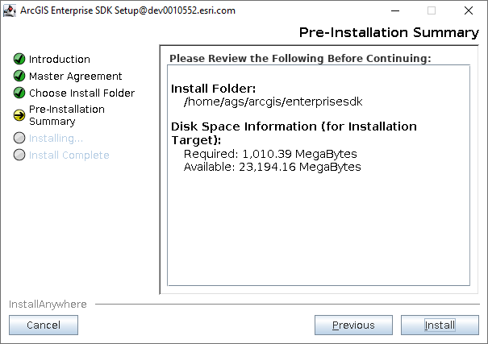
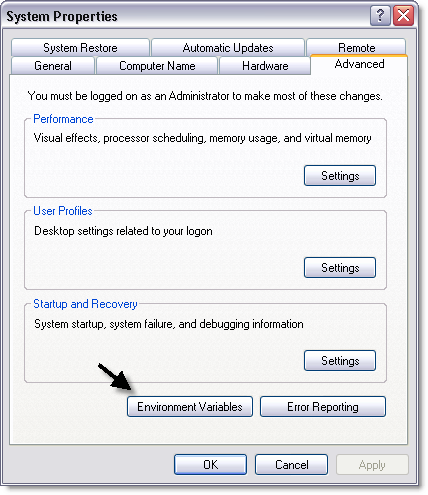
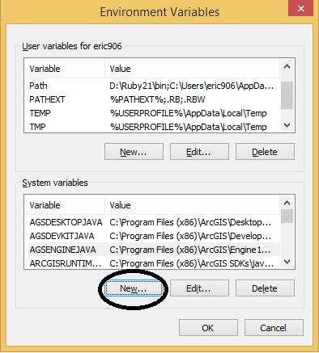
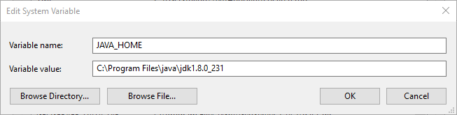
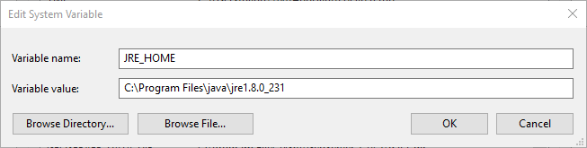
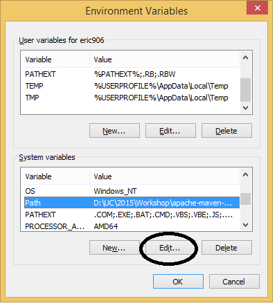
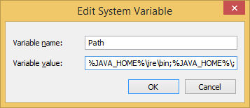
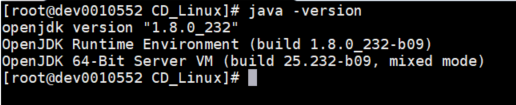
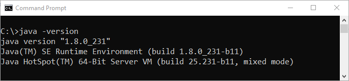

# Install ArcGIS Enterprise SDK

This topic describes components of the ArcGIS Enterprise SDK setup.

### About the ArcGIS Enterprise SDK

The first step for developing extensions for map services published via ArcGIS Pro, is to install the ArcGIS Enterprise SDK. The SDK contains all the required resources for developing extensions (SOEs and SOIs) to extend map services. The SDK includes samples, tools, and documentation for both .NET and Java; during the setup, you can choose which supported integrated development environment (IDE) you wish to use.

### Install ArcGIS Enterprise SDK on Linux

Developing SOEs or SOIs on Linux machine only supports Java (with Eclipse Plugin). You can install ArcGIS Enterprise SDK via the setup wizard or in silent mode:

1. Verify that the machine meets [System Requirements](../system-requirements-java/).
2. Download the ArcGIS Enterprise *.tar.gz file from [My Esri](https://my.esri.com/) and extract it.
3. Run the Setup program:
    - To run as a wizard (requires a display), just run `./Setup` without any arguments.

      The installation wizard will pop up and you can review the master license agreement and choose the installation location.

      

    - To run the Setup silently, use the following arguments `./Setup -m silent -l yes -d INSTALLATION_PATH`.
    
      The `INSTALLATION_PATH` is the location where you want the software installed. The `-l` followed by `yes` indicates your acceptance of the license agreement, which is available on Esri's website.

Once you finish installing the SDK, you can [install ArcGIS Eclipse plugin](../legacy-use-arcgis-eclipse-plugin/) and start building your SOE or SOI projects.

### Install ArcGIS Enterprise SDK on Windows

The ArcGIS Enterprise SDK offers the following packages:

-   Java (with Eclipse Plugin) -> Installs help, samples and tools for Java developers. It also installs a plugin for Eclipse IDE.
-   Visual Studio 2019 -> Installs help, samples and tools for .NET developers using Visual Studio 2019.
-   Visual Studio 2017 -> Installs help, samples and tools for .NET developers using Visual Studio 2017.

On Windows machine, you can install Enterprise SDK by accepting all available IDE options during installation, including both .NET and Java.

If you are installing the SDK on a Windows machine where Visual Studio 2019 Professional Edition and Visual Studio 2017 Professional Edition are installed, you will be able to choose each of these three packages.

If neither Visual Studio 2019 or 2017 are installed on the target machine, you will only be able to select the Java (with Eclipse Plugin) package.

Refer to the [System Requirements](https://enterprise.arcgis.com/en/system-requirements/latest/windows/arcgis-enterprise-sdk-system-requirements.htm), before installing the ArcGIS Enterprise SDK on a Windows machine.

### Set up the Java environment

To develop extensions using the ArcGIS Enterprise software development kit (SDK) for the Java platform, you must have a compatible Java development kit (JDK) 8 update 191 or higher as a stand-alone install, or as part of an integrated development environment (IDE). You must also configure your environment correctly. If the environment is not set correctly, the Java proxies will be unable to access core Enterprise SDK objects through the Java Native Interface (JNI).

After installation, set up the JAVA_HOME environment variable if you have installed the JDK, or set up the JRE_HOME environment variable if you have installed the JRE.

#### On Linux

1.  Set up the JAVA_HOME or JRE_HOME environment variable. For example, when using C-shell, use the setenv command to set up the variables:

    `setenv JAVA_HOME "<Path_To_JAVA>"`

	-or-

    `setenv JRE_HOME "<Path_To_JRE>"` 

2.  Modify your PATH variable. See the following C-shell example:

    `setenv PATH $JAVA_HOME/jre/bin:$JAVA_HOME/bin:$PATH`
	    
	-or-

    `setenv PATH $JRE_HOME/bin:$PATH`

    The `$JAVA_HOME` variable should be prepended to the front of `$PATH`, to avoid JVM crashes.

3.  Source init_devkit.sh or init_devkit.csh depending on the user shell. See the following:
    -   If you use C-shell, run "source init_devkit.csh".
    -   If you use bash or bourne shell, run "source init_devkit.sh".

This script is located in the ArcGIS Enterprise SDK installation directory inside the Java folder in the Linux setup. It sets the environment variable (ENTDEVKITJAVA) that points to the ArcGIS Enterprise SDK installation location and other runtime variables.

Do the previous post installation steps every time you open a new console; hence, an easier approach is adding this to your .cshrc or .bashrc profile.

#### On Windows

On Windows, post installation configuration to setup environment variables is not necessary until and unless you use the command line as an integral part of your development environment.

On Windows, the JAVA_HOME/JRE_HOME environment variables can be created from the System Properties dialog box.

1.  To access the System Properties dialog box, click Start, then Control Panel.
2.  On the Control Panel window, double-click System; click on "Advanced system settings" and the System Properties dialog box appears. (This step may vary depending upon your Windows operating system version).  
    
3.  On the System Properties dialog box, click Advanced, then click Environment Variables; the Environment Variables dialog box appears.  
    
4.  On the Environment Variables dialog box, click New to create system variables; the New System Variable dialog box appears.
5.  On the New System Variable dialog box, type JAVA_HOME in the Variable name text box. The variable value should be the JDK path. Make sure the JDK version is supported by the SDK. To check which version of Java should be used, refer to [ArcGIS Enterprise SDK system requirements](https://enterprise.arcgis.com/en/system-requirements/latest/windows/arcgis-enterprise-sdk-system-requirements.htm).

    

6.  In the Variable value text box, type the path to your Java installation directory.
7.  Click OK.
8.  If you installed JRE, type JRE_HOME in the Variable name text box on the New System Variable dialog box.
9.  In the Variable value text box, type the path to your JRE installation directory.
10. Click OK. See the following screen shot:  
    
11. On the Environment Variables dialog box, click Path under the System variables area.
12. Click Edit. See the following screen shot:  
    
13. On the Edit System Variable dialog box, prepend the path variable value by typing `%JAVA_HOME%\jre\bin;%JAVA_HOME%\bin;` in the Variable value text box. If deploying an application, prepend the path variable by typing `%JRE_HOME%\bin;` in the Variable value text box.
14. Click OK. See the following screen shot:  
    
15. When OK is clicked on the Edit System Variable dialog box, click OK on the Environment Variables dialog box.
16. Click OK on the System Properties dialog box (if applicable, close any open dialog boxes).

### Test the Java environment setup

#### On Linux

To test the Java environment setup for the ArcGIS Enterprise SDK, type `java -version` on the terminal. The version number of your Java installation might be different from the following screen shot:

#### On Windows

To test the Java environment setup for the ArcGIS Enterprise SDK, open a command prompt or command shell and type `java -version` to show the version number of your Java installation. The version number of your Java installation might be different from the following screen shot:  

