# Install ArcGIS Eclipse plugin

This topic discusses the installation and use of the ArcGIS Eclipse IDE plugins. You can use any Eclipse version. This topic uses Eclipse Photon to explain the process.

### About ArcGIS Eclipse plugin

ArcGIS Eclipse plugin provides the following features:

-   Server object extension and server object interceptor templates. A project template includes all the necessary boilerplate code to begin a specific type of extension development.
-   Wizards to help you create SOEs and SOIs, to extend map service published via ArcGIS Pro, in ArcGIS Enterprise.

**Note:** If you already have the ArcGIS Eclipse plugin imported into your copy of the Eclipse IDE, you don’t need to import the plugin when you install a new ArcGIS SDK. Just close and reopen Eclipse after you’ve installed an SDK. This applies to both the ArcObjects Java SDK and the ArcGIS Enterprise SDK.

### Download and install Eclipse

To install the Eclipse IDE from the Eclipse Web site, see [Eclipse Downloads](http://www.eclipse.org/downloads/) and install the supported version of Eclipse.

### Install ArcGIS Eclipse plugin

The following will walk you through installing the ArcGIS Eclipse plugin:

**Step 1:** Uninstall existing ArcGIS plugins:

1.  Ensure that the "bin" folder in JDK (Version 1.8.0_191 and above) is added to the PATH environment variable.
2.  Start Eclipse
3.  Click "Help" menu -> "Install New Software…" menu item.
4.  Ensure that no ArcObjects plugins are installed. Click on the "What is already installed?" link in the lower part of the Install wizard:

    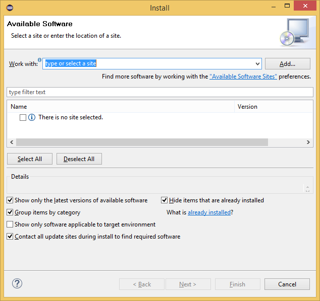

5.  Uninstall the Esri ArcObjects plugin if it's listed in the "Eclipse Installation Details" dialog. Select the plugin and click Uninstall.

    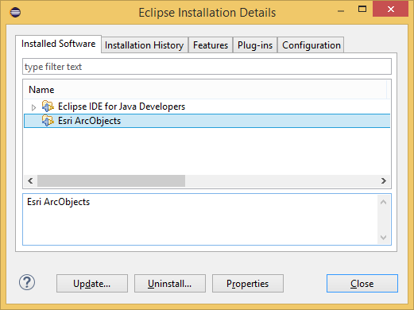

6.  Restart Eclipse.

**Step 2:** Create a local update site

1.  Click "Help" menu -> "Install New Software…" menu item.

2.  Click "Add…" to create a local update site.

3.  Click "Local…" and browse to the \\&lt;ArcGIS Enterprise SDK Installation folder>/java/tools/eclipse_plugin/arcgis_update_site/arcobjects folder. Click OK.

4.  Provide a name for this repository. Click OK.

    

**Step 3:** Install the plugin

1.  Select the update site you just added from the "Work with" drop down list.
2.  Expand ArcGIS plugin and select Esri ArcObjects. The Palette plugin is not required for developing ArcGIS Extensions such as Server Object extension and server object interceptor

    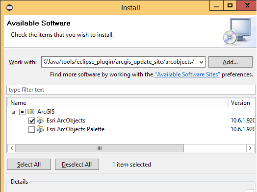

3.  Click Next.
4.  Read and click the "I accept the terms in the license agreements" option button to accept the Esri license agreement. Click Next.
5.  Click Finish.
6.  Restart Eclipse.

The ArcGIS Eclipse plugins are now installed in your Eclipse IDE.

### Add the ArcGIS Enterprise SDK library

Once you install ArcGIS Enterprise SDK, you can find the ArcGIS Enterprise SDK Java library at **\\&lt;ArcGIS Enterprise SDK Installation folder>\\java\\tools\\arcgis-enterprise-sdk.jar**

For documentation related to the ArcGIS Enterprise SDK Java library refer to [ArcGIS Enterprise SDK JavaDoc](/api-reference/java/) section of this help document.

We strongly recommend that you follow the steps below for adding the ArcGIS Enterprise SDK library to avoid various code compilation issues and extension export issues.

1.  Ensure that the "bin" folder in JDK (Version 1.8.0_191 and above) is added to the PATH environment variable.

2.  Start Eclipse

3.  Click "File" -> "New" -> "Java Project" menu item, to create new Java project in Eclipse

    or

    Click "File" -> "Open Projects from File System" -> menu item, to open an existing Java project in Eclipse. Navigate to the appropriate project folder and add project in Eclipse.

4.  Open the project properties by right-clicking on the project folder in Eclipse and clicking on Properties.

    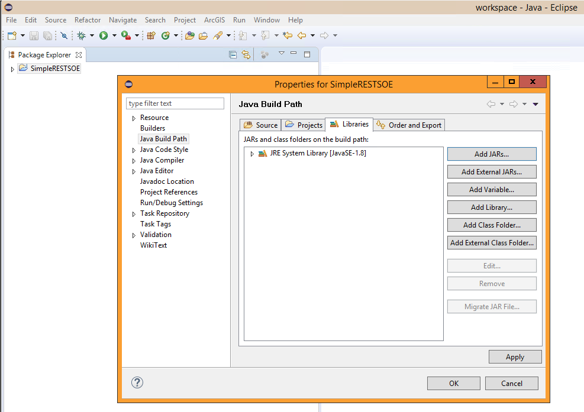

5.  In the project properties window, click on "Add Library..".

    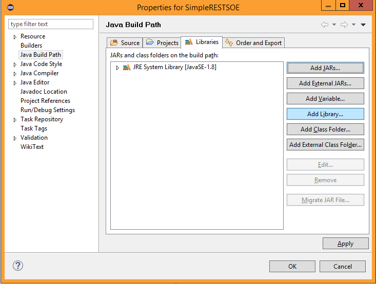

6.  In the Add Library window, click on the "ArcObjects Library" option, and then click Next.

    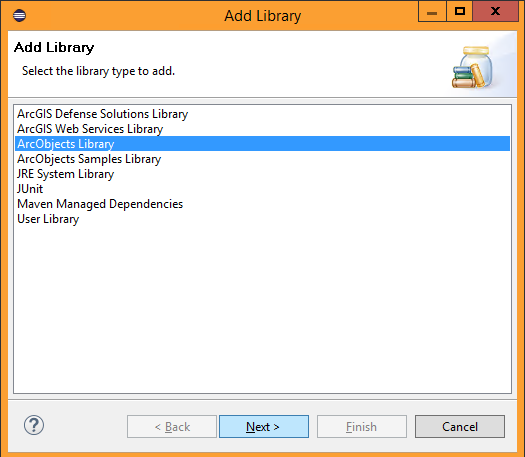

7.  In next window choose the option "ArcGIS Enterprise", and then click Finish.

    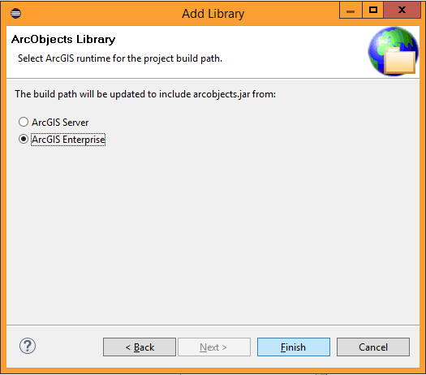

8.  In the project properties window, click Apply, then OK.

    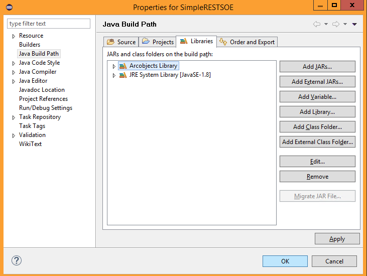

9.  This will add the ArcGIS Enterprise SDK Library in your project, which you can use to develop extensions.

    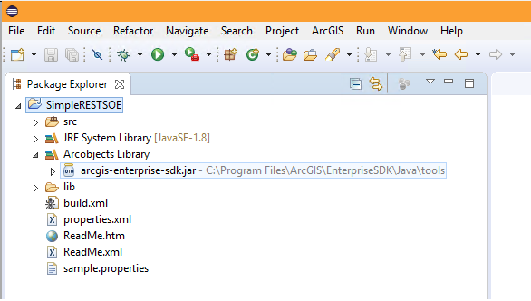

### Uninstall ArcGIS Eclipse plugin

1.  Start Eclipse.
2.  Click the **Help** menu -> **Install New Software…**
3.  Click the **What is already installed?** link in the lower part of the Install wizard:  

    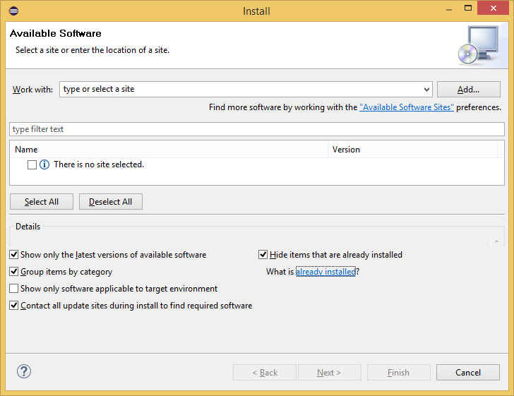

4.  Select **Esri ArcObjects** and click **Uninstall**.

    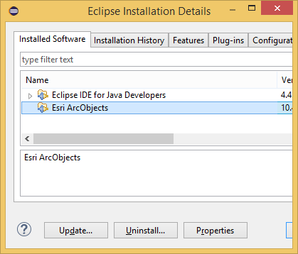

5.  Restart Eclipse when prompted to do so.