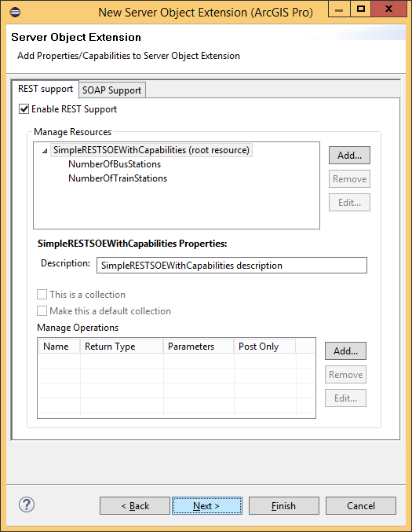

# Work with SOE capabilities

Server object extension (SOE) web capabilities provide a mechanism for ArcGIS Server administrators to enable or disable access to specific functionality exposed by SOEs. A web capability (herein “capability”) can be enabled or disabled from inside ArcGIS Server Manager or ArcGIS Pro.

### About capabilities

A capability can be considered a switch ton control access to either one or more SOAP operations or REST sub-resources/operations. A capability should be independent of other capabilities and selecting one capability must have no effect on other capabilities. The ArcGIS for Server map service, for example, provides three capabilities, called “Map”, “Query”, and “Data”. If the “Query” capability is disabled, access to all query related functionality is disabled. Similar logic applies to the “Map” and “Data” capabilities.

### Create capabilities using the Eclipse wizard

To demonstrate the use of capabilities, this section walks you through creating an example REST SOE that provides location-based transport services. To keep things simple, this SOE has only two sub-resources: NumberOfBusStations and NumberOfTrainStations. The former returns the number of bus stations and the latter returns the number of train stations in a given city.

To control access to these two sub-resources, the SOE has two capabilities: “BusServices” and “TrainServices”. The “BusServices” capability controls access to the bus service related REST endpoints (the NumberOfBusStations sub-resource, in this example), while “TrainsServices” does the same for the NumberOfTrainStations sub-resource.

The following steps create a REST SOE that handles capabilities:

1.  Create a REST SOE using the Eclipse SOE creation wizard. If you are unfamiliar with using the Eclipse SOE wizard, see the [develop REST SOE](../legacy-develop-rest-soes/) topic.
2.  After providing general Java class information on the first page of the wizard, click “Next”, ensure that the “REST Support“ tab is visible, and check the “Enable REST Support” check box.
3.  Add two sub-resources to the SOE, called “NumberOfBusStations” and “NumberOfTrainStations”. Click “Next”.

    

4.  Click the “Web Capabilities” tab. Check the “Add Capabilities” check box. A dialog box to manage properties appears.

    

5.  Click “Add” to add a new capability and enter “BusServices”.

    

6.  Click Apply. Add another capability called “TrainServices”. Click OK. Your REST SOE now has two capabilities, as follows.

    

7.  Check the check box next to BusServices. This indicates that the BusServices capability is enabled by default when your REST SOE is deployed to ArcGIS for Server.
8.  Click Finish and inspect the Java class that gets generated. The ServerObjectExtProperties annotation must have values for the allSOAPCapabilities and defaultSOAPCapabilities attributes, corresponding to the capabilities you created in the Eclipse wizard.

    

9.  Inspect the `getResource()` method (expanded in the figure above). This method is provided with a list of enabled capabilities (first parameter) that could be used to determine which capabilities are enabled. Replace the body of this method with the following code snippet:

    ```java
    if (resourceName.equalsIgnoreCase("") || resourceName.length() == 0){
        return getRootResource(outputFormat, requestPropertiesJSON,
            responsePropertiesMap);
    }

    else if (resourceName.equals("NumberOfBusStations")){
        if (capabilitiesList.contains("BusServices")){
            return getSubResourceNumberOfBusStations(capabilitiesList, outputFormat,
                requestPropertiesJSON, responsePropertiesMap);
        }
        else{
            return ServerUtilities.sendError(406, "Unable to access subresource " +
                resourceName + ". ", new String[]{
                
                    "Please contact the ArcGIS Server admin to enable access to this subresource."
            }
            ).getBytes("utf-8");
        }
    }

    else if (resourceName.equals("NumberOfTrainStations")){
        if (capabilitiesList.contains("TrainServices")){
            return getSubResourceNumberOfTrainStations(capabilitiesList, outputFormat,
                requestPropertiesJSON, responsePropertiesMap);
        }
        else{
            return ServerUtilities.sendError(406, "Unable to access subresource " +
                resourceName + ". ", new String[]{
                
                    "Please contact the ArcGIS Server admin to enable access to this subresource."
            }
            ).getBytes("utf-8");
        }
    }

    return null;
    ```

    The above code snippet checks which resource or sub-resource is being invoked and checks if the corresponding capability is enabled. If it is, then access to the sub-resource is allowed; otherwise, an appropriate error message is returned to the user. If your SOE has REST operations, similar logic could be used to tie those operations to capabilities.

10. Export your SOE, deploy it to ArcGIS Server, and enable the SOE on a map service. If using Manager, when the map service is edited and the SOE is highlighted, note which capabilities are enabled. The BusServices capability should be checked, since that’s the state you chose for this capability in the Eclipse wizard.

    

11. Click “Save and Restart”.
12. Use the ArcGIS Server REST Admin page to clear your REST cache, then open the Services Directory, navigate to the map service page, and click your SOE in the “Supported Extensions” section.
13. Scroll down to the Child Resources section on your SOE root resource page.

    

14. Click the “NumberOfTrainStations” sub-resource. Verify that you receive an error message from your SOE informing you that this sub-resource is not accessible. This is expected because the TrainServices capability is disabled.  

    

15. Navigate back to root resources page and click on “NumberOfBusStations” sub-resource. Verify that you are able to access this sub-resource. This subresource is visible because the BusServices capability is enabled.

     

16. Edit the map service and enable the TrainServices capability on your SOE. Test access to the NumberOfTrainStations sub-resource again and notice that you can now access the resource.

### Use capabilities in SOAP SOEs

All Java SOAP SOEs extend the `com.esri.arcgis.server.SOAPRequestHandler` class. This base class implements the IRequestHandler interface and its `handleStringRequest()` method, processes incoming SOAP requests, and generates appropriate SOAP responses.

```java
String handleStringRequest(String capabilities, String request)throws IOException,
    AutomationException
```

This method takes in two parameters: a list of capabilities that are enabled on the SOE, and the XML SOAP request. When a SOAP operation is invoked on the SOE, the SOAPRequestHandler’s implementation of `handleStringRequest()` is provided, with a list of capabilities enabled on the SOE as its first parameter. This list is exposed by the `SOAPRequestHandler` class via a method called `getAuthorizedCapabilities()`. The SOAP SOE implementation (in other words, your Java SOE class that extends `SOAPRequestHandler`) must call the `getAuthorizedCapabilities()` method to obtain this list, then use logic similar to that used in the above REST SOE to provide or block access to appropriate functionality.

The export and registration steps for SOAP SOEs are the same as those for REST SOEs.
