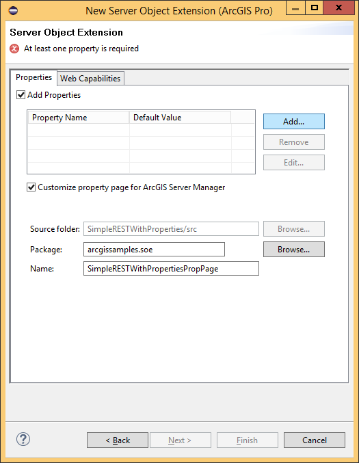
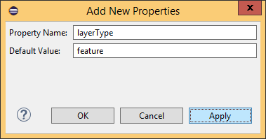
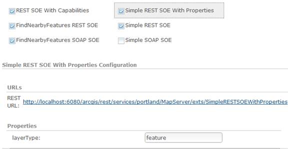
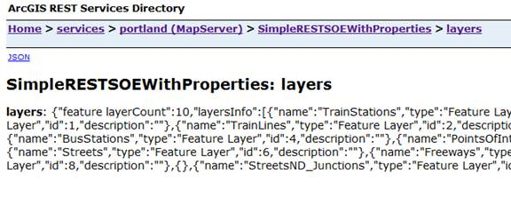
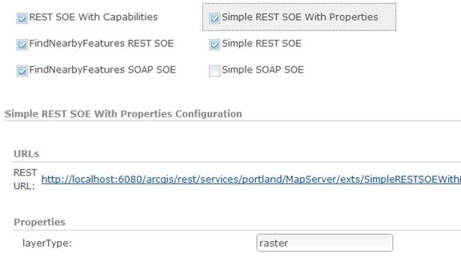
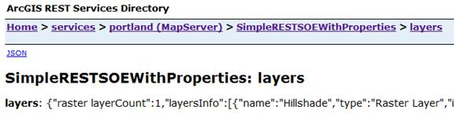
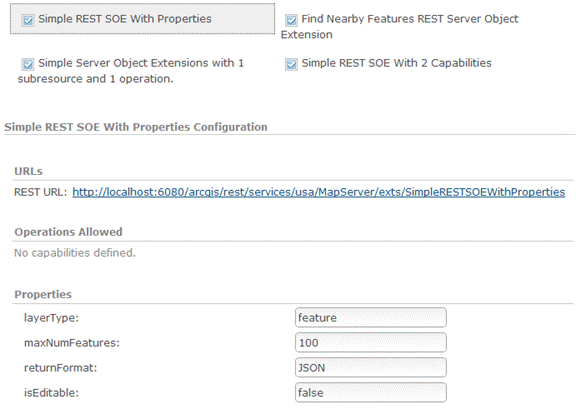
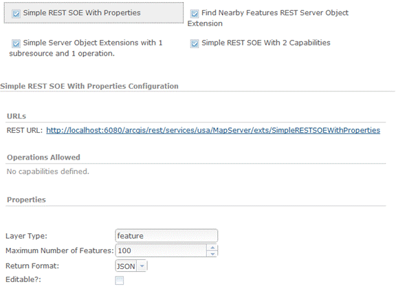
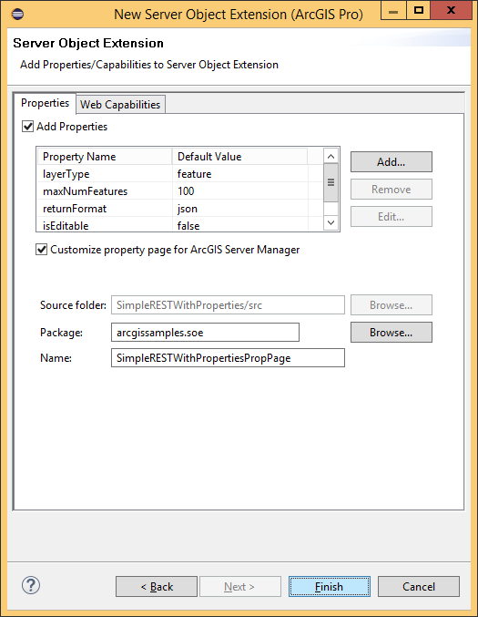
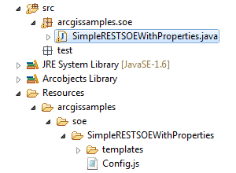

# Work with SOE properties

Properties allow server administrators to modify how an SOE or SOI behaves when enabled on a particular service.

Properties are typically created and initialized as attributes of the `@ServerObjectExtProperties` annotation during SOE creation time. During SOE development, these properties need to be woven into the SOE’s business logic for them to have any influence on the SOE’s runtime behavior. Post-deployment, as an ArcGIS Server administrator, you can modify values of these properties, thereby influencing execution of your SOE’s business logic. 

This topic mainly demonstrates configuring SOE properties. Similar concepts can also be applied to SOI properties, and you can refer to [SOI properties](../soi-properties-java/) for more details.

### Create properties using the Eclipse wizard

To demonstrate the use of properties, this section walks you through creating an example REST SOE that has one property and one sub-resource. The value of this property will define the runtime behavior of the sub-resource.

1.  Create a REST SOE called “SimpleRESTSOEWithProperties” using the Eclipse SOE creation wizard. To learn more about creating a REST SOE using the Eclipse SOE creation wizard, see the [develop REST SOEs](../legacy-develop-rest-soes/) topic.

2.  On the second page of the SOE creation wizard, ensure that the “REST Support” tab is visible, check the “Enable REST Support” check box and add one sub-resource called “layers”. At run time, this sub-resource will return information about all layers in the map service. Click Next.

3.  Select the “Properties” tab and check the “Add properties” check box. This displays a dialog box to add properties, as follows:

    

4.  Click Add to add a property called layerType. Provide a default value “feature”. The value of the layerType property will dictate the type of layer returned by the “layers” sub-resource.

    

5.  Click “OK”.
6.  Uncheck the “Customize property page for ArcGIS Server Manager” check box. By unchecking this check box, you indicate that you do not want to create a custom property page for ArcGIS Server Manager. To learn more about such property pages, see the “Creating Custom Property Pages for Manager” topic.
7.  Click "Finish". The wizard will now generate code for SOE based on choices you made in the wizard.
8.  Inspect the Java SOE class called SimpleRESTSOEWithProperties.java. Note that the ServerObjectExtProperties annotation now includes an attribute called properties, which has a name=value pair corresponding to the “layerType” property you created in the Eclipse wizard.

    ```java
    @ServerObjectExtProperties(displayName = "Simple REST SOE With Properties",
        description = "Simple REST SOE With Properties", properties = {
        "layerType=feature"})
    ```

9.  Add a global member to the SimpleRESTSOEWithProperties SOE class called “layerType”.

    ```java
    private String layerType;
    ```

10. Initialize the SOE.

    ```java
    public class SimpleRESTSOE implements IServerObjectExtension, IRESTRequestHandler{
        private static final long serialVersionUID = 1L;
        private IServerObjectHelper soHelper;
        private ILog serverLog;
        private IMapServerDataAccess mapServerDataAccess;
        private IMapLayerInfos layerInfos;

        public SimpleRESTSOE()throws Exception{
            super();
        }

        /**
        * init() is called once, when the instance of the SOE is created.
        */
        public void init(IServerObjectHelper soh)throws IOException, AutomationException{
            this.soHelper = soh;
            this.serverLog = ServerUtilities.getServerLogger();
            this.mapServerDataAccess = (IMapServerDataAccess)this.soHelper
                .getServerObject();

            IMapServer ms = (IMapServer)this.soHelper.getServerObject();
            IMapServerInfo mapServerInfo = ms.getServerInfo(ms.getDefaultMapName());
            this.layerInfos = mapServerInfo.getMapLayerInfos();

            serverLog.addMessage(3, 200, "Initialized " + this.getClass().getName() + 
                " SOE.");
        }

        /**
        * shutdown() is called once when map service is shutting down
        */
        public void shutdown()throws IOException, AutomationException{
            serverLog.addMessage(3, 200, "Shutting down " + this.getClass().getName() + 
                " SOE.");
            this.soHelper = null;
            this.serverLog = null;
            this.mapServerDataAccess = null;
        }
    ```

11. Scroll down to the `construct()` method. This method takes in an `IPropertySet` as its parameter. This property set is hydrated at run time when you modify the SOE’s properties in ArcGIS Server Manager, and is later passed on to the `construct()` method. This method, therefore, holds the logic that handles the change in behavior of the SOE at run time.

12. Modify the `construct()` method to capture the “layerType” property from the property set.

    ```java
    public void construct(IPropertySet propertySet)throws IOException{
        // Retrieve layer type.
        this.layerType = (String)propertySet.getProperty("layerType");
    }
    ```

13. Copy the following code snippet into your SOE class. This method returns layer information for layers of the type indicated by the layerType property. It’s called when the “layers” sub-resource is invoked by end users in the Services Directory or a client web app.

    ```java
    public byte[] getLayersInfo()throws Exception{
        String aoLayerType = "";
        if (this.layerType.equalsIgnoreCase("feature")){
            aoLayerType = "Feature Layer";
        }
        else if (this.layerType.equalsIgnoreCase("raster")){
            aoLayerType = "Raster Layer";
        }
        else if (this.layerType.equalsIgnoreCase("dataset")){
            aoLayerType = "Network Dataset Layer";
        }
        else{
            return ServerUtilities.sendError(1, 
                "Propety layerType has invalid value. Acceptable values are \"feature\", \"raster\", and \"dataset\".", null).getBytes("utf-8");
        }

        int layerTypeCount = 0;
        JSONObject json = new JSONObject();
        JSONArray layerArray = new JSONArray();
        for (int i = 0; i < layerInfos.getCount(); i++){
            IMapLayerInfo layerInfo = layerInfos.getElement(i);
            String lType = layerInfo.getType();
            if (lType.equalsIgnoreCase(aoLayerType)){
                JSONObject layerJSON = new JSONObject();
                layerJSON.put("name", layerInfo.getName());
                layerJSON.put("type", lType);
                layerJSON.put("id", layerInfo.getID());
                layerJSON.put("description", layerInfo.getDescription());
                layerArray.put(layerTypeCount, layerJSON);
                layerTypeCount++;
            }
        }
        json.put(this.layerType + " layerCount", layerTypeCount);
        json.put("layersInfo", layerArray);
        return json.toString().getBytes();
    }
    ```

14. Export your Java SOE using the “Export SOE” wizard. To learn more about use of this wizard, please see the “Developing REST SOEs Using Java” topic.
15. Deploy your Java SOE using ArcGIS Server Manager.
16. Enable your Java SOE on a map service. When the SOE is highlighted, the Properties section displays the layerType property with the default value you set in the Eclipse wizard.  

    

17. Save and restart the map service and open it in the Services Directory. Click the SOE in the “Supported Resources” section, then click the “layers” sub-resource. It displays all layers of type feature.

    

18. Edit the map service again and modify the layerType property value to “raster”. Save and restart the map service.

    

19. Access the “layer” sub-resource on the SOE. It should now display only layers of type raster.

    

The ArcGIS Enterprise SDK includes a sample called SimpleRESTSOEWithProperties, which demonstrates development and use of properties in SOEs.

As mentioned earlier, SOE property values could be edited in ArcGIS Server Manager or in ArcGIS Pro (before publishing the service).

ArcGIS Server Manager, provides a property editing experience in the Capabilities section of the map service properties, as mentioned previously. However, by default, Manager renders simple text boxes that administrators can use to edit property values. If more advanced UI controls are desired, such a custom property page must be created and packaged along with the SOE. To learn more, see the [create custom property pages for ArcGIS Server Manager](#create-custom-property-pages-for-arcgis-server-manager) section.


### Create custom property pages for ArcGIS Server Manager

SOE properties allow modification of SOE behaviors at runtime. You can modify values of these properties using ArcGIS Server Manager. This topic describes editing property values in Manager using a custom property page for Manager.

When you wish to modify values of SOE properties in ArcGIS Manager, you must log into Manager, click on the map service, select “Capabilities” and then select your SOE from the list of the map service’s capabilities. When an SOE is selected, its REST/SOAP URLs, allowed operations, and properties are displayed. You will notice that in the properties section, an editable text box is rendered for each property by default. To modify values, you must enter new text in these boxes and then click “Save and Restart” to restart the map service and the SOE for these new values to take effect.



The provision of simple text boxes to accept new property values is the default behavior of Manager. This ensures that a simple out-of-the-box user experience is available for all SOEs that have properties. However, property values are not always textual in nature, and the use of text boxes alone as user interface media leaves ample scope for users to enter incorrect or vague values for properties that need accurate and precise values. In such scenarios, richer and more appropriate user interface elements such as drop-down boxes, lists, checkboxes, radio buttons, etc. are necessary to present the true nature of the properties and elicit accurate and precise values from the server administrator.

To cater to such scenarios, Manager provides an extension mechanism whereby SOE developers can create their own custom user interface widgets using the Dojo JavaScript library and integrate it with a property page. Let’s use the above SimpleRESTSOEWithProperties SOE to illustrate a custom property page. This SOE has the following properties:

| Property  | Description |
| ------------- | ------------- |
| layerType | Type of layer the SOE needs to look for, from among a limited list such as feature, raster or all.  |
| maxNumFeatures | Maximum number of features the SOE can return. |
| returnFormat  | Format in which information must be returned to the client app. Some acceptable formats are json, html and text. |
| isEditable  | Indicates if new features could be created and saved to the geodatabase via an SOE operation.  |    

Since the layerType property corresponds to the type of layers in a map, possible values are limited to “feature”, “raster”, and “all” for the sake of this example. Thus, a radio button group or a drop-down list would be appropriate to convey existence of such a domain. Let’s choose a radio button group for this property.

A text box seems an appropriate user interface element for the maxNumFeatures property, since a numeric value is required.

The returnFormat property value is also restricted to three possibilities, namely html, json and text. Lets use a drop-down combo box user interface element.

The isEditable property is a flag that indicates if certain functionality (in this case, editing) should be enabled or not. A checkbox is the best user interface element to accept boolean information.

Thus, the customized property page would then look like the following:



#### Create a custom property page in Eclipse

A custom property page can be created during SOE creation time. If using the Eclipse wizard to create an SOE, after creating properties and their default values on the “Properties” page of the wizard, check the “Customize property page for ArcGIS Server Manager” checkbox to indicate the desire to create a custom property page for Manager.



When you click “Finish”, ensure that a folder called “Resources” is created in your Eclipse project.



This folder will have a folder structure that mimics your SOE’s package structure. This hierarchy will end with a sub-folder named after your SOE, which will contain a JavaScript file called Config.js and its dependencies.

#### Components of a custom property page

A custom property page for ArcGIS Manager is a Dojo widget that Manager loads and renders in real time. The simplest implementation of this widget as a custom property page requires a JavaScript file called Config.js, which defines a Dojo class with setter and getter functions for each property. Such implementation depends on declarations of the user interface HTML elements in an html file.  A custom property page, thus, has at the least the following components:

-   The Config.js file: The Config.js file is the entry point into the custom property page and thus must always be named “Config.js”. The setter and getter functions defined in this file use the dojoAttachPoint attribute to refer to appropriate DOM nodes in the html template, and are called by Manager to get and set property values when appropriate.
-   The HTML file: This is named after the SOE and resides in the templates folder. This HTML file defines and lays out all Dojo and HTML user interface elements. In the above sample, this HTML file contains an HTML table, with each row in the table holding a separate Dojo element.

In order to accommodate custom property pages for multiple SOEs simultaneously, Manager imposes certain constraints on property page widgets. These are:

-   The file that defines the Dojo widget must be named Config.js. Use of any other name would render the custom property page inaccessible to Manager during runtime.
-   All such widgets must use “arcgis.soe.\\&lt;fully qualified SOE name>” as their namespace.

The use of unique namespace for each SOE’s property page leaves you free to structure your custom property page implementations as you see fit, as long as the Config.js file is present. To develop your own custom property page, please refer to the one that’s part of the SimpleRESTSOEWithProperties ArcGIS Enterprise SDK sample.

