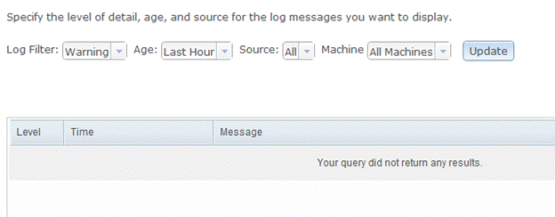

# Log messages

This topic discusses how to add messages to the ArcGIS Server logs within your server object extensions and server object interceptors. This can be useful when troubleshooting your SOEs/SOIs.

### About adding log messages

ArcGIS Server writes events that occur in the server and any errors associated with those events, to logs. Events such as when services are started, when services go into use, and when machines are added to the server are some of the examples of events logged by the server. ArcGIS Server also handles all logging events that occur within each map service and SOE/SOI. For more information on which events get logged, please visit the [Server logs](https://enterprise.arcgis.com/en/server/latest/administer/windows/about-server-logs.htm) section in ArcGIS Server Help.

All extensions created by using the Eclipse SOE/SOI creation wizard include a reference to the ILog interface. This interface provides the `addMessage()` method to log messages, which takes in 3 parameters:

```java
ILog.addMessage( < message type > ,  < message code > ,  < message string > );

Example: this.serverLog.addMessage(3, 200, "my log message");
```

Log messages can vary in their type from "Severe", which indicates a problem that requires immediate attention, to "Verbose", which is a frequent message generated multiple times per request to Server. The messages that are logged are defined by the log type/level that is set in the server. The following are acceptable values for the message level parameter in `ILog.addMessage()` and their corresponding log levels in ArcGIS Server:

| Message levels  | Log types/levels |  Type/Level Description |
|  :---: |  :---: | ------------- |
| 1  | Severe  |  Serious problems that require immediate attention. This level only includes severe messages |
| 2  | Warning  |  Moderate problems that require attention. This level also includes severe messages. |
| 3  | Info |  Common administrative messages of the server, including messages about service creation. |
| 4  | Fine  |  Common messages from use of the server that are logged, at most, once per request. |
| 5  | Verbose  |  Frequent messages from the server that could be logged multiple times per request, such as noting that each layer in a map service was drawn successfully, how fast the layer was drawn, and how long it took the server to access the layer's source data. |
| 100  | Debug |  Debug log messages. |  

The message code is a result code associated with the message. This code is an arbitrary integer value to uniquely define the source of the message. Codes 0 - 5999 are utilized by ArcGIS Server. Codes 6000 and above can be generated by any service component (for example MapServer, GeocodeServer, and custom components,). An example of non-ArcGIS codes is the use of HTTP status codes for returning state of resources in REST SOEs.

### Viewing log messages

Logs generated by SOEs/SOIs are accessible via ArcGIS Server Manager's Logs module. To view and query logs you must choose:

-   The log level from the Log Filter drop down list. The level you choose here must match with the level you used in your SOE's `ILog.addMessage()` methods.
-   The age of the logs from Age drop down list,
-   The applicable map service from the Source drop down list and,
-   The machine (if using multiple machines in a cluster) from the Machine drop down list.


