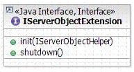
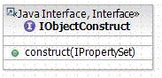
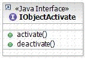

# Overview of developing SOEs

This topic provides an overview of server object extension (SOE) development with the ArcGIS Enterprise SDK in Java, as well as other related topics.

### Developing SOEs

A server object extension can be defined by implementing the `com.esri.arcgis.server.IServerObjectExtension` interface.



This interface is mandatory for SOEs, and includes two methods: init() and shutdown(). This interface is used by the server object to manage the lifetime of the SOE. The server object creates the SOE and calls the init() method, handing it back a reference to the server object via the ServerObjectHelper argument. The ServerObjectHelper implements a weak reference, one that is not protected from the garbage collector, on the server object. The extension can keep a strong reference on the server object helper (for example, in a member variable), but this is not recommended as a strong reference can cause unnecessary objects to remain in memory and hinder performance. An extension should get the server object from the server object helper in order to make any method calls on the server object, then release the reference after making the method calls.

The init() method is called once, when the instance of the SOE is created. Like the init() method, the shutdown() method is called only once and informs the SOE that the server object's context is being shut down and is about to go away. In response, the SOE should release its reference on the server object helper. Any log entries are merely informative and are optional. For information about SOE logging, see the [log messages](../log-messages-java/) topic.

### SOE annotations

Annotations are used inside Java SOEs to indicate that a Java class is an ArcGIS extension and to hold metadata that ArcGIS Server requires to deploy and manage SOEs at run time. At ArcGIS 10.1 and above, Java SOEs support two types of annotations:

#### @ArcGIS Extension

An `@ArcGISExtension` annotation indicates that the annotated interface or class is automatically exposed to the ArcGIS platform as an ArcGIS extension. The `@ArcGISExtension` annotation is used by ArcGIS as a way to associate your interface and classes as extensions without the need for any configuration or API calls embedded in some external source. The following is an example of an annotated interface and class for an SOE:

```java
// Custom Interface
@ArcGISExtension 
public interface IMySoeInterface{
    public String mySoeFoo();
}

// SOE class
@ArcGISExtension 
public class SOE implements IServerObjectExtension, IMySoeInterface{
    // IServerObjectExtension methods
    public void init(IServerObjectHelper arg0)throws IOException,
        AutomationException{
        // Called once when the instance of the SOE is created
    }
    public void shutdown()throws IOException, AutomationException{
        // Called once when the SOE’s context is shut down
    }

    //IMySoeInterface method
    public String mySoeFoo(){
        return "some string";
    }
}
```

This annotation is mandatory, and its absence will render the SOE’s Java class invisible to ArcGIS for Server at deployment time. Consequently, this SOE will not exist at run time.

#### @ServerObjectExtProperties

An `@ServerObjectExtProperties` annotation is required by an SOE to hold name-value pairs that are supplied to ArcGIS Server when your SOE is deployed as an extension to a map service.

The following element-pairs are supported:

-   **displayName** defines the name your SOE will show when users enable it as a capability in an ArcGIS Server administrative client such as ArcGIS Server Manager and ArcGIS Pro. This name can have spaces.
-   **description** is used to describe your SOE in a more detailed and user-friendly manner. It will show up in an ArcGIS Server administrative client to help administrators understand the usage of your SOE.
-   **properties** is where you can define properties on your SOE. For example, if an SOE allows editing of a layer, a property value could dictate which layer would be available for editing, thus giving the administrator control over runtime usage/behavior of the SOE.
-   **allSOAPCapabilities** defines all available capabilities that an SOE can have. When exposing your SOE as a web service, you can create functionality that can be enabled or disabled by an administrator of ArcGIS Server. Such functionality is called a “web capability”. This parameter’s value is a comma-separated list that holds all capabilities exposed by an SOE.
-   **defaultSOAPCapabilites** lists all web capabilities that are enabled on the SOE by default.  
-   **supportsSharedInstances** is a boolean parameter defining whether the SOE can be enabled with a service using shared instances. If this property is not present in the SOE, the SOE can't be applied to a service which is set to use shared instances. This property is introduced at 10.8.1 version.

The following code snippet demonstrates the use of the above-mentioned annotations and available attributes, along with their values:

```java
// SOE class
@ArcGISExtension 
@ServerObjectExtProperties(displayName = "My SOE", description = "My first SOE",
    properties = {"property1Name=property1Value", "property2Name=property2Value"},    
    defaultSOAPCapabilities = {"myWebCapability1"}, 
    allSOAPCapabilities = {"myWebCapability1", "myWebCapability2"},
    supportsSharedInstances = false)
    
public class SOE implements IServerObjectExtension, IMySoeInterface{

    public void init(IServerObjectHelper arg0)throws IOException,
        AutomationException{
        // Called once when the instance of the SOE is created
    }

    public void shutdown()throws IOException, AutomationException{
        // Called once when the SOE’s context is shut down
    }

    //IMySoeInterface method
    public String mySoeFoo(){
        return "some string";
    }

}
```

### Interfaces and classes

The following are some interfaces your SOE can implement to enable specific behavior inside SOEs.

#### com.esri.arcgis.system.IObjectConstruct



This interface is optional and needs to be implemented only if the SOE requires extra initialization such as initializing properties with values defined by a server administrator in ArcGIS Server Manager. The interface includes a single method called `construct()`, which is called only once when the SOE is created, after `IServerObjectExtension.init()` is called. For SOEs that have properties, `construct()` hands back the configuration properties for the SOE as a property set.

#### com.esri.arcgis.system.IObjectActivate



The `IObjectActivate` interface is optional (that is, its implementation is not required unless your SOE requires special logic to execute before and after servicing a request). It includes two methods:

-   `activate()` — Called each time a client makes a request to the SOE, via SOAP or REST
-   `deactivate()` — Called each time a client gets and releases the server object's context.

Any logic you implement in these methods should not be expensive.

#### com.esri.arcgis.server.SOAPRequestHandler

If you plan on exposing your Java SOE as a SOAP-based web service, your SOE class must then extend the `SOAPRequestHandler` base class. Extending this base class is not required if you are creating a REST SOE. This base class defines a `handleStringRequest()` method that’s exposed by the `IRequestHandler` interface. This method takes in SOAP requests, invokes the appropriate business method from the SOE class, generates a SOAP response, and returns it to the client application, thus relieving you of the burden of handling SOAP requests and responses and allowing you to focus on your SOE’s business logic development. This is discussed in more detail in the [develop SOAP SOEs](../develop-soap-soes-java/) topic.

#### com.esri.arcgis.system.IRESTRequestHandler

If you plan on exposing your Java SOE as a RESTful Web Service, you must implement the `IRESTRequestHandler` interface. The interface provides two methods:

-   `handleRESTRequest()` — Called once for each HTTP request to the SOE.
-   `getSchema()` — Called by the ArcGIS REST handler to interrogate the SOE for its resource and operations hierarchy at runtime.

If you're using the Eclipse SOE creation wizard, these methods are automatically generated, thereby allowing you to focus on your implementation of sub-resource and operation methods. This is discussed in more detail in the [develop REST SOEs](../develop-rest-soes-java/) topic.

### ArcGIS Enterprise Software Development Kit

The ArcGIS Enterprise Software Development Kit (ArcGIS Enterprise SDK) is shipped with ArcGIS for Server but is a separate install. This SDK includes the following:

-   The [**install-maven-artifacts**](../install-the-maven-artifacts/) tool
-   Samples (`..\EnterpriseSDK\Samples\Java`)
-   Help documentation (`..\EnterpriseSDK\Help`)

### Also See

-   [Develop SOAP SOE](../develop-soap-soes-java/)
-   [Develop REST SOE](../develop-rest-soes-java/)
-   [SOE with properties](../soe-properties-java/)
-   [Log messages](../log-messages-java/)
-   [Debug extensions](../debug-extensions-dedicated-java/)
