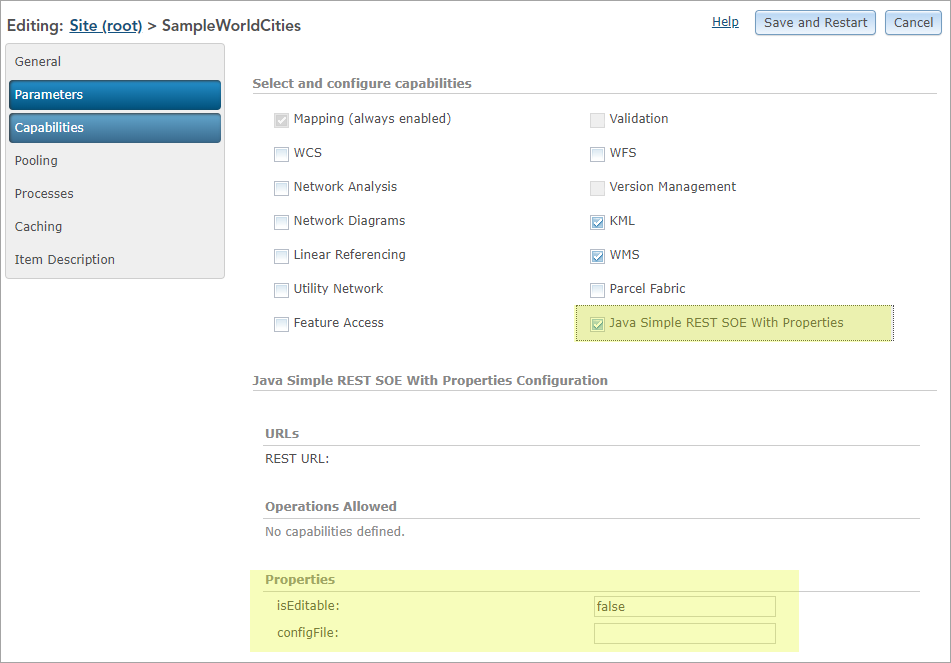
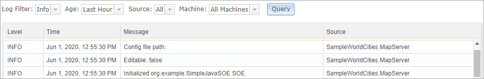
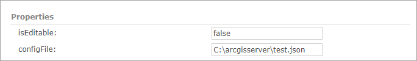
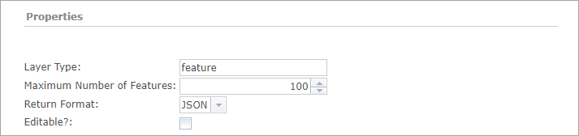
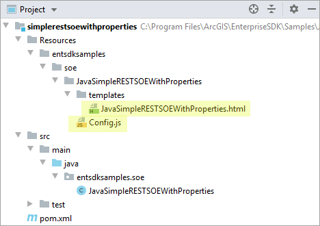

# SOE properties

### SOE default properties

SOEs can expose a set of read-write name-value pairs stored as a `PropertySet`. These properties appear as text boxes in ArcGIS Server Manager and can be changed by the server administrator, allowing the SOE to accept dynamic inputs managed by the server administrator. As SOE properties persist after the map service restarts and ArcGIS Server restarts, they can also be used as global control variables.  

SOE properties are specified at SOE class annotation (`@ServerObjectExtProperties`). You can define and manage the properties as follows:  

1.  Create a new SOE project called SimpleJavaSOE.  

2.  In SimpleSOEProperties.java, add properties as the following code:

    ```java
    @ArcGISExtension
    @ServerObjectExtProperties(displayName = "Java Simple REST SOE With Properties",
          description = "Java Simple REST SOE With Properties.",
          properties= {"isEditable=false","configFile="},
          allSOAPCapabilities = "" ,
          defaultSOAPCapabilities = "" ,
          supportsSharedInstances = false)
    ```

    Properties are defined as a string array in SOE class annotation. The first property's name is isEditable, with a default value of false. The second property, configFile, doesn't have any default value assigned.  

3.  Implement `IObjectConstruct` to work with the SOE properties.  

    To get and set the SOE properties, you need to implement the `IObjectConstruct` interface and use the `IObjectConstruct.construct()` method. The `construct()` method is triggered right after SOE initialization.

    ```java
    public class SimpleJavaSOE implements IServerObjectExtension, IRESTRequestHandler, IObjectConstruct { 
          //... 
          public void construct(IPropertySet props) throws IOException, AutomationException { 
              String editableStr = (String)props.getProperty("isEditable"); 
              if (editableStr.equalsIgnoreCase("true")|| editableStr.equalsIgnoreCase("false")) { 
                      boolean editable = Boolean.parseBoolean((String) props.getProperty("isEditable")); 
                      serverLog.addMessage(3, 200, "Editable: " + editable); 
              } 
              else 
                      serverLog.addMessage(2, 200, "Editable property is not valid."); 
              String configFilePath = (String)props.getProperty("configFile"); 
              serverLog.addMessage(3, 200, "Config file path: " + configFilePath); 
          } 
          //... 
    } 
    ```

    The properties are passed as the `IPropertySet` in the `Construct()` method. You can write their values in Server logs for testing.  

4.  Now let's compile this project and [deploy the SOE](../deploy-extensions-java/).  

    In ArcGIS Server Manager, browse to the **Capabilities** page of a map service. When the SOE is selected, you will see the following **Properties** text boxes:  

    

5.  If you enable the SOE and click the **Save and Restart** button, you will be able to find the logs the SOE writes in server logs.  

    

6.  Edit one of the properties.  

    

7.  Click the **Save and Restart** button again.  

    Now the **Capabilities** page shows the updated SOE properties. Check the server logs and you will find the changes are also logged by the SOE during service restart.  

### SOE custom property page

If you want to use HTML elements and widgets to help the server administrator manage the SOE properties better, such as a drop-down list of available selections, a password field, and so on, you can implement a custom property page that plugs into ArcGIS Server Manager and exposes user interface elements more complex than the input text boxes, such as basic HTML references and dijit form widgets:



This section is based on the [Java simple REST SOE with properties sample](/sample-code/Samples/java/soe/simplerestsoewithproperties/ReadMe/), which contains a custom property page.

Custom property pages can require an extensive amount of testing and troubleshooting. The knowledge of web forms development using HTML and JavaScript is desired. In most cases, the default SOE properties illustrated in the above section is sufficient for editing properties. Therefore, before investing your time on developing a custom property page, consider if the default properties illustrated at the above [SOE default properties](#soe-default-properties) section will meet your requirement.

#### How to create a custom property page

A custom property page for ArcGIS Manager is a Dojo widget that Manager loads and renders in real time. The simplest implementation of this widget as a custom property page requires a JavaScript file called `Config.js`, which defines a Dojo class with setter and getter functions for each property. Such implementation depends on declarations of the user interface HTML elements in an html file. A custom property page, thus, has at the least the following components:

- The `Config.js` file

  The `Config.js` file is the entry point into the custom property page and thus must always be named “Config.js”. The setter and getter functions defined in this file use the `dojoAttachPoint` attribute to refer to appropriate DOM nodes in the html template, and are called by ArcGIS Manager to get and set property values when appropriate.

- The HTML file

  This is named after the SOE class and resides in the `templates` folder. This HTML file defines and lays out all Dojo and HTML user interface elements. In the above sample, this HTML file contains an HTML table, with each row in the table holding a separate Dojo element.

In order to accommodate custom property pages for multiple SOEs simultaneously, Manager imposes certain constraints on property page widgets. These are:

-   The file that defines the Dojo widget must be named `Config.js`. Use of any other name would render the custom property page inaccessible to Manager during runtime.
-   All such widgets must use `arcgis.soe.<fully qualified SOE name>` as their namespace.

The use of unique namespace for each SOE’s property page leaves you free to structure your custom property page implementations as you see fit, as long as the `Config.js` file is present. 

To develop your own custom property page, you can first create an SOE from archetype, and then manually add the above files and folders based on your SOE's package structure, similar to the [Java simple REST SOE with properties sample](/sample-code/Samples/java/soe/simplerestsoewithproperties/ReadMe/):

