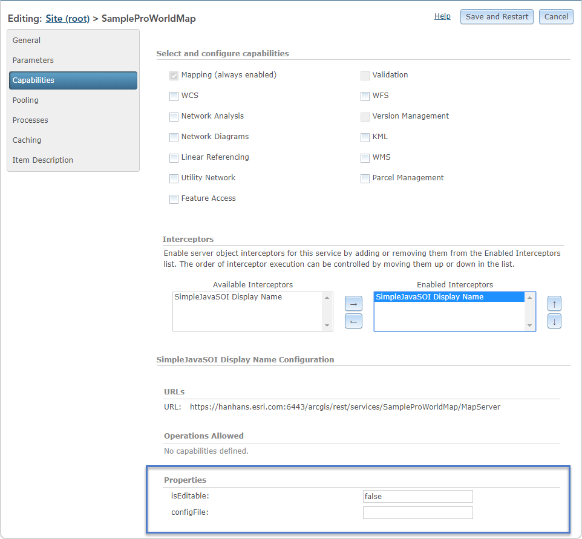

# SOI properties

This topic demonstrates how to implement properties and a custom property page in an SOI.

### SOI default properties

SOIs can expose a set of read-write name-value pairs stored as a `PropertySet`. These properties appear as text boxes in ArcGIS Server Manager and can be changed by the server administrator, allowing the SOI to accept dynamic inputs managed by the server administrator. As SOI properties persist after the map service restarts and ArcGIS Server restarts, they can also be used as global control variables.  

SOI properties are specified at SOI class annotation (`@ServerObjectExtProperties`). You can define and manage the properties as follows:  

1.  Create a new SOI project called SimpleJavaSOI.  

2.  In SimpleSOIProperties.java, add properties as the following code:

    ```java
    @ServerObjectExtProperties(displayName = "SimpleJavaSOI Display Name", 
        description = "SimpleJavaSOI Description",  
        interceptor = true, 
        servicetype = "MapService", 
        properties= {"isEditable=false","configFile="}) 
    ```

    Properties are defined as a string array in SOI class annotation. The first property's name is isEditable, with a default value of false. The second property, configFile, doesn't have any default value assigned.  

3.  Implement `IObjectConstruct` to work with the SOI properties.  

    To get and set the SOI properties, you need to implement the `IObjectConstruct` interface and use the `IObjectConstruct.construct()` method. The `construct()` method is triggered right after SOI initialization.

    ```java
	public class SimpleJavaSOI 
        implements IServerObjectExtension, IRESTRequestHandler, IWebRequestHandler, 
        IRequestHandler2, IRequestHandler, IObjectConstruct { 
        //... 
        public void construct(IPropertySet props) throws IOException, AutomationException { 
            String editableStr = (String)props.getProperty("isEditable"); 
            if (editableStr.equalsIgnoreCase("true")|| editableStr.equalsIgnoreCase("false")) { 
                    boolean editable = Boolean.parseBoolean((String) props.getProperty("isEditable")); 
                    serverLog.addMessage(3, 200, "Editable: " + editable); 
            } 
            else 
                    serverLog.addMessage(2, 200, "Editable property is not valid."); 
            String configFilePath = (String)props.getProperty("configFile"); 
            serverLog.addMessage(3, 200, "Config file path: " + configFilePath); 
        } 
        //... 
	} 
    ```

    The properties are passed as the `IPropertySet` in the `Construct()` method. You can write their values in Server logs for testing.  

4.  Now let's compile this project and [deploy the SOI](../deploy-extensions-java/).  

    In ArcGIS Server Manager, browse to the **Capabilities** page of a map service. When the SOI is selected, you will see the following **Properties** text boxes:  

    

5.  If you enable the SOI and click the **Save and Restart** button, you will be able to find the logs the SOI writes in server logs.  

    

6.  Edit one of the properties.  

    

7.  Click the **Save and Restart** button again.  

    Now the **Capabilities** page shows the updated SOI properties. Check the server logs and you will find the changes are also logged by the SOI during service restart.  

### SOI custom property page

If you want to use HTML elements and widgets to help the server administrator manage the SOI properties better, such as a drop-down list of available selections, a password field, and so on, you can implement a custom property page that plugs into ArcGIS Server Manager and exposes user interface elements more complex than the input text boxes, for example, basic HTML references and dijit form widgets can be embedded in the custom property page.  

Custom property pages can require an extensive amount of testing and troubleshooting. The knowledge of web forms development using HTML and JavaScript is desired. In most cases, the default SOI properties illustrated in the above section is sufficient for editing properties. Therefore, before investing your time on developing a custom property page, consider if the default properties illustrated at the [SOI default properties](#soi-default-properties) section will meet your requirement.  