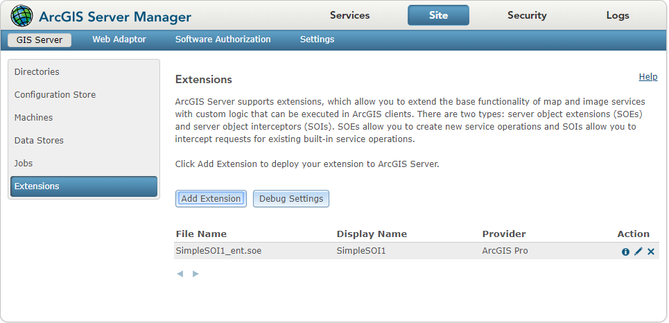
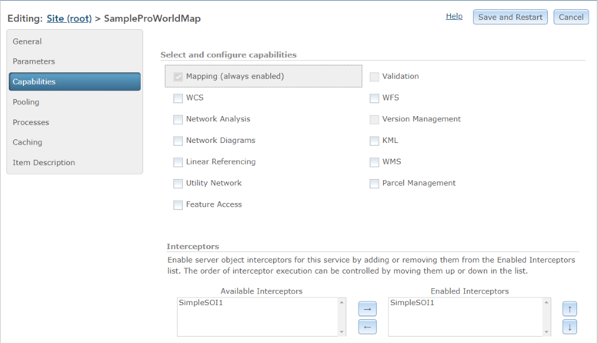
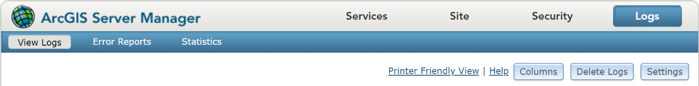
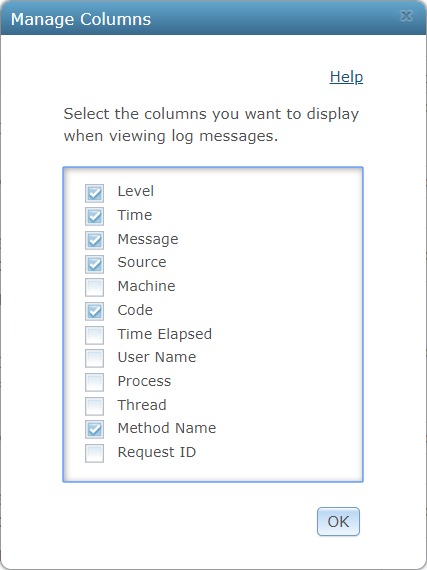
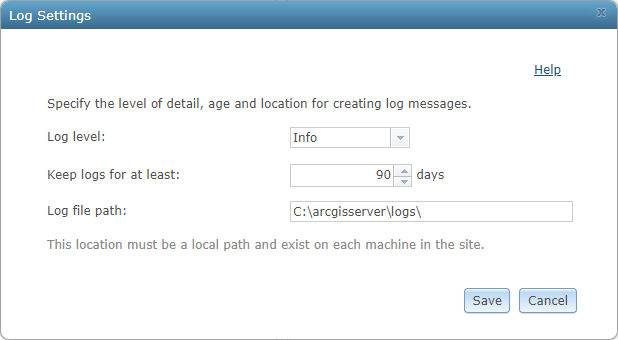
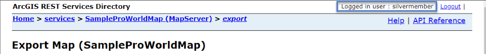
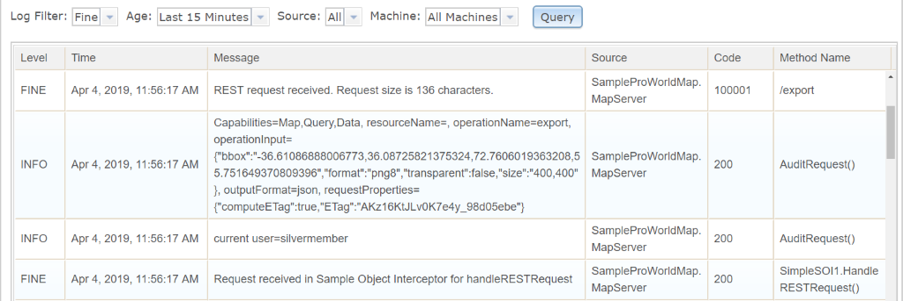

# Audit requests in SOIs

This topic demonstrates how to audit and log REST request information in SOIs, enable SOIs with a map service, and check the SOI auditing information from ArcGIS Server logs.

### Audit REST requests in SOIs

After an SOI is created from the Visual Studio template, the REST request handler is automatically generated.  

```cs
public byte[] HandleRESTRequest(string Capabilities, string resourceName, string operationName, 
	string operationInput, string outputFormat, string requestProperties, out string responseProperties)
```

As the above method carries REST request details, you can log this information for auditing purposes. You can either use built-in ArcGIS Server logs, or choose your own log management mechanism.  

For example, the following code writes the name of the logged-in user, the name of the operation performed by the user, input parameters, and other information to info level log messages. Copy this code under the `HandleRESTRequest()` function above.  

```cs
_serverLog.LogMessage(ServerLogger.msgType.infoStandard, _soiName + ".HandleRESTRequest()", 200, "Request received " +
	"in Sample Object Interceptor for handleRESTRequest");

string loginUser = "current user=" + SOIBase.GetServerEnvironment().UserInfo.Name;
string userAction = String.Format("Capabilities={0}, resourceName={1}, operationName={2}, operationInput={3}, outputFormat={4}, " +
	"requestProperties={5}", Capabilities, resourceName, operationName, operationInput, outputFormat, requestProperties);

_serverLog.LogMessage(ServerLogger.msgType.infoSimple, "AuditRequest()", 200, loginUser);
_serverLog.LogMessage(ServerLogger.msgType.infoSimple, "AuditRequest()", 200, userAction);
```

The `ServerLogger` class allows the SOI to write server logs that can be viewed by the server administrator from ArcGIS Server Manager. Custom messages along with different message types can be defined. The `ServerLogger.msgType` parameter corresponds to log levels from ArcGIS Server logs in the following manner:  

| Message levels  | Log types/levels |  Type/Level Description |
|  :---: |  :---: | ------------- |
| error | Severe  |  Serious problems that require immediate attention. This level only includes severe messages |
| warning  | Warning  |  Moderate problems that require attention. This level also includes severe messages. |
| infoSimple  | Info |  Common administrative messages of the server, including messages about service creation. |
| inforStandard  | Fine  |  Common messages from use of the server that are logged, at most, once per request. |
| infoDetailed  | Verbose  |  Frequent messages from the server that could be logged multiple times per request, such as noting that each layer in a map service was drawn successfully, how fast the layer was drawn, and how long it took the server to access the layer's source data. |
| debug  | Debug |  Debug log messages. | 

The above table lists log levels from highest to lowest. Severe level is the highest level, which indicates serious problems that require immediate attention, such as service fails to restart, operation failure, and so on. Warning level logs indicate moderate problems that require attention. Info, fine, and verbose are all for informational and monitoring purposes, and SOIs can use them to mark different operations or processing. Debug level is the lowest level, which contains the most detailed messages for troubleshooting the server's states, and it's intended for you as the developer, but not for the server administrator.  

To troubleshoot and monitor processes in SOIs, the log levels from severe to verbose should be sufficient to communicate necessary information to the server administrator. As debug level logs also contain all the server operating logs, it can be inconvenient to query debug level messages logged by an SOI from the vast number of logs managed by the server. Therefore, it's not necessary to use the debug level message type in SOI logging except in your development environment.  

As this auditing logic doesn't need to alter the request or response, you can leave the rest of the boilerplate code as is.  

For auditing SOAP requests and OGC requests, you can perform similar logics to their corresponding request handlers. See [overview of developing server object interceptors](../overview-of-developing-sois-net/).  

### Enable SOIs

Now you can follow these steps to deploy and test the SOI auditing function:  

1.  Rebuild the SOI project in Visual Studio.

    This should generate a .soe file ended with “\_ent” in bin\\Debug or bin\\Release folder of the SOI project.  

2.  Upload the SOI to ArcGIS Server.  

    a.  Browse to ArcGIS Server Manager > **Site > Extensions > Add Extension**.  

    b.  Select the .soe file to add.  

    c.  The SOI will show up at the Extensions page.  

    The **Provider** field indicates whether this SOI is built by Enterprise SDK (Provider: ArcGIS Pro) or ArcObjects (Provider: ArcMap).

    The three buttons listed under the **Action** field are the **Help** button, **Update** button, and **Delete** button. The SOI's description will appear when you click the **Help** button.

    

3.  Enable the SOI with a map service.  

    a.  Browse to ArcGIS Server Manager > **Services** tab.  

    b.  Find a map service published from Pro.  

    c.  Under the **Capabilities** tab > **Interceptors**, select the SOI and click the **→** button to enable it.  

    d.  Click the **Save and Restart** button to restart the map service. SOI will not take effect until the service is restarted.  

      

### Check ArcGIS Server logs

After the SOI is enabled, you can check the SOI logging from ArcGIS Server Manager now. First, you need to make sure the log level is properly set in the server settings. Then you can view the SOI logs from the server manager.  

1.  Browse to ArcGIS Server Manager > **Logs** > **View Logs** page.  

      

2.  Click the **Columns** button and check **Code** in the **Manage Columns** window.  

      

    This will show the message code and message name defined in the SOI's `ServerLogger.LogMessage()` method.  

3.  Click the **Settings** button and set the **log level** to info. Click **Save**.  

      

    The server logs will show all the log messages that are above the log level in these settings. Since this SOI has the info level messages logged, you can set the log level to info or any lower level to allow all the custom messages to display.  

    Note, as the debug log level may cause a significant decrease in performance, it should only be used temporarily while debugging or troubleshooting. If you use the debug log level for troubleshooting SOIs, make sure you switch the log level back after you finish checking debug logs.  

4.  Now you can test the SOI function by accessing the service REST endpoint as a logged-in user.  

    For example, you can test with the export operation of the map service from the browser. Ensure that **Logged in** user appears on the upper right of the html page; otherwise, no logged-in user information can be logged.  

      

5.  Check ArcGIS Server logs.  

    a.  Go back to ArcGIS Server Manager > **Logs** > **View Logs** page.  

    b.  Make sure **Log Filter** is set to **info** or any lower level. You may also use other **Log Filter** settings, such as **Age**, **Source**, and **Machine** to help query the logs that you want to find.  

    c.  Click the **Query** button. The following log messages can be found:  

      

6.  To debug an SOI with a running service, see [debug extensions](../debug-extensions-net/).  

7.  After you finish testing the SOI, ensure that the log level is not set to the debug level, especially for a production environment. 