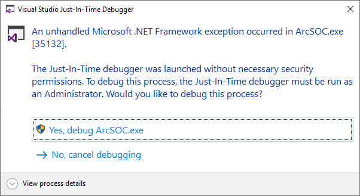
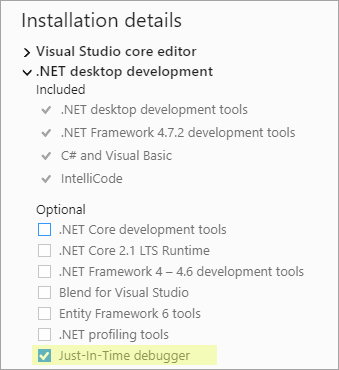
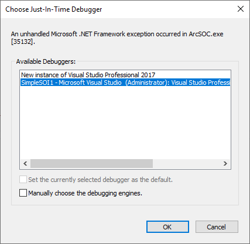

# Automatically attach the debugger

The Visual Studio debugger can be automatically launched and attached to the service process when the`System.Diagnostics.Debugger.Launch()`method is called. Since this approach entails less work, it's highly recommended to adopt it to debug your extension if your server and IDE are installed on the same machine.  

To start debugging at the initialization phase, which is the first phase in the life cycle of an extension, do the following:  

1.  Run Visual Studio as Administrator and open the SOE or SOI project.

2.  Place the following line of code as the first line of your SOE or SOI's`Init()`function:

    ```cs
	public void Init(IServerObjectHelper pSOH) 
	{ 
		System.Diagnostics.Debugger.Launch(); 
		//... 
	} 
    ```

3.  Place a breakpoint in your extension code where you want to pause.  

4.  Build the project in Debug mode. Keep the project open when performing the remainder of these steps.  

5.  Deploy the updated .soe file in ArcGIS Server Manager and enable the extension with a service.  

6.  Once the service is restarted, the `System.Diagnostics.Debugger.Launch()`method is called, which activates the Visual Studio debugger.  

    Note that for shared instances, starting the service will not trigger the `System.Diagnostics.Debugger.Launch()` method. After the service is started, you must send requests that will come through the extension to trigger the extension's `Init()` method and `System.Diagnostics.Debugger.Launch()` method (see more details at [life cycle of extensions using shared instances](../develop-extensions-for-shared-instances-net/#life-cycle-of-extensions-using-shared-instances)). To learn more about using extensions with shared instances, refer to [Work with shared instances](../develop-extensions-for-shared-instances-net/).

    The following **Visual Studio Just-In-Time Debugger** dialog box will pop up automatically.  

    Click **Yes, debug ArcSOC.exe**.  

     

    > Note: If you don't see the **Just-In-Time Debugger** prompt, make sure you select the **Just-In-Time debugger** option when you install Visual Studio. 

     

7.  Choose the project to be debugged and click **OK**.  

    Then click **Attach** when the **Attach Security Warning** dialog box appears.  

      

    If you can't find the project listed in **Available Debuggers**, it’s likely that your project is not opened in Visual Studio in Administrator mode. You can run Visual Studio as an Administrator and load the project to start over.  

8.  The debugger launches and automatically pauses at`System.Diagnostics.Debugger.Launch()`instantly, and you can debug the`Init()`function now.  

      

9.  You can also perform certain service operations to trigger the breakpoints and step through the code as you normally would.

    Stopping the service will trigger the extension's `Shutdown()` method. For dedicated instance, the debug session will be automatically terminated once the `Shutdown()` method finishes executing. For shared instances, after `Shutdown()` method finishes executing, the debug session is still active, waiting for the next breakpoint to be hit by other running extensions or the next extension to be activated within the shared instance pool. 

10. After you finish debugging the extension, be sure to remove the`System.Diagnostics.Debugger.Launch()` method before you deploy the extension to your production environment. 