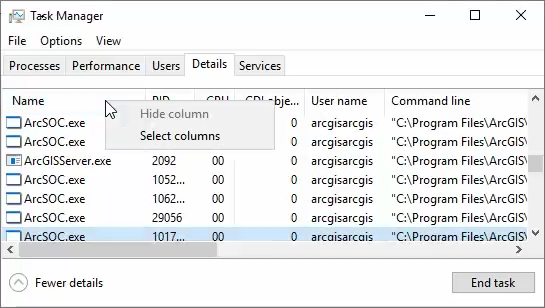
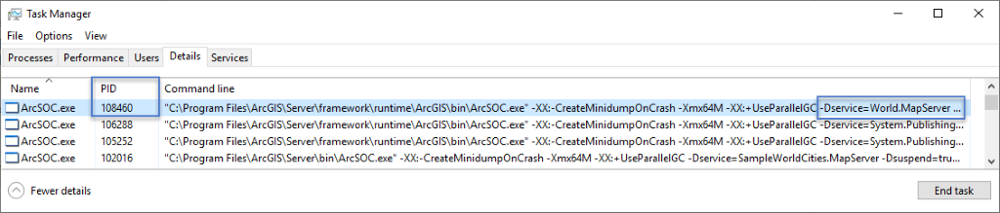
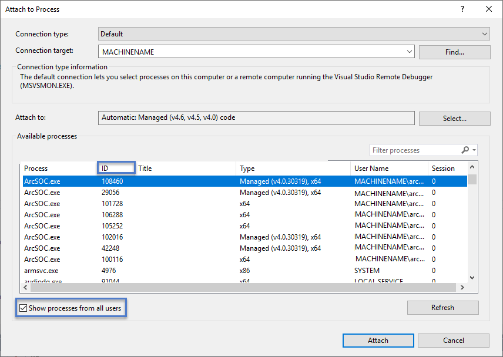
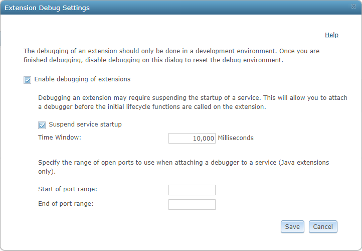

# Manually attach the debugger

### Manually attach the Visual Studio debugger to a service process

Alternatively, you can also manually attach the Visual Studio debugger to the service process. To properly attach the debugger to the designated ArcGIS Server Object Container (ArcSOC) service process, do the following:  

1.  Run Visual Studio as Administrator and open the SOE or SOI project.  

2.  Build the project in Debug mode. Keep the project open when performing the remainder of these steps.  

3.  [Deploy](../deploy-extensions-net/) the updated .soe file in Manager and [enable](../enable-extensions-net/) the extension with the service. Take a note of the map service name.  

4.  Open **Windows Task Manager** and click the **Details** tab. Right-click any column name and choose **Select columns**.  

      

5.  Confirm that **PID** and **Command line** are both checked. Click **OK**.  

6.  Now examine all the ArcSOC.exe processes and find the one with a matching map service name in "-DService=xxxx.MapServer..." of the **Command line** column. Take a note of the **PID** of this ArcSOC.exe.  

      

    For shared instances, you should look for the ArcSOC.exe process with a matching service name as "-DService=DynamicMappingHost.MapServer" in the **Command line** column. You can set **Number of shared instances per machine** to `1` at **Server Manager** >** Site** > **Settings** > **Pooling**, to allow only one DynamicMappingHost ArcSOC process running. This can make it easier to find the DynamicMappingHost process to attach to.

7.  Return to Visual Studio and click **Debug > Attach to Process** to open the **Attach to Process** dialog box.  

    Confirm **Show processes from all users** is checked.  

    Choose the ArcSOC.exe with the **PID** from the last step and click **Attach**.  

    Click **Attach** again when the **Attach Security Warning** dialog box appears.  

      

8.  Now the debugger is attached to the service process. You can perform certain service operations to trigger the breakpoints and step through the code as you normally would. For example, if you put a breakpoint at the`HandleRESTRequest()`function, once you execute a REST operation from a browser (such as `http://<mapservice-url>/export`), the breakpoint will be hit.  

### Enable debugging of the extension's initialization phase

If you want to debug the initialization phase of an extension, which is the`Init()`function for both SOE and SOI, perform the following steps to ensure enough time is available to manually attach a debugger to the service process. 

> Note: You don't need to do these steps if you choose to [automatically attach the Visual Studio debugger](../debug-extensions-net-auto/).  

#### Debug extension's `Init()` method for dedicated instances

1.  Browse to ArcGIS Server Manager > **Site > Extensions**. Click the **Debug Settings** button.  

2.  Check **Enable debugging of extensions** to enable debugging.  

3.  Check the **Suspend service startup** option and provide a time window in milliseconds, if you want to debug into the life cycle methods of your extension. Examples of life cycle methods are`Init()`and `Shutdown()`.  

      

    These methods are invoked by the parent map service during the startup and shutdown phases. When the service starts, ArcGIS Server freezes initialization of the service extension for the duration specified by this time window, allowing you enough time to attach the debugger before a breaking point in `Init()`is hit.  

4.  Ignore the options for specifying a port range. This only applies to debugging extensions built with Java.  

5.  Click **Save**. Debugging is now enabled on ArcGIS Server.  

6.  Set a breakpoint in the`Init()`method of the extension.  

7.  Repeat steps 1 through 8 in the [manually attach the Visual Studio debugger](#manually-attach-the-visual-studio-debugger-to-a-service-process) section, and make sure the Visual Studio debugger is attached to the service process within the time window set in **Extension Debug Settings**. Shortly, the breakpoint set in the last step will be hit.  

8.  Make sure you uncheck the **Enable debugging of extensions** option after you finish debugging the extension.

#### Debug extension's `Init()` method for shared instances

1. Add a breakpoint at the extension's `Init()` method.

2. Follow the instructions to [manually attach the Visual Studio debugger](#manually-attach-the-visual-studio-debugger-to-a-service-process).

2. Start the service with the extension enabled.

3. Send a request to the extension to trigger its `Init()` method.

   Since starting the service that uses the shared instance pool will not trigger its extension's `Init()` method, you must send a request that will come through the extension to trigger the `Init()` method. For example, the REST SOE's `Init()` method will not be called until you visit the REST endpoint of the SOE or send a REST request to the SOE, and the SOI's `Init()` method will not be called until you send a request to the service with which the SOI is enabled.

4. You should see the breakpoint is hit. You can continue debugging through your extension's initialization phase.

5. If you want to debug the `Shutdown()` method, you can manually stop the service, which will trigger the `Shutdown()` method.