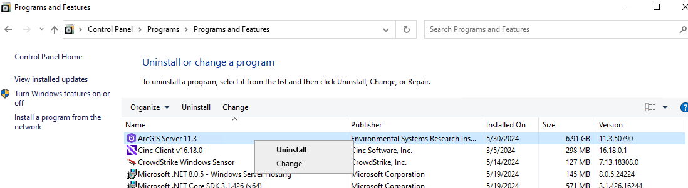
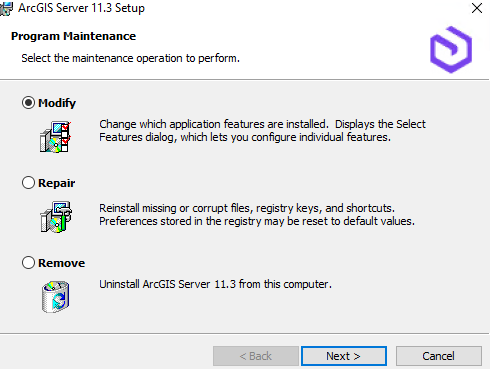

# Deploy extensions

This topic describes how to deploy server object extensions and interceptors in ArcGIS Server Manager. It also covers undeploying of server object extensions and interceptors from ArcGIS Server Manager.

### Prerequisites - Enable .NET Extension Support

Before you deploy a .NET SOE/SOI to ArcGIS Server or ArcGIS Enterprise, you must make sure your ArcGIS Server has been configured with ***.NET Extension Support*** enabled.

1. On the machine where ArcGIS Server is installed, go to ***Control Panel*** > ***Programs and Features***.
2. Right-click ***ArcGIS Server*** and click ***Uninstall/Change***.

     
3. Check ***Modify*** and click ***Next***.

     
4. Click the drop-down button at the ***.NET Extension Support*** feature.

     
5. If ***Feature Description*** on the right states "This feature requires 0KB on your hard drive", then you already have this feature enabled. You can then click ***Cancel*** and exit the wizard. Otherwise, select ***This feature will be installed on local hard drive*** and click ***Next*** and ***Install*** to install this feature.
6. Now your ArcGIS Server is properly configured for .NET SOEs/SOIs and you can continue the following instructions to deploy your extensions.

### Deploy extensions

1.  Log into ArcGIS Server Manager and go to the **Site > Extensions** page.
2.  Click the **Add Extension** button, browse to your newly created .soe file and click **OK**.
3.  The extension will be registered and listed on the **Extensions** page.
4.  Your extension is now deployed to all machines participating in the ArcGIS Server site.

### Undeploy extensions

1.  Log into Manager, and navigate to the **Site > Extensions** page.
2.  Click the cross button next to the extension you want to undeploy.
3.  Click **Yes** in the confirmation dialog box.

Your extension is now undeployed from ArcGIS Server. If this extension was enabled on a service that was running when you undeployed it, that service will be automatically restarted.
