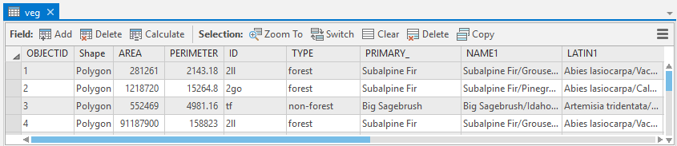
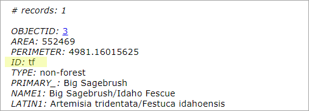
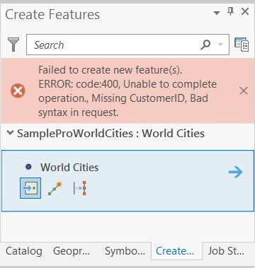

# Handle REST requests and responses in SOIs

This topic demonstrates common workflows of processing REST requests and responses in SOIs. It also provides suggestions for best practices of developing SOIs.

### Handle REST requests and responses in SOIs

The main custom business logic that an SOI executes resides in SOI request handler. For a REST request, it is the `HandleRESTRequest()` method:  

```cs
public byte[] HandleRESTRequest(string Capabilities, string resourceName, string operationName, 
	string operationInput, string outputFormat, string requestProperties, out string responseProperties) 
{ 
	responseProperties = null; 

	IRESTRequestHandler restRequestHandler = _restSOIHelper.FindRequestHandlerDelegate<IRESTRequestHandler>(); 
	if (restRequestHandler == null) 
		return null; 

	return restRequestHandler.HandleRESTRequest( 
			Capabilities, resourceName, operationName, operationInput, 
			outputFormat, requestProperties, out responseProperties); 
} 
```

Understanding whether your business logic needs to customize requests or responses is very important in designing your SOIs and minimizing development efforts. Sometimes, modifying either requests or responses can achieve the same purpose; in this scenario, you may decide which one is more efficient to implement in your code. A solid understanding of how to handle requests and responses in SOIs is crucial for developers.  

This topic mainly discusses handling requests and responses through REST. For handling SOAP requests and responses in SOIs, see [overview of developing server object interceptors](../overview-of-developing-sois-net/).  

### Preprocess REST requests

By reading the request information from the `HandleRESTRequest()` method, you can target certain operations to customize.  

For example, the following code alters the export operation of a map service. It makes only the first layer visible when the map service is displayed on a web map by overriding the layers input parameter of the export operation.  

```cs
public byte[] HandleRESTRequest(string Capabilities, string resourceName, string operationName, 
	string operationInput, string outputFormat, string requestProperties, out string responseProperties) 
{ 
	responseProperties = null; 

	IRESTRequestHandler restRequestHandler = _restSOIHelper.FindRequestHandlerDelegate<IRESTRequestHandler>(); 
	if (restRequestHandler == null) 
		return null; 
	if (operationName == "export")
	{
		JsonObject inputJson = new JsonObject(operationInput);
		string layers;
		if (inputJson.TryGetString("layers", out layers))
			inputJson.Delete("layers");
		inputJson.AddString("layers", "show:0");
		operationInput = inputJson.ToJson();
	}
	return restRequestHandler.HandleRESTRequest( 
			Capabilities, resourceName, operationName, operationInput, 
			outputFormat, requestProperties, out responseProperties); 
}  
```

The `operationName` variable contains the name of the request's service operation. The `operationInput` variable is a string that is a JSON representation of input request parameters. See [ArcGIS REST API](https://developers.arcgis.com/rest/services-reference/resources-and-operations.htm) for the list of service operations and inputs that each operation accepts. Another way to learn more about operation name and inputs is that you can use the [audit REST requests SOI](../audit-requests-in-sois-net/) code snippet to capture `operaitonName` and `operationInput`, when the desired service operations are performed.  

In this way, the map service always displays the designated layer on the web map, regardless of what REST client displays this map service, such as ArcGIS Online Map Viewer, ArcGIS Pro, custom JavaScript application, and so on. As there is no code logic defined for handling SOAP or OGC requests for now, this customization will not affect WMS, WFS, WCS services or exporting the map service via a SOAP client.  

If you are developing SOIs for security or access controls, it is recommended that you begin by implementing all the REST, SOAP, and OGC request handlers and blocking all requests, to only let through the requests that meet your criteria. More details about blocking requests are disclosed in the [SOI error handling](#soi-error-handling) section.  

### Postprocess REST responses

In other situations, it might be more appropriate to postprocess responses in SOIs. For example, to process a map service query result before it is passed to the client, you may follow this postprocess REST responses workflow.  

The following example shows how to postprocess a map service query result. An SOI can make the **ID** field inaccessible for all the records with the “non-forest” **TYPE**, while revealing the **ID** field for the “forest” **TYPE**, without changing the underlying data of the map service (the data source is shown as the following table). The map service is published from the veg feature class (**\\&lt;Installation folder of ArcGIS Enterprise SDK>\\Samples \\EnterpriseSDKSampleData\\Yellowstone\\veg.gdb\\VegData\\veg**).  

  

Code snippet:  

```cs
public byte[] HandleRESTRequest(string Capabilities, string resourceName, string operationName, 
	string operationInput, string outputFormat, string requestProperties, out string responseProperties) 
{ 
	responseProperties = null; 

	IRESTRequestHandler restRequestHandler = _restSOIHelper.FindRequestHandlerDelegate<IRESTRequestHandler>(); 
	if (restRequestHandler == null) 
		return null; 

	//map service query operation example:  
	//operationName = "query", resourceName = "layer/0", outputFormat = "json" 
	if (operationName == "query" && resourceName.Length > 0 && outputFormat == "json")
	{
		byte[] originalResponse = restRequestHandler.HandleRESTRequest(Capabilities, resourceName, operationName,
	operationInput, outputFormat, requestProperties, out responseProperties);

		String originalResult = System.Text.Encoding.UTF8.GetString(originalResponse);

		JsonObject resultJSON = new JsonObject(originalResult);
		object[] features;
		if (resultJSON != null && resultJSON.TryGetArray("features", out features))
			foreach (var feature in features)
			{
				JsonObject jsonFeature = feature as JsonObject;
				JsonObject attributes;
				if (jsonFeature != null && jsonFeature.TryGetJsonObject("attributes", out attributes))
				{
					string type;
					string id;
					if (attributes != null && 
						attributes.TryGetString("TYPE", out type) && 
						attributes.TryGetString("ID", out id))
						if (type == "non-forest")
						{
							attributes.Delete("ID");
							attributes.AddString("ID", "N/A");
						}
				}
			}
		string modifiedResult = resultJSON.ToJson();
		return System.Text.Encoding.UTF8.GetBytes(modifiedResult);
	}

	return restRequestHandler.HandleRESTRequest( 
			Capabilities, resourceName, operationName, operationInput, 
			outputFormat, requestProperties, out responseProperties); 
}                      
```

The above code first verifies if the operation name is "query", as it only customizes query results. It also checks if the output format is json because different output data formats need to be handled differently, and this code only demonstrates customizing JSON outputs. The `resourceName` checks if the operation is a map service layer query, to distinguish from a feature service query. Typically, you can use `operationName`, `Capabilities`, and `resourceName` variables to help locate the exact operation you want to customize. To find out what variable values are associated with the specific operations to intercept, you can use the [audit REST requests SOI](../audit-requests-in-sois-net/) code snippet to help obtain and understand the values of those variables.  

As a query response is a JSON object containing features and schema information, to postprocess the response, this JSON object needs to be parsed properly and then modified. In the code, the raw byte-array response (`originalResponse`) is obtained from the `restRequestHandler.HandleRESTRequest()` method. This is the original query response before any customization. Next, the byte array is parsed to a string (`originalResult`) and then a JSON object (`resultJSON`). Based on the JSON structure, the **ID** field value is set to “N/A” for those features whose **TYPE** field value is “non-forest”. After modifying the JSON object, you can convert it back to a string (`modifiedResult`), and then to a byte array as the final return object for the `HandleRESTRequest()` function.  

Using an SOI to postprocess responses can be tricky, depending on the format of the response. In most cases, the responses are JSON objects. Using certain tools or existing parsers, such as `ESRI.Server.SOESupport.JsonObject`, `ESRI.Server.SOESupport.Conversion`, `Newtonsoft`, `Regular Expressions`, `System.Text.Json` (for .NET only), `System.Web.Script.Serialization.JavaScriptSerializer`(for .NET Framework only), and so on, will help you customize the response more effectively. Understanding of JSON structure is also very important. See the LayerAccessSOI and OperationAccessSOI samples (**\\&lt;Installation folder of ArcGIS Enterprise SDK>\\Samples\\DotNet**) for the complete SOI projects of handling different requests.  

In other scenarios, the responses can be in different formats. For example, map service export operation can result in an image file as a response, instead of a JSON response. In this case, you will have to programmatically process the image if any customization is desired, such as applying a watermark. For this workflow, see ApplyWatermarkSOI sample (**\\&lt;Installation folder of ArcGIS Enterprise SDK>\\Samples\\DotNet\\ServerApplyWatermarkSOI**).  

ArcGIS Server returns texts in UTF8 encoding, so you need to use the `String.getBytes("utf-8")` method to convert the string result to byte array.  

Now, you can test the ***Query*** REST endpoint of the map service. Before the SOI is enabled, type `OBJECTID=3` for the ***Where*** parameter, `*` for the ***Out Fields*** parameter, and `HTML` or `JSON` for ***Format***. Leave all other parameters as default, and click the ***Query*** button. Your request URL should look like this:

``` bash
https://<serverdomain>/<webadaptorname>/rest/services/Veg/MapServer/0/query?where=OBJECTID%3D3&text=&objectIds=&time=&geometry=&geometryType=esriGeometryEnvelope&inSR=&spatialRel=esriSpatialRelIntersects&distance=&units=esriSRUnit_Foot&relationParam=&outFields=*&returnGeometry=true&returnTrueCurves=false&maxAllowableOffset=&geometryPrecision=&outSR=&having=&returnIdsOnly=false&returnCountOnly=false&orderByFields=&groupByFieldsForStatistics=&outStatistics=&returnZ=false&returnM=false&gdbVersion=&historicMoment=&returnDistinctValues=false&resultOffset=&resultRecordCount=&returnExtentOnly=false&datumTransformation=&parameterValues=&rangeValues=&quantizationParameters=&featureEncoding=esriDefault&f=html
```

This returns the following response where the **ID** field has a value:  

  

After enabling the SOI, the same query request returns "N/A" for the **ID** field for the same feature with “non-forest” **Type**.  

  

### SOI error handling

SOI error handling not only is necessary for functioning and troubleshooting purposes, but also can be beneficial to data filtering or validation workflows. There are two ways to handle errors in SOIs.  

The first approach is to send a custom error response. SOIs can intercept and block invalid applyEdits requests of a feature service. They can also send a custom error message indicating that the edit request has invalid attributes or geometry as the following logic:  

```cs
public byte[] HandleRESTRequest(string Capabilities, string resourceName, string operationName, 
	string operationInput, string outputFormat, string requestProperties, out string responseProperties) 
{ 
	responseProperties = null; 

	IRESTRequestHandler restRequestHandler = _restSOIHelper.FindRequestHandlerDelegate<IRESTRequestHandler>(); 
	if (restRequestHandler == null) 
		return null; 

	if (operationName == "applyEdits") 
	{ 
		if (!operationInput.Contains("CustomerID")) 
		{ 
			string editsError = "{\"error\":{\"code\":400,\"message\":\"Unable to complete operation.\",\"details\":[\"Missing CustomerID\"]}}"; 
			return System.Text.Encoding.UTF8.GetBytes(editsError); 
		} 
	}                
	return restRequestHandler.HandleRESTRequest( 
			Capabilities, resourceName, operationName, operationInput, 
			outputFormat, requestProperties, out responseProperties); 
} 
```

Any editing request that doesn't meet the requirement will result in an edit validation error that will propagate to the client. For example, editing the feature service layer in ArcGIS Pro, you should be able to see the editing failure with a detailed error message such as the following:  

  

Another approach to handle operation failure in an SOI is to throw a `RESTErrorException` with detailed error messages:  

```cs
throw new RestErrorException("Service handler not found");
```

The SOI request handler will wrap this exception and let the server handle this exception. It hides the detailed error message in the response but automatically logs the message in server logs. This approach works better for failures that help the server administrator troubleshoot and are not intended to be revealed to the client applications.  

Keep in mind, as different client applications may handle service operation failures differently, some may not be able to prompt error messages when certain operations fail. Make sure you test the SOI with your frequently used client applications carefully to achieve the desired functions. 