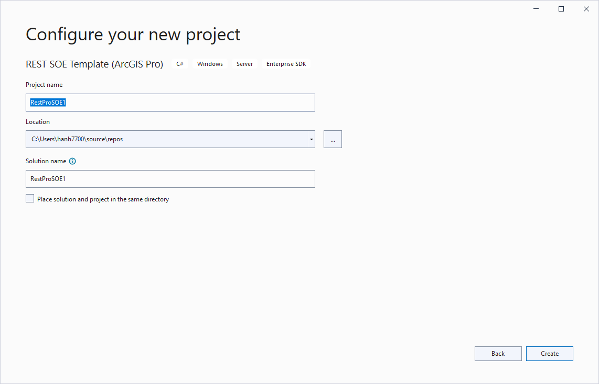

# How to create an SOE from the template in Visual Studio

When you install the ArcGIS Enterprise SDK, you get templates for Visual Studio that can help you build REST server object extensions (SOEs), SOAP SOEs, and server object interceptors (SOIs). Use the following steps to open a template and start building a REST SOE:

1.  Start Microsoft Visual Studio.
2.  Choose **Create a new project**.
3.  In the project templates list, set the languages filter to `C#` (or `Visual Basic`) and the project types filter to `Enterprise SDK`. You should be able to see `SOAP SOE Template (ArcGIS Pro)`, `REST SOE Template (ArcGIS Pro)`, and `CSharp SOI Template (ArcGIS Pro)` in the list of templates.
    
  

4. Choose `REST SOE Template (ArcGIS Pro)` and click **Next**.
5. Set the project name, location, and solution name for your SOE, and click **Create**.

  

5. In the Solution Explorer, click the .cs or .vb file (depending on your chosen language in Step 3), and modify the template code as desired before you build the project.
