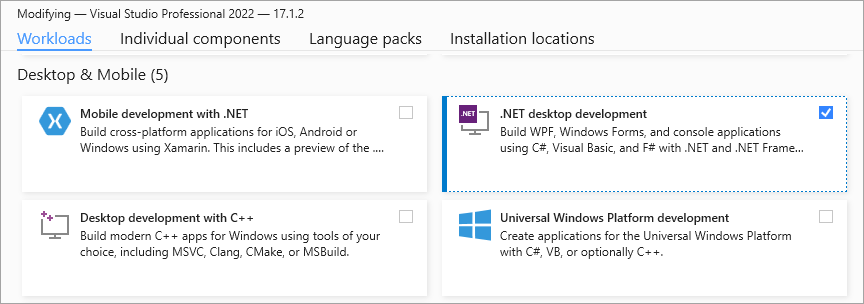
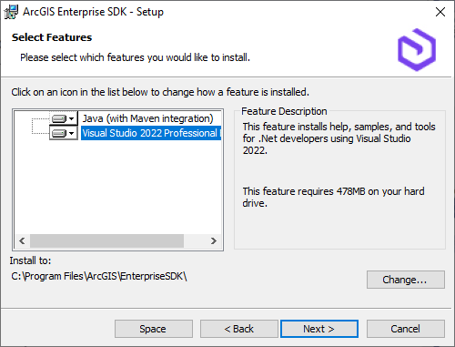
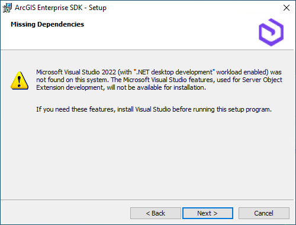

# Installation

Follow these two steps to set up your .NET SOE and SOI development environment:

1. [Install Microsoft Visual Studio](#install-microsoft-visual-studio)
2. [Install ArcGIS Enterprise SDK](#install-arcgis-enterprise-sdk)

After you install ArcGIS Enterprise SDK with the Visual Studio feature, follow the rest of this topic for more details on the components included with the Enterprise SDK's Visual Studio feature and how to create a new SOE or SOI project. 

## Install Microsoft Visual Studio
To enhance the developer experience, ArcGIS Enterprise SDK installation adds custom SOE and SOI templates to the Visual Studio integrated developer environment (IDE). ArcGIS Enterprise SDK 11.3 supports the following versions of Visual Studio:

- Microsoft Visual Studio 2022 (C#, VB.NET) Community, Professional, and Enterprise Edition

To check the supported versions of Visual Studio for previous versions of ArcGIS Enterprise SDK, refer to [ArcGIS Enterprise SDK system requirements](https://enterprise.arcgis.com/en/system-requirements/11.3/windows/arcgis-enterprise-sdk-system-requirements.htm).

You must install the **.NET desktop development** workload when you install Visual Studio:

The Visual Studio integration is an optional feature included with Enterprise SDK. You must install a supported version of Visual Studio with the **.NET desktop development** workload enabled before you install ArcGIS Enterprise SDK with its optional Visual Studio feature.

## Install ArcGIS Enterprise SDK

Once a supported version of Visual Studio is installed, you can install ArcGIS Enterprise SDK. Depending on the SDK version and the supported versions of Visual Studio installed previously, you will see the particular Visual Studio edition listed as an optional feature and automatically selected in the SDK setup. For example, here is the **Select Features** page in the setup of ArcGIS Enterprise SDK 11.3:

If no supported version of Visual Studio is found on the machine, you will see the following **Missing Dependencies** page in the SDK setup:

If you click **Next**, the **Select Features** page will not show any Visual Studio edition in the list of features. If this happens, you should install a supported version of Visual Studio first, and then install ArcGIS Enterprise SDK again, which will allow you to select the Visual Studio feature.

## Components of ArcGIS Enterprise SDK

The ArcGIS Enterprise SDK offers the following components:
- Visual Studio integration
  - SOE and SOI templates:
    - For C#
      - REST SOE Template (ArcGIS Pro)
      - SOAP SOE Template (ArcGIS Pro)
      - CSharp SOI Template (ArcGIS Pro)
    - For Visual Basic
      - REST SOE Template (VB) (ArcGIS Pro)
      - SOAP SOE Template (VB) (ArcGIS Pro)
      - VB SOI Template (ArcGIS Pro)
  - .NET SOE and SOI samples (`\EnterpriseSDK\Samples\DotNet`)
- Java (with Eclipse Plugin)
  - SDK tools and artifacts (`\EnterpriseSDK\Java\maven`)
  - Java SOE and SOI samples (`\EnterpriseSDK\Samples\Java`)
- Help documentation for both .NET and Java (see `\EnterpriseSDK\Help\README.md`)

Once you have installed ArcGIS Enterprise SDK with the Visual Studio feature, you can create new projects for the development of SOEs and SOIs by using one of the ArcGIS Enterprise SDK templates available in the **Create a new project** wizard of Visual Studio. A project template includes all the necessary boilerplate code to begin developing a specific type of extension.

For general information on creating and using solutions and projects in Visual Studio, see the documentation on the Microsoft Visual Studio Web site. You can also find step-by-step information on using the different elements of the ArcGIS Visual Studio Integration Framework in the .NET development walkthroughs.

## Create a new SOE or SOI project

To create a new project in Visual Studio, choose **Create a new project**. If an existing project is open, you can create a new project by clicking the **File** menu in Visual Studio and choosing **New** > **Project**.

You can also set the languages, platforms, or project types filters to help locate the specific SOE or SOI template that you are looking for. See the following screenshot:  

After you select an SOE or SOI template, set the appropriate project name, location, and solution name for your new project, and click **Create**. See:

